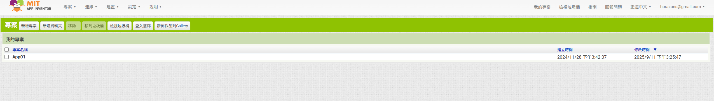
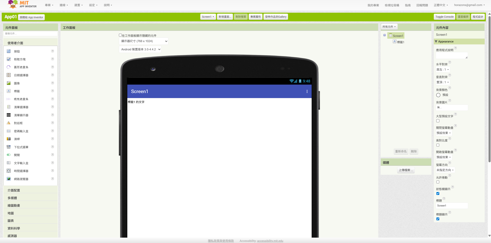
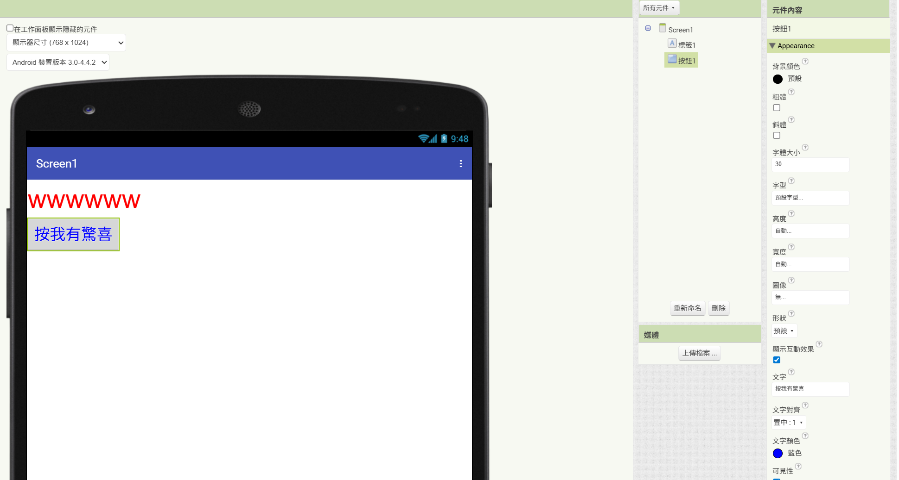
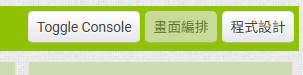
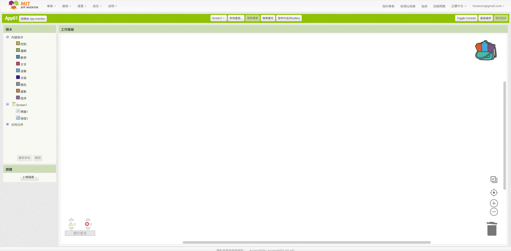
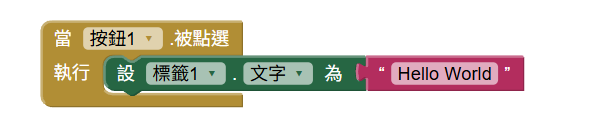
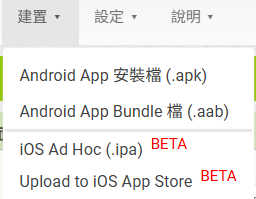
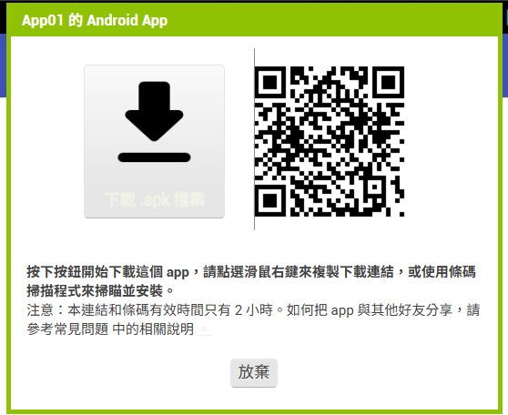

<!-- _class: lead -->
<!-- _paginate: false -->

### Ch. 2

# Hello World

## Horazon
## 應用程式設計

---

# 本章目標

1. 建立第一個專案 (Project)
2. 認識按鈕 (Button) 與標籤 (Label)
3. 讓手機與電腦連線 (AI Companion)
4. 完成 "Hello World" (點按鈕變文字)

---

# 建立新專案

1. 在 AI2 網頁左上角，點選 **"專案" (Projects)** -> **"新增專案" (Start new project)**
2. 輸入專案名稱：`Hello_學號`
   - <mark>注意：名稱不能用中文！也不能用數字開頭！</mark>
   - 正確範例：`Hello_A1234567`
   - 錯誤範例：`你好`、`123Hello`

---

# 認識開發介面

登入後，你會看到這個畫面 (如果是英文，可在右上角選 "繁體中文")：

### 四大區域
1. **元件面板 (Palette)**: 拿材料的地方 (按鈕、標籤...)
2. **工作面板 (Viewer)**: 你的手機畫面預覽
3. **元件清單 (Components)**: 用了哪些東西
4. **屬性面板 (Properties)**: 設定顏色、大小

---

# 認識開發介面

---

# 設計畫面 (Designer)

我們還在「**外觀編排 (Designer)**」模式：

1. **拉一個「按鈕 (Button)」**：從左邊拉到中間手機畫面。
2. **拉一個「標籤 (Label)」**：也拉進去。

 

### 修改屬性 (右邊面板)
- 點選剛拉進去的按鈕，在右邊「屬性」更改「**文字**」為：`按我有驚喜`
- 點選標籤，更改「**文字**」為：`wwwwww`
- 試著改改看「**字體大小**」或「**背景顏色**」！

---
# 設計畫面 (Designer)

---

# 撰寫程式 (Blocks)

畫面做好了，但它還不會動。我們要切換到「**程式設計 (Blocks)**」模式。

1. 點擊右上角的 **"Blocks" (程式設計)** 按鈕。
2. 進入像拼圖一樣的畫面。

---

# 撰寫程式 (Blocks)

---

# 拼積木的時間！

我們的目標：**當按鈕被按下時，標籤的文字變成 "Hello World!"**

1. 在左邊點選 **"Button1"** -> 拉出 `<當 Button1.被點選>` (黃色積木)
2. 在左邊點選 **"Label1"** -> 拉出 `<設 Label1.文字 為>` (深綠色積木)
3. 把它們**卡在一起**！
4. 在左邊點選 **"文字 (Text)"** -> 拉出最上面的 `" "` (紅色字串積木)
5. 改裡面的字為 `"Hello World!"`，並卡在最後面。

<mark>這樣就完成了，我們需要測試看看!</mark>

---

# 測試 (AI Companion)

1. 電腦網頁上方點選 **"連線 (Connect)"** -> **"AI Companion"**
   - 會出現一個 **QR Code**。
2. 拿起你的手機，打開 **MIT AI2 Companion** App。
3. 點選 **"scan QR code"** (掃描 QR Code) 或輸入 6 位數代碼。
4. 等跑條跑完...

 

### 成功了嗎？
試著按按看手機上的按鈕，標籤變字了嗎？

---
# 建置測試 (Build APK)

AI Companion 的方法，有時候蠻常失敗的。
我這邊建議用建置的方式
1. 上方建置(Build) -> 建置專案(Build Project)
2. Android App 安裝檔 (.apk)
3. 下載到電腦
4. 使用模擬器安裝

---

# 重點回顧

- **Designer (外觀)**：用來排版，放按鈕、標籤。
- **Blocks (程式)**：用來寫邏輯，拼積木。
- **AI Companion**：用來讓手機跟電腦同步，馬上看到結果。
- **Build APK**：用來建置 App，安裝到手機(或模擬器)上。

 

### 下一章：做一個可以用的計算機！