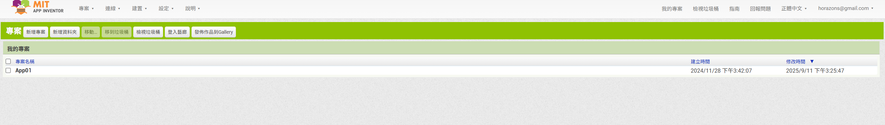

<!-- _class: lead -->
<!-- _paginate: false -->

### Ch. 2

# AI2開發環境與介面

## Horazon
## 應用程式設計

---

# 本章目標

1. **建立第一個專案 (Project)**。
2. **熟悉開發介面 (IDE)**：Palette, Viewer, Components, Properties。
3. **認識元件分類**：UI, Layout, Media, Sensors。
4. **掌握 Screen 屬性設定**。

---

# 建立新專案

1. 在 AI2 網頁左上角，點選 **"專案" (Projects)** -> **"新增專案" (Start new project)**。
2. 輸入專案名稱：`MyFirstApp`。

### ⚠️ 命名規則 (重要！)
- **只能用**：英文、數字、底線 (`_`)。
- **不能用**：中文、空白、特殊符號 (`@#$%`)。
- **開頭**：必須是英文字母 (不能是數字)。

> ✅ `App_01_Test`
> ❌ `我的 App` (中文)
> ❌ `2024Project` (數字開頭)

---

# 深入認識開發介面 (IDE)

AI2 的介面設計非常直觀，分為四大區域：

1. **Palette (元件面板)**：工具箱 (左)。
2. **Viewer (工作面板)**：畫布 (中)。
3. **Components (元件清單)**：圖層 (右)。
4. **Properties (屬性面板)**：設定 (最右)。

---

# 1. 元件面板 (Palette)

這是你的軍火庫，分類非常詳細：

- **User Interface (使用者介面)**: `Button`, `Label`, `Image`, `TextBox` (最常用)。
- **Layout (介面配置)**: `HorizontalArrangement`, `VerticalArrangement` (排版必備)。
- **Media (媒體)**: `Sound`, `Player`, `Camera`, `TextToSpeech`。
- **Drawing and Animation**: `Canvas`, `ImageSprite` (做遊戲用)。
- **Sensors (感測器)**: `Clock` (計時器), `Accelerometer`, `LocationSensor`。
- **Connectivity (通訊)**: `Web`, `BluetoothClient`。

> **找不到元件？** 上方有搜尋欄，打 "Text" 就會跳出相關元件。

---

# 2. 工作面板 (Viewer)

這是你設計 App 外觀的地方 (WYSIWYG)。

- **模擬畫面**：這只是「預覽」，實際在不同手機上可能會稍微跑版。
- **切換模式**：上方可以選 `Phone size`, `Tablet size` (平板), `Monitor size`。
- **隱藏元件**：像 `Sound` 或 `Clock` 這種看不到的元件，拉進來後會出現在畫面下方的 **「非可視元件 (Non-visible components)」** 區域。

---

# 3. 元件清單 (Components)

這裡列出所有已經拉到畫面上的元件。

### 階層結構 (Tree View)
- 元件是有「父子關係」的。
- 把 Button 拉進 VerticalArrangement，Button 就會縮排，變成它的小孩。

### 必做動作：重新命名 (Rename)
預設叫 `Button1`, `Label1`... 很快你就會搞混。
請務必改成有意義的名字！

- `btn_submit` (送出按鈕)
- `lbl_score` (分數標籤)
- `img_avatar` (頭像圖片)

---

# 4. 屬性面板 (Properties)

點選任何一個元件，這裡就能設定它的細節。
不用寫程式，光改這裡就能改變很多事！

### 通用屬性
- **BackgroundColor**: 背景色 (None 代表透明)。
- **Text**: 顯示的文字內容。
- **FontSize**: 字體大小 (預設 14，建議改 20 以上)。
- **Visible**: 是否顯示 (取消勾選就隱藏)。
- **Enabled**: 是否啟用 (取消勾選變灰色，不能按)。

---

# 特別介紹：Screen1 的屬性

點選 **Screen1** (最上層)，它掌管整個 App 的設定。

1. **AppName**: 安裝到手機後顯示的名稱 (支援中文)。
2. **Icon**: 安裝後的圖示 (上傳 512x512 png)。
3. **Title**: 畫面上方標題列的文字 (預設是 Screen1，很醜，改掉！)。
4. **TitleVisible**: 取消勾選，就可以隱藏標題列 (全螢幕感)。
5. **Scrollable**: **非常重要！**
   - 勾選：內容太多時可以捲動。
   - 不勾：內容太多會被切掉。

---

# 外觀編排 (Designer) vs 程式設計 (Blocks)

AI2 採用雙模式開發，右上角可以切換：

### Designer (外觀編排)
- **做什麼**：拉元件、改顏色、排版、設定屬性。
- **比喻**：像是裝潢房子，擺放家具。

### Blocks (程式設計)
- **做什麼**：拼積木、寫邏輯、處理事件。
- **比喻**：像是幫家電接電線，設定「按開關燈會亮」。

---

# 專案管理技巧

應用程式做久了，這幾招要學起來：

1. **備份 (Export .aia)**：
   - 雖然 AI2 在雲端，但建議定期下載 .aia 檔到電腦備份。
   - 或是要交作業給老師，就是交這個檔。
2. **另存新檔 (Checkpoint)**：
   - 做大改版前，先 "Save project as..." 存成 `App_v2`。
3. **垃圾桶**：
   - 刪除的專案會在垃圾桶保留 7 天。

---

# 實作練習：打造第一個介面

請試著跟著做：

1. 拉一個 **Label**，Text 改為「我的 App」。
2. 設定 Screen1 的 **AlignHorizontal** 為 **Center (置中)**。
3. 拉一個 **Button**，Text 改為「點我」。
4. 改 Button 的 **Shape** 為 **Rounded (圓角)**。
5. 改 Button 的 **BackgroundColor** 為 **Blue**。
6.改 Button 的 **TextColor** 為 **White**。

不用寫程式，光是 Designer 就能做出像樣的介面了！

---

# 重點回顧

1. **四大面板**：Palette (拿), Viewer (看), Components (管), Properties (改)。
2. **Naming**: 元件一定要重新命名 (英文+底線)。
3. **Screen1**: 設定 Icon, Title, Scrollable。
4. **AIA**: 專案原始檔 (要備份)。

 
