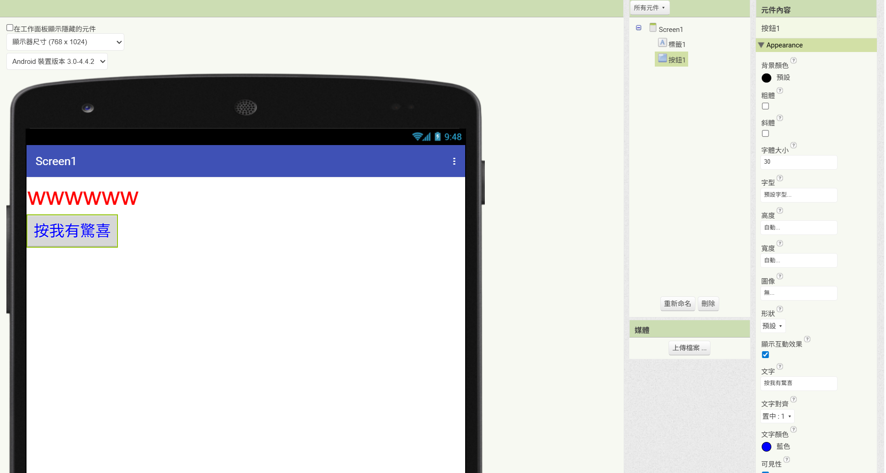
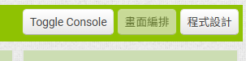
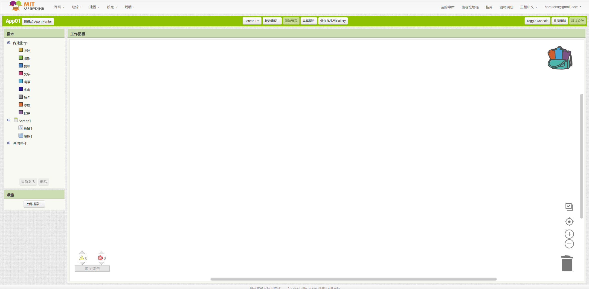
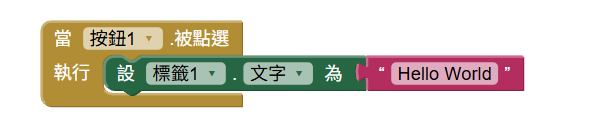
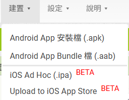
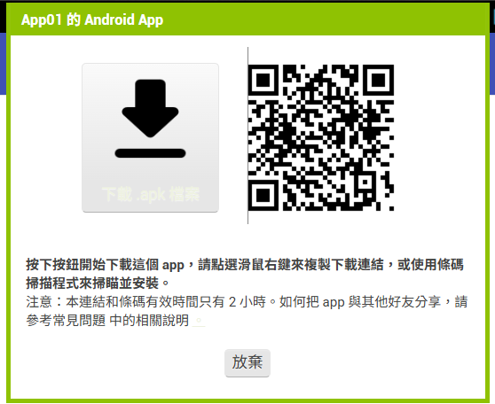

<!-- _class: lead -->
<!-- _paginate: false -->

### Ch. 3

# 基礎元件與事件驅動機制

## Horazon
## 應用程式設計

---

# 本章目標

1. **認識按鈕 (Button) 與標籤 (Label)**
2. **理解事件驅動 (Event-Driven)**
3. **完成 "Hello World" 實作**
4. **挑戰：互動變色龍**

---

# 什麼是「事件驅動 (Event-Driven)」？

App Inventor 的核心觀念就是**事件驅動**。

- **傳統程式 (Procedural)**：程式一行一行執行完就結束。
- **App 程式 (Event-Driven)**：程式在「等待」。
  - 等待你**按按鈕** (Click Event)
  - 等待**簡訊進來** (Text Received Event)
  - 等待**時間到** (Timer Event)
  - <mark>有事情發生 (Event)，程式才會動 (Handler)！</mark>

---

# 認識元件：按鈕 (Button)

按鈕是互動的核心。除了改文字，還有很多好玩的屬性：

### 外觀屬性
- **Image**: 可以設成圖片 (例如：把按鈕變成一張圖片)。
- **Shape**: 形狀
  - *Default* (直角)
  - *Rounded* (圓角)
  - *Oval* (橢圓)
- **BackgroundColor**: 背景顏色。

### 行為屬性
- **Enabled**: 如果取消勾選，按鈕會變灰，不能按 (適合還沒填完資料時鎖住)。

---

# 認識元件：標籤 (Label)

標籤是用來「顯示文字」的，使用者不能修改它。

### 常用技巧
- **HTMLFormat**: 如果勾選這個，文字裡面可以用 HTML 語法！
  - `<b>粗體</b>` -> **粗體**
  - `<font color="red">紅字</font>` -> <font color="red">紅字</font>
- **FontSize**: 字體大小。
  - 手機螢幕小，建議字體至少 **20** 以上才看得清楚。

---

# 設計畫面 (Designer)

我們還在「**外觀編排 (Designer)**」模式：

1. **拉一個「按鈕 (Button)」**：從左邊拉到中間手機畫面。
2. **拉一個「標籤 (Label)」**：也拉進去。

<br>

### 修改屬性 (右邊面板)
- 點選剛拉進去的按鈕，在右邊「屬性」更改「**文字**」為：`按我有驚喜`
- 點選標籤，更改「**文字**」為：`wwwwww`
- 試著改改看「**字體大小**」或「**背景顏色**」！

---
# 設計畫面 (Designer)



---

# 撰寫程式 (Blocks)

畫面做好了，但它還不會動。我們要切換到「**程式設計 (Blocks)**」模式。

1. 點擊右上角的 **"Blocks" (程式設計)** 按鈕。
2. 進入像拼圖一樣的畫面。



---

# 撰寫程式 (Blocks)



---

# 拼積木的時間！

我們的目標：**當按鈕被按下時，標籤的文字變成 "Hello World!"**

1. 在左邊點選 **"Button1"** -> 拉出 `<當 Button1.被點選>` (黃色積木)
2. 在左邊點選 **"Label1"** -> 拉出 `<設 Label1.文字 為>` (深綠色積木)
3. 把它們**卡在一起**！
4. 在左邊點選 **"文字 (Text)"** -> 拉出最上面的 `" "` (紅色字串積木)
5. 改裡面的字為 `"Hello World!"`，並卡在最後面。

---

# 拼積木的時間！



<mark>這樣就完成了，我們需要測試看看!</mark>

---

# 深入剖析 Hello World 程式

讓我們回頭看剛寫的積木：

```blocks
當 (Button1).被點選
    設 (Label1).文字 為 "Hello World!"
```

### 翻譯成白話文
1. **Who (誰)**：`Button1`
2. **When (什麼時候)**：`.Click` (被點選時)
3. **Do (做什麼)**：`Set Label1.Text` (設定標籤的文字)
4. **Value (值)**：`"Hello World!"`

這就是標準的 **「事件 (Event) -> 處理 (Handler)」** 結構！

---

# 測試 (AI Companion)

1. 電腦網頁上方點選 **"連線 (Connect)"** -> **"AI Companion"**
   - 會出現一個 **QR Code**。
2. 拿起你的手機，打開 **MIT AI2 Companion** App。
3. 點選 **"scan QR code"** (掃描 QR Code) 或輸入 6 位數代碼。
4. 等跑條跑完...

<br>

### 成功了嗎？
試著按按看手機上的按鈕，標籤變字了嗎？


---
# 建置測試 (Build APK)

AI Companion 的方法，有時候蠻常失敗的。
我這邊建議用建置的方式
1. 上方建置(Build) -> 建置專案(Build Project)
2. Android App 安裝檔 (.apk)
3. 下載到電腦
4. 使用模擬器安裝

<style scoped>
img[alt="first"]{
  position: absolute;
  top: 60%;
  left: 40%
}
img[alt="second"]{
  position: absolute;
  top: 35%;
  left: 62%;
  width: 35%
}
</style>



---

# 練習：互動變色龍

試著修改你的 Hello World 程式，讓它更有趣：

### 任務目標
1. 加入 **3 個按鈕**，文字分別是「紅」、「綠」、「藍」。
2. 加入 **1 個標籤**，文字是「我是變色龍」。
3. 當按下「紅」按鈕 -> 標籤背景變紅色。
4. 當按下「綠」按鈕 -> 標籤背景變綠色...以此類推。

> **提示**：你需要 `設 Label1.背景顏色` 積木。

---

# 常見錯誤 (Common Mistakes)

### 1. 積木沒卡緊
如果有聽到「卡」一聲，加上積木顏色正常，才算連接成功。
- 如果積木邊緣有**黃色驚嘆號**，表示有錯誤！

### 2. 選錯元件
- 我們要改的是 `Label1` 的文字，不要選成 `Button1` 的文字。
- 注意看綠色積木的下拉選單，確認是操作對的對象。

### 3. 字串積木哪裡找？
- 紅色的 `" "` 積木在左邊的 **"Text (文字)"** 抽屜裡的第一個。

---

# 總結：App 的生命週期

一個 App 的運作通常是這樣的：

1. **使用者介面 (UI)** 等待操作。
2. **事件 (Event)** 被觸發 (例如按按鈕)。
3. **程式積木 (Blocks)** 接手處理。
4. **結果 (Result)** 反映回介面 (例如改文字、變色)。

這就是 AI2 的運作原理！

<br>
