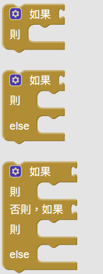

<!-- _class: lead -->
<!-- _paginate: false -->

### Ch. 5

# 邏輯判斷：及格了嗎？

## Horazon
## 應用程式設計

---

# 本章目標

1. 學習 **布林值 (Boolean)**：真 (True) 與 假 (False)
2. 學習 **比較運算子**：大於、小於、等於
3. 學習 **If 判斷式**：如果...就...
4. 實作一個「成績判斷」App

---

# 什麼是「判斷」？

生活中我們隨時都在做判斷：

- **如果** 下雨，**就** 帶傘。
- **如果** 肚子餓，**就** 吃飯。
- **如果** 考 60 分以上，**就** 及格；**否則** 不及格。

在程式裡，我們用 **If / Then / Else** 來寫這些邏輯。

---

# 比較運算子 (Math)

電腦只懂數字，我們需要用符號告訴它怎麼比大小：

- `=` (等於)
- `>` (大於)
- `<` (小於)
- `>=` (大於等於)
- `<=` (小於等於)
- `≠` (不等於)

這個積木在 **Logic (邏輯)** 抽屜裡。

---

# 實作：成績判斷 App

### 畫面設計
1. **標籤**：顯示「請輸入分數：」
2. **文字輸入盒 (TextBox)**：改名 `輸入盒_分數`
3. **按鈕 (Button)**：改名 `按鈕_檢查`，文字改「檢查」
4. **標籤 (Label)**：改名 `標籤_結果`，顯示結果

---

# 程式設計：判斷及格

我們希望：
- 輸入 60 分以上 -> 顯示「及格」
- 輸入 59 分以下 -> 顯示「不及格」

### 使用 控制 -> 如果-則-else 積木

---
# 所有的判斷積木

  

這三個都是判斷的積木，他們實際上屬於同一種積木，只是長得不一樣而已。

1. 在 **如果 (If)** 後面，必須接一個 **「判斷式」** (例如：分數 > 60)。
   - 這個判斷式的結果只能是 **真 (True)** 或 **假 (False)**。
2. 在 **則 (Then)** 或 **否則 (Else)** 後面，是接 **「要執行的動作」**。
   - 例如：`設 標籤.文字 為 "及格"`。

---

# 思考一下：防呆機制

如果使用者輸入 **"ABC"** 或是 **"-100"** 怎麼辦？

程式可能會當機，或者顯示奇怪的結果。

這時候我們就需要更多的 **If** 來檢查：
1. **如果** 輸入是空的？
2. **如果** 分數超過 100？
3. **如果** 分數低於 0？

---

# 流程圖：單一選擇 (If)

只有在 **條件成立 (True)** 時，才執行動作。

    

---

# 流程圖：二擇一 (If-Else)

**條件成立** 做 A，**不成立** 做 B。

    

---

# 流程圖：多重選擇 (If-ElseIf-Else)

檢查多個條件，找到第一個成立的執行。

    

---

# 重點回顧

- **If ... Then**: 只有條件成立才執行。
- **If ... Then ... Else**: 條件成立做 A，不成立做 B。
- **比較運算子**: 用來產生 True 或 False 的條件。

 
