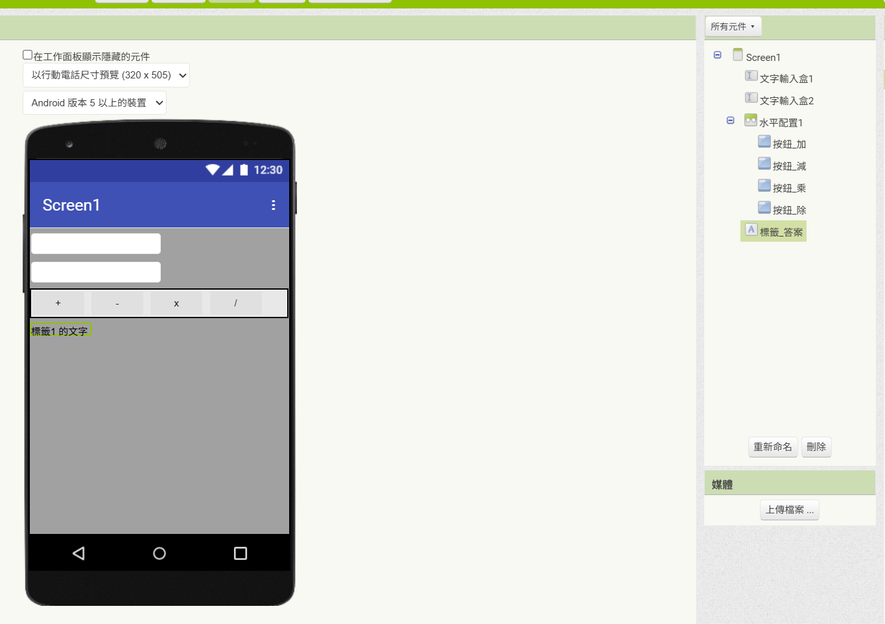

<!-- _class: lead -->
<!-- _paginate: false -->

### 作業 1

# 簡易計算機 App

## Horazon
## 應用程式設計

---

# 作業說明

製作一個 **四則運算計算機**，可以計算兩個數字的加、減、乘、除！

### 核心功能
1. 輸入兩個數字
2. 提供 加、減、乘、除 四個按鈕
3. 按下按鈕後，顯示正確的計算結果

 

<mark>本作業目標：練習「數學運算積木」與「按鈕事件」。</mark>

---

# 畫面設計 (Designer)

請依照以下建議配置元件：

### 1. 輸入區
- 一個 **文字輸入盒(TextBox)**：輸入第一個數字 
- 一個 **文字輸入盒(TextBox)**：輸入第二個數字 
- **注意**：記得把這兩個輸入盒的 **"NumbersOnly"** 屬性打勾 (限輸入數字)！

### 2. 按鈕區 (操作)
- 放入一個 **水平配置 (HorizontalArrangement)**
- 在裡面放入四個 **Button**：
  - 文字分別改為：「+」、「-」、「×」、「÷」

### 3. 結果區
- 一個 **Label**：用來顯示結果 (字體建議設大一點，例如 30)

---
# 畫面設計 (Designer)

---

# 程式邏輯 (Blocks)

我們需要為這四個按鈕分別寫程式。

### 1. 加法按鈕

### 2. 其他按鈕
- **減法**：使用 `-` 積木
- **乘法**：使用 `*` 積木
- **除法**：使用 `/` 積木

---

# 進階挑戰 (加分題)

如果你覺得太簡單，可以試著加上這些功能：

### 1. 清除按鈕 (Clear)
- 加一個「C」按鈕 (放在水平配置中)。
- 按下後，把兩個輸入盒和結果標籤的文字都變成空字串 `""`。

### 2. 除數為 0 的防呆
- 如果第二個數字是 `0`，按除法會發生什麼事？
- 試著用 **If / Else** 判斷：
  - 如果 `數字2 = 0`，顯示 "不能除以零！"
  - 否則，才執行除法運算。

---

# 評分標準

| 項目 | 配分 | 說明 |
|:---|:---:|:---|
| **基本功能** | 80% | 四個按鈕都能正確算出結果 |
| **進階功能：清除按鈕** | 10% | 實作「C」按鈕清除內容 |
| **進階功能：除零防呆** | 10% | 判斷分母不可為 0 |

---

# 繳交方式

1. 在 AI2 網頁，選擇 **「建置」→「Android App 安裝檔 (.apk)」**
2. 等待進度條跑完，下載 `.apk` 檔案
3. 將此檔案繳交至創課平台

