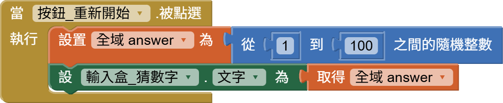

<!-- _class: lead -->
<!-- _paginate: false -->

### Ch. 6

# 猜數字遊戲 (1-100)

## Horazon
## 應用程式設計

---

# 本章目標

1. 學習 **亂數 (Random)**：讓電腦隨機選數字
2. 學習 **全域變數 (Global Variables)**
3. 綜合應用 **如果/否則 (If/Else)** 邏輯
4. 製作「終極密碼」遊戲 (1~100)

---

# 什麼是亂數 (Random)？

遊戲好玩的地方，就在於**不可預測性**。

- 抽卡機率、爆擊率、掉寶率
- **猜數字的答案** (每次都要不一樣！)

這些都是由「亂數」決定的。在 AI2 裡，我們可以用 **數學 (Math)** 裡的 `<隨機整數 (random integer)>` 來產生。

---

# 遊戲規則

1. 電腦隨機選一個 1~100 的數字 (答案)。
2. 玩家輸入一個數字。
3. 電腦判斷：
   - 太大了！
   - 太小了！
   - 猜對了！

這需要用到上一章學的 **比較 (Compare)** 與 **控制 (Control)**。

---

# 畫面設計

1. **標籤**：顯示提示 (例如 "請猜 1~100")。
2. **文字輸入盒**：改名 `輸入盒_猜數字`，讓玩家輸入數字。
3. **按鈕**：改名 `按鈕_猜`，文字改「猜！」。
4. **按鈕**：改名 `按鈕_重新開始`，文字改「重新開始」。
5. **對話框 (Notifier)**：在 **使用者介面 (User Interface)** 裡找，拉進去 (它在畫面上看不到，會在下面)。

--- 
# 畫面設計

---

# 定義變數 (Variables)

我們需要一個變數來存電腦選的「正確答案」：

1. **變數 (Variables)** -> `<初始化全域變數 (initialize global)>`
2. 名字改 `answer`，初始值隨便給個 0 (反正程式開始跑會重設)。

---

# 觀念：什麼是變數 (Variable)？

變數就像是一個 **「杯子」** 或 **「置物櫃」**。

- **變數名稱 (Name)**：標籤貼紙 (例如 `answer`)，用來識別這個杯子。
- **變數值 (Value)**：杯子裡裝的東西 (例如 `50`)。

### 操作變數
- **Set (設)**：把東西放進杯子 (舊的會被丟掉)。
- **Get (取)**：把東西從杯子拿出來看 (東西還在)。

---

# 遊戲初始化 (Game Start)

我們寫一個 **程序 (Procedure)** 或者直接在 **Screen1.初始化 (Initialize)** (畫面啟動時) 設定：

記得「重新開始」按鈕 (`按鈕_重新開始`) 也要做一樣的事！

---

# 觀念：隨機 (Random) 與 種子 (Seed)

### 為什麼要有隨機種子？
電腦其實無法產生「真正的」亂數，它是靠數學公式算出來的 (偽亂數)。
- **隨機種子 (Random Seed)**：就是這個公式的「起始值」。

### 重要特性
- 如果 **種子一樣** -> 產生的 **亂數序列就一樣**！
- 這在測試程式時很有用 (可以重現 Bug)。
- 但在真正玩遊戲時，我們希望每次都不一樣，AI2 會自動幫我們處理這件事 (通常是用當下時間當種子)。

---

# 核心邏輯：判斷大小

當「猜」按鈕 (`按鈕_猜`) 被按下：

- **比較積木**：在 **數學 (Math)** 抽屜裡的 `=`，可以下拉選 `>` 或 `<`。
- **顯示警告 (ShowAlert)**: 會像 Toast 一樣短暫顯示訊息。

---

# 觀念：邏輯判斷二元運算子

前面提到 `+` `-` `*` `/` 是 **數學二元運算子** (結果是指數字)。
這裡用到的 `>` (大於)、`<` (小於)、`=` (等於) 也是 **二元運算子**。

### 特性比較
它們不一樣的地方在於 **「輸出 (Output)」**：

- **輸入**：同樣是給它 **兩個** 數字。
- **輸出**：它會給你 **「真假值 (Boolean)」**。

---

# 觀念：邏輯判斷二元運算子

| 比較積木 | 意思是 | 結果 (範例: 10 > 5) |
|---|---|---|
| `>` | 大於 | **True (真)** |
| `<` | 小於 | **False (假)** |
| `=` | 等於 | **False (假)** |

> **True (成立)** 或 **False (不成立)** 就是電腦用來判斷 **If / Else** 要走哪條路的依據！

---

# 重點回顧

- 建置 & 測試
- 本段為一段實際教學運用，接著讓我們進到**作業2**
 

- **隨機整數 (Random Integer)**: 產生隨機數字是遊戲的核心。
- **變數**: 用來記住電腦選的答案。
- **多重判斷 (If / Else If / Else)**: 處理三種狀況 (大於、小於、等於)。

 

