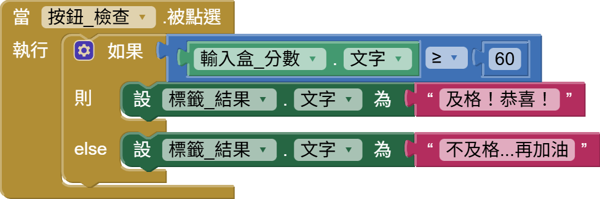
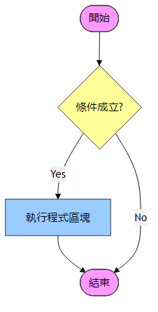
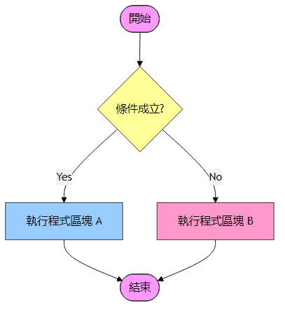
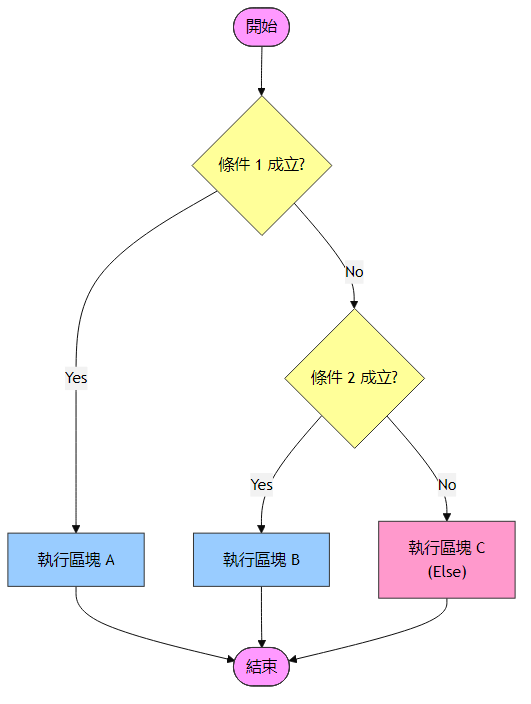
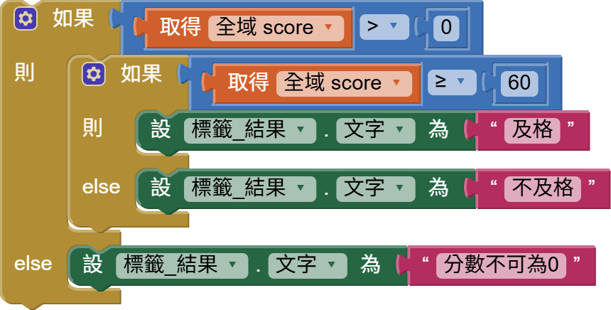

<!-- _class: lead -->
<!-- _paginate: false -->

### Ch. 6

# 流程控制：條件判斷

## Horazon
## 應用程式設計

---

# 本章目標

1. 認識 **布林值 (Boolean)**：電腦世界的 True 與 False。
2. 學習 **比較運算子**：比大小。
3. 掌握 **If 判斷式** 的三種型態。
4. 實作一個「成績判斷」App。

---

# 什麼是「判斷」？

生活充滿了選擇，程式也是：

- **如果** 下雨，**就** 帶傘。
- **如果** 肚子餓，**就** 吃飯。
- **如果** 考 60 分以上，**就** 及格；**否則** 不及格。

在程式裡，我們用 **If (如果) / Then (則) / Else (否則)** 來寫這些邏輯。
這是讓程式「變聰明」的第一步！

---

# 電腦眼中的世界：布林值 (Boolean)

電腦的邏輯很單純，只有兩種可能：

- **True (真)**：成立、是的、有。
- **False (假)**：不成立、不是、沒有。

這就是 **布林值**。所有的判斷式最終都會變成這兩個值之一。

---

<style scoped>
table { font-size: 1em; }
</style>

# 比較運算子 (Comparison)

我們要怎麼產生布林值？通常是透過 **比較**：

| 符號 | 意義 | 範例 (假設 Score=80) | 結果 |
| :---: | :--- | :--- | :--- |
| `=` | 等於 | Score = 100 | False |
| `≠` | 不等於 | Score ≠ 0 | True |
| `>` | 大於 | Score > 60 | True |
| `<` | 小於 | Score < 60 | False |
| `>=` | 大於等於 | Score >= 80 | True |
| `<=` | 小於等於 | Score <= 59 | False |

> 這個積木在 **Logic (邏輯)** 抽屜裡 (綠色)。


---

# 比較運算子圖解

<div style="display: grid; grid-template-columns: 1fr 1fr; gap: 20px; align-items: center;">

- `=` (等於)
- `>` (大於)
- `<` (小於)
- `>=` (大於等於)
- `<=` (小於等於)
- `≠` (不等於)


</div>

電腦看到這些積木，會自動算出 True 或 False。

---

# 實作：成績判斷 App

我們來做一個 App，輸入分數，告訴你及不及格。

### 畫面設計
1. **標籤**：顯示「請輸入分數：」
2. **文字輸入盒 (TextBox)**：改名 `txt_score`，勾選 NumbersOnly。
3. **按鈕 (Button)**：改名 `btn_check`，文字改「檢查」。
4. **標籤 (Label)**：改名 `lbl_result`，字體加大，紅色顯示結果。

---

# 程式設計：判斷及格

我們希望：
- 輸入 60 分以上 -> 顯示「及格」
- 輸入 59 分以下 -> 顯示「不及格」

### 使用 控制 (Control) -> 如果-則-else 積木



---

# 判斷積木三兄弟

在 Control 抽屜裡，你會看到 If 積木。點選藍色齒輪，可以變身成三種型態：

1. **單一選擇 (If)**:
   - 只有 `如果...則...`。
   - 條件不成立時，什麼都不做。
   
2. **二擇一 (If-Else)**:
   - `如果...則...否則...`。
   - 一定會執行其中一條路。
   
3. **多重選擇 (If-ElseIf-Else)**:
   - `如果...則...否則如果不...則...`。
   - 用來處理 3 種以上的狀況 (例如：A, B, C, D 等第)。

---

# 流程圖：單一選擇 (If)

只有在 **條件成立 (True)** 時，才執行動作。

<div style="display: flex; justify-content: center;">
    
</div>

> 例如：如果下雨，帶傘。(沒下雨就不帶，沒寫 Else)

---

# 流程圖：二擇一 (If-Else)

**條件成立** 做 A，**不成立** 做 B。

<div style="display: flex; justify-content: center;">
    
</div>

> 例如：及格 vs 不及格。非黑即白。

---

# 流程圖：多重選擇 (If-ElseIf-Else)

檢查多個條件，找到第一個成立的執行。

<div style="display: flex; justify-content: center;">
    
</div>

> 例如：
> 1. 分數 > 90? -> 優
> 2. 分數 > 80? -> 甲
> 3. 分數 > 70? -> 乙
> 4. 否則 -> 丙

---

# 常見陷阱：順序很重要！

在多重選擇 (If-ElseIf) 中，電腦是 **由上往下** 檢查的。
一旦這條路成立，**後面就不會檢查了！**

### 錯誤示範
```text
如果 分數 > 60 -> 顯示 "丙"
否則如果 分數 > 80 -> 顯示 "甲"  <-- 永遠不會執行！
```
因為 85 分大於 60，第一條就成立了，它就顯示 "丙" 然後結束了。

### 正確做法
要先檢查**最嚴格**的條件 (例如 > 90)，再檢查寬鬆的。

---

# 思考一下：防呆機制

如果使用者輸入 **"ABC"** 或是 **"-100"** 怎麼辦？
程式可能會當機，或者顯示奇怪的結果。

這時候我們就需要更多的 **If** 來檢查，這叫做 **「資料驗證 (Validation)」**：

1. **如果** `txt_score.Text` 是空的？ -> 顯示 "請輸入數字"
2. **如果** 分數 > 100？ -> 顯示 "不可能這麼高分吧"
3. **如果** 分數 < 0？ -> 顯示 "倒扣也不會變負的吧"
4. **否則** -> 執行原本的及格判斷。

---

# 巢狀判斷 (Nested If)

就像 Layout 可以巢狀，If 也可以包 If！




---

# 重點回顧

1. **Boolean**: 電腦的判斷依據 (True / False)。
2. **If ... Then**: 單一條件。
3. **If ... Else**: 二擇一。
4. **Else If**: 多重條件，注意順序 (先嚴格，後寬鬆)。
5. **Validation**: 使用 If 排除錯誤輸入。

<br>
