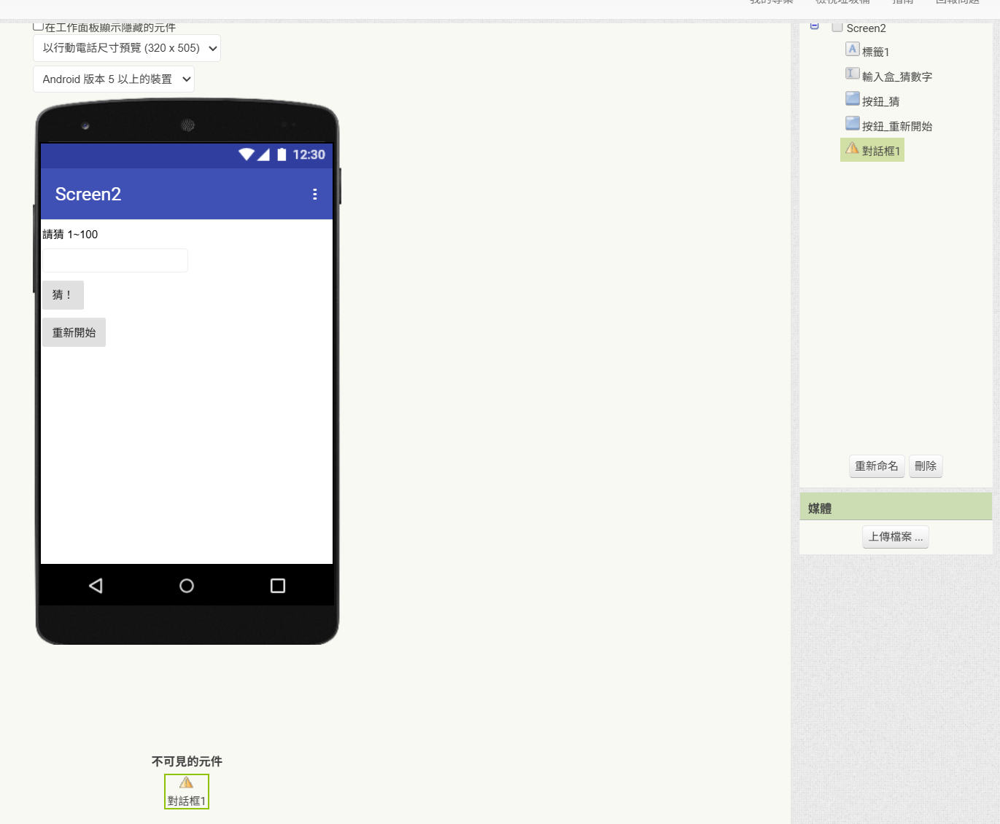
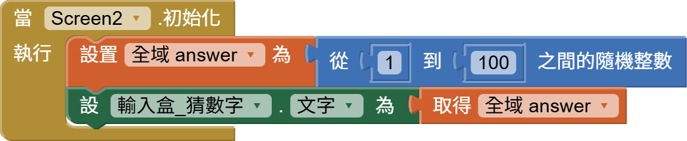
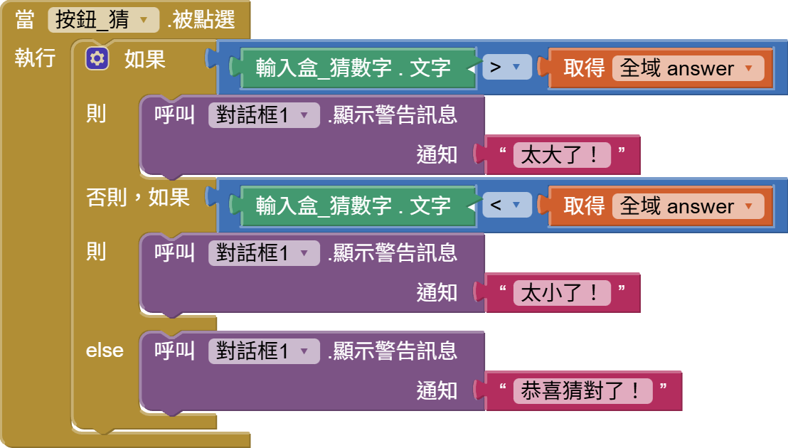

<!-- _class: lead -->
<!-- _paginate: false -->

### Ch. 7

# 亂數產生與變數存取

## Horazon
## 應用程式設計

---

# 本章目標

1. 學習 **亂數 (Random)**：不可預測的樂趣。
2. 學習 **變數 (Variables)**：電腦的記憶體。
3. 認識 **全域變數 (Global)** 與 **區域變數 (Local)**。
4. 製作「終極密碼」猜數字遊戲 (1~100)。

---

# 什麼是亂數 (Random)？

遊戲好玩的地方，就在於**不可預測性**。

- 抽卡機率 (SSR!)
- 爆擊率 (Critical Hit!)
- 掉寶率 (Drop Rate)
- **猜數字的答案** (每次都要不一樣！)

這些都是由「亂數」決定的。在 AI2 裡，我們可以用 **數學 (Math)** 裡的積木來產生。

### 常用積木
- `random integer from [1] to [100]`：產生 1 到 100 的整數。
- `random fraction`：產生 0.0 到 1.0 的小數 (例如 0.87)。

---

# 遊戲規則：終極密碼

1. **Game Start**: 電腦心裡想一個數 (1~100)。
2. **Game Loop**:
   - 玩家輸入數字。
   - 電腦判斷：
     - 太大了！
     - 太小了！
     - 猜對了！
3. **Game Over**: 猜對後，跳出慶祝畫面，提供「再玩一次」按鈕。

---

# 畫面設計

1. **標籤**：顯示提示 (例如 "請猜 1~100")。
2. **文字輸入盒**：改名 `txt_guess`，NumbersOnly 打勾。
3. **按鈕**：改名 `btn_guess`，文字改「猜！」。
4. **按鈕**：改名 `btn_reset`，文字改「重新開始」。
5. **對話框 (Notifier)**：在 **使用者介面** 裡找，拉進去 (非可視元件)。

---

# 變數 (Variables)：電腦的暫存區

我們需要一個地方記住電腦選的「正確答案」。
這個地方就是 **變數**。

### 變數的譬喻
變數就像是一個 **「有標籤的杯子」**。

- **變數名稱 (Name)**：標籤貼紙 (例如 `answer`)。
- **變數值 (Value)**：杯子裡裝的東西 (例如 `50`)。
- **變數類型**：杯子的大小 (裝數字、裝文字...)。

---

# 定義變數 (Global Variable)

在 Blocks 裡找不到 `answer` 屬性，因為它是我們自己定義的。

1. 去 **Variables (變數)** 抽屜 (橘色)。
2. 拉 `<initialize global name to>`。
3. 名字改 `answer`。
4. 初始值隨便給個 `0` (反正程式開始跑會重設)。

> **全域 (Global)** 的意思是：這個變數在整個 Screen1 任何地方都可以用。

---

# 操作變數：Set 與 Get

定義好之後，Variables 抽屜會多出兩個積木：

### get (取值)
- **讀取** 杯子裡的東西。
- 就像「拿出來看」 (東西還在)。
- 用於：比大小的時候 (`if get answer > 50`)。

### set (設值)
- **放入** 新的東西到杯子裡。
- **舊的東西會被丟掉！**
- 用於：重置遊戲時 (`set answer to random 1-100`)。

---

# 遊戲初始化流程

遊戲開始時 (Screen1.Initialize) 和 重置時 (Button.Click)，要做一樣的事：

1. 隨機產生一個答案 -> 存入 `answer` 變數。
2. 清空輸入框。
3. 顯示提示訊息。

> 為了避免程式碼重複，我們會把這些步驟包成一個 **程序 (Procedure)** (之後會教)。

---

# 核心邏輯：判斷大小

當「猜」按鈕 (`btn_guess`) 被按下：

我們需要三個判斷 (If-ElseIf-Else)：

1. **If** `get answer` < `txt_guess.Text` (電腦 < 玩家)
   - 顯示 "太大了！"
2. **Else If** `get answer` > `txt_guess.Text` (電腦 > 玩家)
   - 顯示 "太小了！"
3. **Else** (等於)
   - 顯示 "猜對了！"
   - 跳出慶祝視窗 (Notifier)。

---

# 實作：積木組合

###Notifier 的用法
`call Notifier1.ShowAlert notice "訊息"`
- ShowAlert 會像吐司 (Toast) 一樣，顯示一下就消失，適合這種提示訊息。

---

# 觀念：隨機 (Random) 與 種子 (Seed)

### 為什麼要有隨機種子？
電腦其實無法產生「真正的」亂數，它是靠數學公式算出來的 (偽亂數)。
- **隨機種子 (Random Seed)**：就是這個公式的「起始值」。

### 重要特性
- 如果 **種子一樣** -> 產生的 **亂數序列就一樣**！
- AI2 預設會用「當下時間」當種子，所以每次玩都不一樣。
- 但如果你設死 `Random Seed = 123`，那每次重開 App，答案都會是同一個順序！(測試時很有用)

---

# 變數的作用域 (Scope)

除了 Global，還有 **Local (區域變數)**。

- **Global**: 整個螢幕大家都認識它。
  - 用途：分數、等級、設定值。
  
- **Local**: 只有在某個積木 **裡面** 才有效。
  - 用途：臨時計算用的中間值 (例如迴圈變數 `i`)。
  - 優點：用完即丟，節省記憶體，也不會干擾別人。
  
*(初學者先用 Global 就可以搞定 90% 的需求)*

---

# 延伸思考：猜次數限制

如果我想限制玩家「只能猜 5 次」？

1. 需要一個新變數 `guess_count`，初始值 5。
2. 每次猜錯，`set guess_count to (get guess_count - 1)`。
3. 判斷 `If guess_count <= 0` -> Game Over。

這就是變數的強大之處！我們可以記錄狀態。

---

# 重點回顧

1. **random integer**: 產生 1~100 的亂數。
2. **Initialize Global**: 建立全域變數 (貼標籤)。
3. **Set**: 改變變數的值 (賦值)。
4. **Get**: 讀取變數的值。
5. **Logic**: 結合 If 判斷與變數，做出有「記憶」的遊戲。

 
