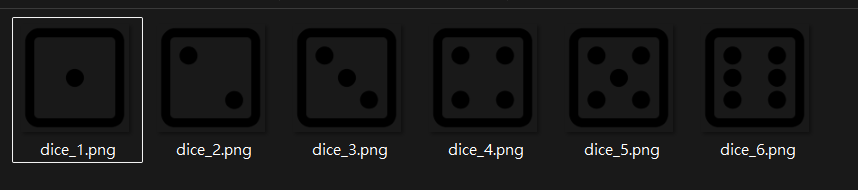
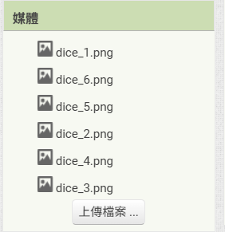
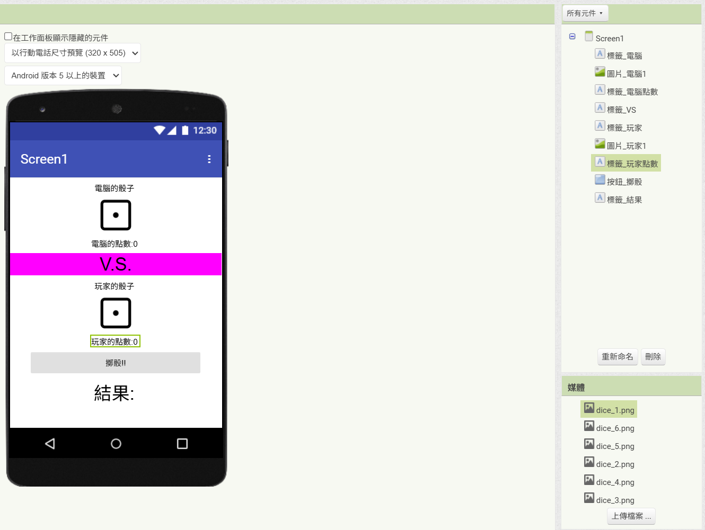
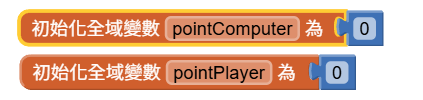
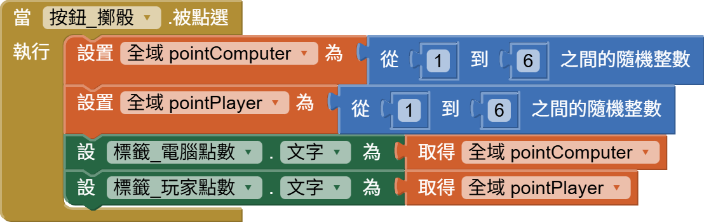
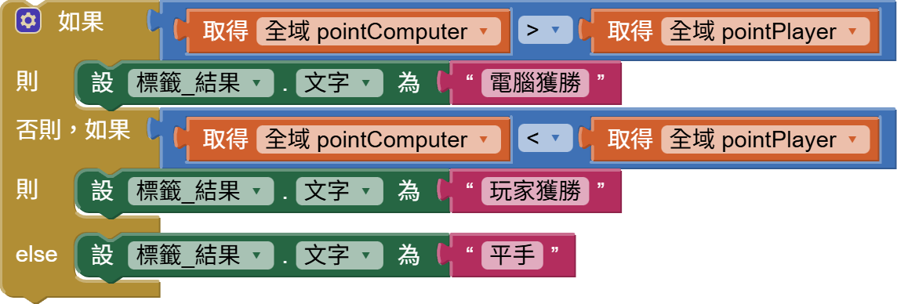
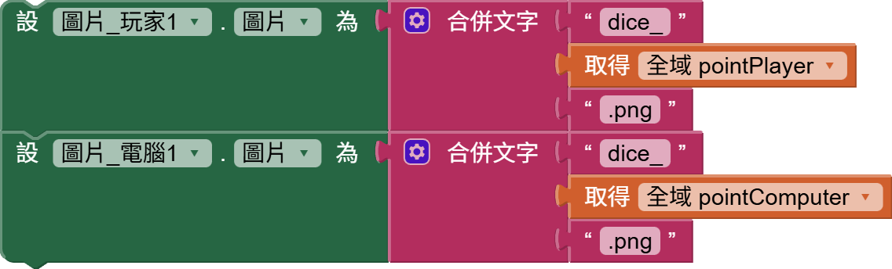
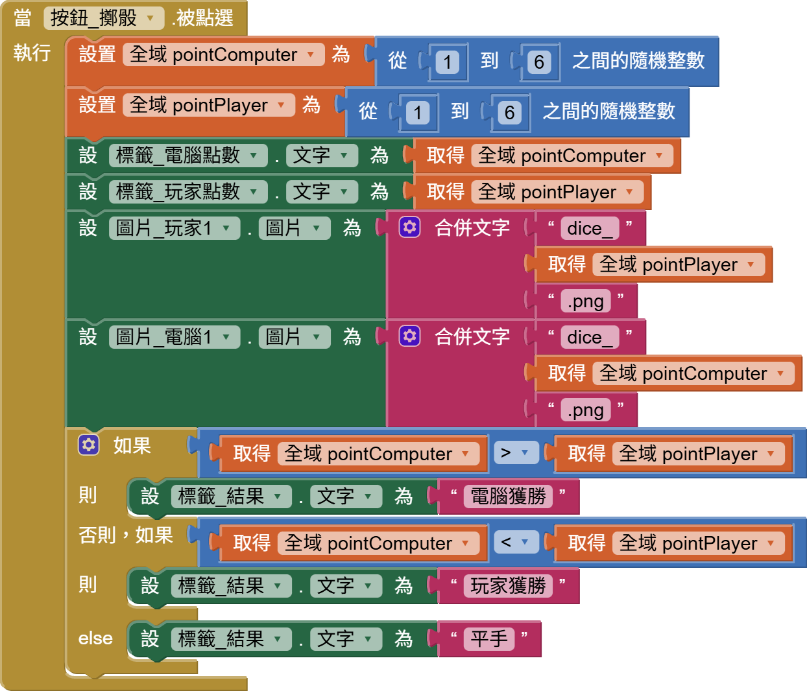

<!-- _class: lead -->
<!-- _paginate: false -->

### 作業 2

# 骰子比大小

## Horazon
## 應用程式設計

---

# 作業目標

1. 練習 **亂數 (Random)**：兩邊都要隨機擲骰子。
2. 練習 **圖片切換**：根據點數顯示對應圖片。
3. 練習 **比較判斷**：誰的點數大？

---

# 前置準備

下載圖片壓縮檔，解壓縮
下載圖片壓縮檔，解壓縮

將所有圖片拉至媒體區域

---

# 畫面設計

- 電腦區域
   - **標籤_電腦**：顯示「電腦的骰子」
   - **圖片_電腦** ：預設顯示 `dice_1.png`
   - **標籤_電腦點數**：顯示「電腦的點數:0」
- **標籤_V.S.**：顯示 "V.S."
- 玩家區域
   - **圖片_玩家** ：預設顯示 `dice1.png`
   - **標籤_玩家**：顯示「你的骰子」
   - **標籤_玩家點數**：顯示「你的點數:0」
- 擲骰子區域
   - **按鈕_擲骰子** ：按下後開始比賽
   - **標籤_結果** ：顯示「你贏了！」或「電腦贏了...」

---
# 畫面設計

---
# 程式邏輯(1)

先製作兩個變數，儲存雙方的骰子點數

當按鈕按下去，先顯示文字就好

---
# 程式邏輯(2)

勝負判斷

注意：放入剛才的按鈕行為 最後面 
(為什麼要這樣做？)

---
# 程式邏輯(3)

我們要讓圖片顯示出骰子點數
這邊利用串接方式，來完成圖片名稱設置
如：3點則 "dice_"+"3"+".png" = "dice_3.png"

注意：放入剛才的按鈕行為

---

# 程式邏輯提示

當 `按鈕_擲骰子` 被點選：

1. 宣告兩個**區域變數 (Local Variables)**：`pointComputer`, `pointPlayer`
2. 兩個變數都設為 `隨機整數 1~6`
3. 設定圖片：
   - Image_PC.Picture = "dice_" + pointComputer + ".png"
   - Image_Player.Picture = "dice_" + pointPlayer + ".png"
4. 判斷輸贏 (If / Else If / Else)：
   - 如果 `pointPlayer > pointComputer` -> 顯示「你贏了！」
   - 如果 `pointPlayer < pointComputer` -> 顯示「電腦贏了...」
   - 否則 -> 顯示「平手！」

---
# 目前的完整程式

---

# 加分項目

### 進階挑戰：雙骰子大戰

1.  **升級規則**：電腦與玩家雙方都必須擲出 **兩顆骰子**。
2.  **圖片顯示**：兩顆骰子的圖片要分別顯示，而且要各自隨機 (不能兩顆永遠一樣)。
3.  **勝負判斷**：計算兩者的 **總和 (Sum)**，點數總和最大者獲勝。

> 提示：你會需要更多的變數 (例如 `pointComputer1`, `pointComputer2`...)
> 要注意，骰子的點數要各自隨機

---

# 評分標準

| 項目 | 配分 | 說明 |
|:---|:---:|:---|
| **基本功能** | 80% | 1. 功能正常(包含勝負、圖片)  2. 元件務必在範圍內 |
| **進階功能：兩顆骰子** | 20% | 1. 電腦與玩家雙方都必須擲出兩顆骰子 2. 兩顆骰子的圖片要合理 (各自隨機) 3. 計算兩者的總和 (Sum)，並正確判斷勝負 (Point > Sum) |

---

# 繳交方式

1. 在 AI2 網頁，選擇 **「建置」→「Android App 安裝檔 (.apk)」**
2. 等待進度條跑完，下載 `.apk` 檔案
3. 將此檔案繳交至創課平台

