<!-- _class: lead -->
<!-- _paginate: false -->

### Ch. 11

# 清單資料結構與演算法

## Horazon
## 應用程式設計

---

# 本章目標

1. 認識 **清單 (List)** 資料結構。
2. 學習 **建立 (Create)** 與 **操作 (CRUD)** 清單。
3. 結合 **迴圈 (Loop)** 遍歷清單。
4. 實作：樂透開獎機 (不重複號碼)。

---

# 變數不夠用了？

假設我們要寫一個 App 記錄全班 50 個人的成績。
用之前的變數做法：

- `score1` = 90
- `score2` = 85
- ...
- `score50` = 60

你要拉 50 個變數積木嗎？**太可怕了！**

---

# 什麼是清單 (List)？

變數像是一個**杯子**，只能裝一個東西。
清單像是一個**置物櫃**，可以裝很多東西，每一格都有編號。

- `scores = [100, 90, 85, 70, ...]`
- `names = ["Alice", "Bob", "Charlie"]`

我們只需要一個變數名稱 `scores`，就可以管理 50 個分數！

---

# 索引 (Index)

清單裡的每一格都有編號，這個編號叫做 **索引 (Index)**。

### ⚠️ 重要觀念
- 大部分程式語言 (C, Java, Python) 是從 **0** 開始數。
- **App Inventor 是從 1 開始數！**
  - 第 1 格：Index 1
  - 第 2 格：Index 2

> 如果你去拿 Index 0 或是超過長度的 Index，程式會報錯 (Error)。

---

# 建立清單

在 Blocks 的 **Lists (淺藍色)** 抽屜：

### 1. 固定清單 (Make a list)
- 用於一開始就知道內容的。
- 例：星期一、星期二...星期日。

### 2. 空清單 (Create empty list)
- 用於一開始不知道內容，後面才要加進去的。
- 例：樂透號碼 (一開始是空的，球掉出來才填入)。

---

# 清單是一種型態，你還是需要一個變數!

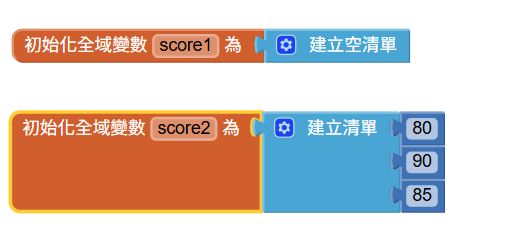

你可以在程式碼中臨時使用，會向上面這樣建立清單變數

---

# 清單操作 (CRUD)

資料結構最核心的四個動作：

1. **新增 (Add)**: `add items to list`
   - 把東西加到清單最後面。
   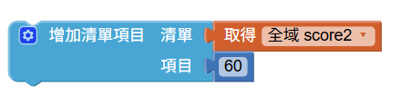
2. **讀取 (Read/Select)**: `select list item`
   - 指定 index，把東西拿出來看。
   - 注意：index是從1開始。
   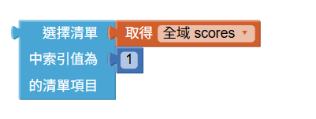

---

# 清單操作 (CRUD)

3. **修改 (Update/Replace)**: `replace list item`
   - 把指定 index 的東西換掉。
   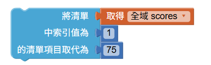
4. **刪除 (Delete/Remove)**: `remove list item`
   - 把指定 index 的東西丟掉 
   - 重要：後面的元素的會補上來。
   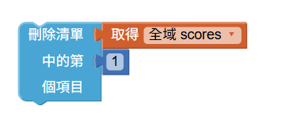

---

# 實作：樂透開獎機

目標：按一下按鈕，產生 6 個 **不重複** 的號碼 (1~49)。

### 為什麼要強調「不重複」？
如果你只用 `隨機整數 1~49` 做 6 次，有可能出現 `[5, 5, 12, ...]`。
樂透不能有兩個 5 號！

這就需要 **演算法 (Algorithm)**。

---

# 演算法邏輯

我們使用 `While` 迴圈搭配 `is in list` 檢查：

1. 準備一個空清單 `lotto_list`。
2. 執行6次 (找到6個數字)，重複做：
    a. 產生一個隨機數 `n` (1~49)。
    b. **檢查**：如果 `n` **不在** (`not is in list`) 清單裡？
       - 把它 **加入** 清單。
    c. 如果在裡面？(代表重複了)
       - 什麼都不做，再抽一次。

---

# 演算法邏輯

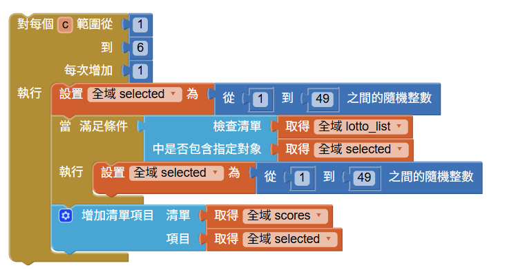

---

# 顯示結果

迴圈跑完後，我們得到一個有 6 個號碼的清單。
怎麼顯示在 Label 上？

### 簡單法

- 結果：`(1 15 23 42 45 49)` (無法控制格式)。
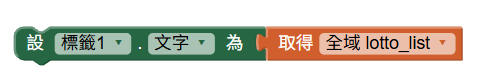

---

# 另一種迴圈：For Each Item

如果我們要把它們一個一個列出來？
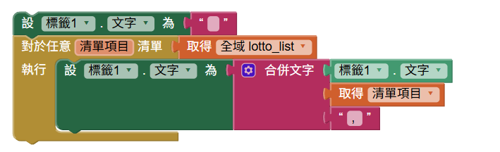

- 這個迴圈會自動把清單從頭到尾跑一遍。
- `item` 變數會依序變成 1, 15, 23...

---

# 隨機抽取 (Pick Random Item)

Lists 抽屜還有一個神器：`隨機抓取`。

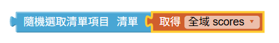

- 如果你已經有一個名單 `["小明", "小華", "小美"]`。
- 直接用這個積木，它會幫你隨機選一個人。
- **不用** 自己產生亂數 index 再去 select。

---

# 尋找最大的數值

給予一個清單 [20,30,1,15,70,14,50]，我們想找到**最大的數值**以及**位置**

1. 先假設 最大值為第1個元素 (20)
2. 檢查所有元素
3. 如果比目前最大值還大，就更新最大值
4. 最後回傳最大值

---

# 尋找最大的數值

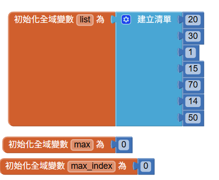
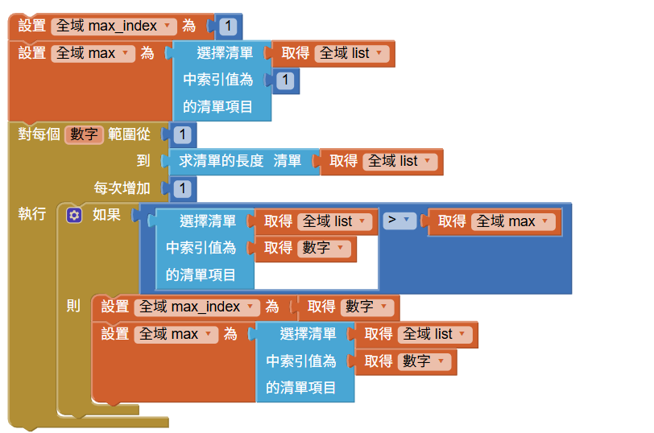

---

# 資料結構 與 演算法

本章使用的**清單**是一種**資料結構**(Data Structure)。
- 清單可以很方便的存取元素、檢查元素是否存在、遍歷清單等。
- 清單可以讓我們更方便的處理大量資料。

而**演算法**(Algorithm)就是處理資料結構的一套解法步驟。
- **尋找最大值**是一個問題。
- 而 前一份投影片的方法 就是演算法的一種。
- 同一個問題不只一種演算法。

資料結構與演算法常常是相輔相成的。

---

# 重點回顧

1. **List**: 清單，可以裝很多資料。
2. **Index**: 從 1 開始的門牌號碼。
4. **For Each Item**: 最適合處理清單的迴圈。
5. **資料結構 & 演算法**: 好的資料結構 (List) 可以讓演算法更簡單！

 
