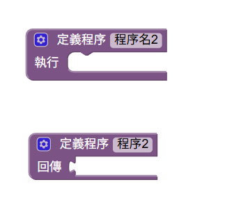
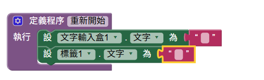
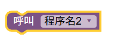
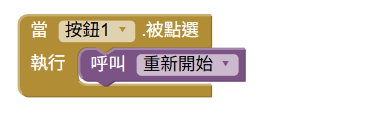
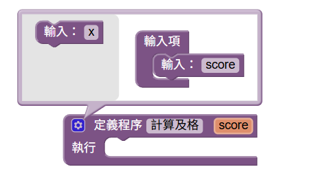
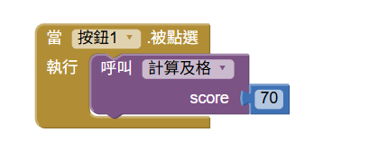
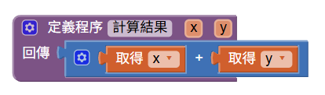
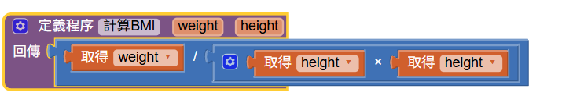
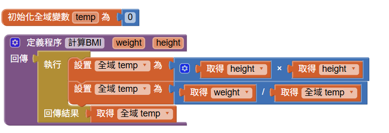
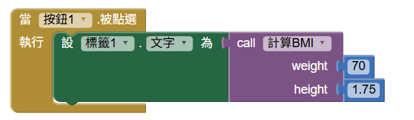

<!-- _class: lead -->
<!-- _paginate: false -->

### Ch. 12

# 函式與程序 (Procedure)

## Horazon
## 應用程式設計

---

# 本章目標

1. 了解程式設計中的 **「模組化」** 概念。
2. 學習建立 **無回傳值 (Do)** 的程序。
3. 學習建立 **有回傳值 (Result)** 的程序。
4. 學會如何設定與使用 **參數 (Parameters)**。

---

# 情境：如果沒有程序會怎樣？

想像你正在寫一個射擊遊戲：

- 當玩家「按下重新開始」：
  1. 分數歸零
  2. 敵人回到原點
  3. 播放開始音效

- 當玩家「角色死亡」後復活：
  1. 分數歸零
  2. 敵人回到原點
  3. 播放開始音效

這兩件事情的動作 **完全一樣**！

---

# 傳統寫法的缺點

如果你每次都把這 3 個積木拉一遍...

1. **浪費時間**：同樣的積木你要拉好幾次。
2. **容易出錯**：如果不小心拉錯一個字，遊戲就會出現 Bug。
3. **很難修改**：如果老闆說「遊戲開始要多播放一個動畫」，你就要去修改 **所有** 複製過的地方。

這時候，我們需要 **程序 (Procedure)**！

---

# 什麼是程序 (Procedure)？

簡單來說：**把一堆積木打包起來，貼上一個新標籤！**

在程式設計裡，這叫做 **DRY 原則** (Don't Repeat Yourself)：
**「不要重複你自己」**。

把重複的事情寫成一個程序，以後只要「呼叫」它就可以了。

---

# 紫色的 Procedures 抽屜

在 AI2 的積木區，有一個紫色的 **Procedures** 抽屜。
裡面有兩個最重要的積木：

第一個可以"做一件事情"，第二個是"計算出一個結果"
我們先從最簡單的 **做一件事情** 開始！

---

# 建立你的第一個程序

1. 拉出 `定義程序` 積木。
2. 點擊 `程序名` 這個字，幫它改個好懂的名字。
   - 例如：`ResetGame` (重置遊戲)。
3. 把你要執行的動作（分數歸零、敵人回原點）塞進 `執行` 內。

> **注意：** 這樣做只是「定義」了這組動作，程式還不會執行它喔！

---

# 如何呼叫 (Call) 程序？

當你建立好 `ResetGame` 之後，神奇的事情發生了！
在紫色的 Procedures 抽屜裡，會自動多出一個新積木：

---

# 享受程序的便利

現在，你可以把 `call ResetGame` 放在任何需要的地方。

整個程式碼變得非常乾淨、好懂！
而且如果要修改，只要改 `ResetGame` 裡面，所有地方都會自動跟著變！

---

# 讓程序變聰明：參數 (Parameters)

有時候，我們的程序需要一點點變化。
例如：「加分程序」，有時候加 10 分，有時候扣 5 分。
這時我們需要給程序裝上 **「參數」(Inputs)**。

參數就像是投幣機的投幣口，你要給它代幣，它才能辦事。

---

# 如何加上參數？

1. 點擊程序積木左上角的 **藍色小齒輪**。
2. 把左邊的 `input x` 拖進右邊的 `inputs` 裡。
3. 幫參數取一個有意義的名字，例如 `points` (分數)。

現在你的 `call` 積木旁邊，就會多出一個缺口，要你填入數字了！

---

# 參數的使用範例

定義：

呼叫：
- 計算及格：輸入為分數，會印出"及格/不及格"

---

# 有回傳值的程序 (Result)

剛才教的 `do`，是叫電腦去做事 (命令)。
現在要教的 `result`，是叫電腦去 **算數學 (計算機)**！

- 拉出 `to procedure result` 積木。
- 肚子裡放的是「計算過程」。
- `result` 旁邊要放的是「計算出來的結果」。

---

# Result 程序範例：算 BMI

我們建立一個 `CalculateBMI` 程序。
設定兩個參數：`height` (身高) 和 `weight` (體重)。

在 `result` 的缺口接上數學公式：
`weight / (height * height)`

---

# Result 程序範例：算 BMI

有時候程式碼比較複雜，可以利用**控制**區塊內的
執行..回傳結果.. 來執行更多內容

---

# Result 程序範例：算 BMI

呼叫時：

這個程序變成了一個方便的計算機！

---

# 重點回顧

1. **Procedure (程序)**：打包重複的程式碼，方便管理與使用。
2. **DRY 原則**：Don't Repeat Yourself (不要做白工)。
3. **執行 vs 結果**：執行一串動作 vs 進行運算並回傳數值。
4. **Parameters (參數)**：讓程序更靈活，可以處理不同的狀況。

 
