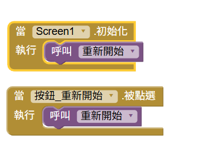
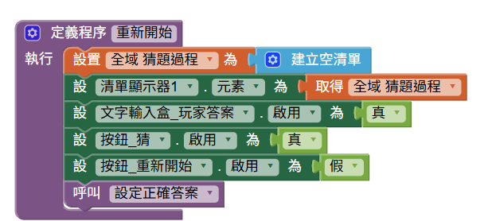
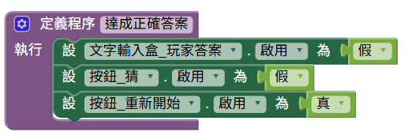
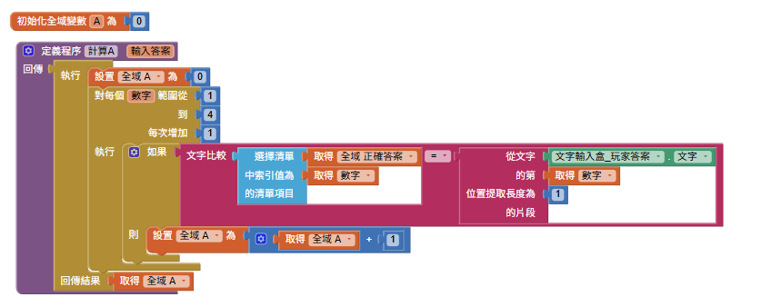
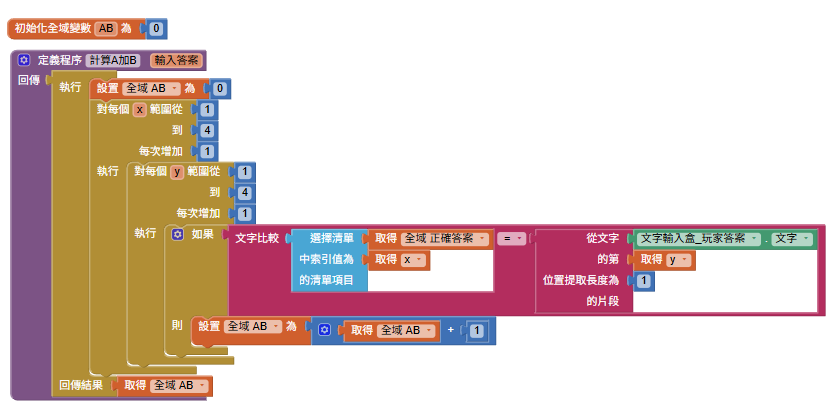

<!-- _class: lead -->
<!-- _paginate: false -->

### 作業 3

# 猜數字遊戲 (xAxB)

## Horazon
## 應用程式設計


---

# xAxB 範例

## 秘密數字為 **1 3 5 7**

| 猜測 | 結果 | 說明 |
|:---:|:---:|:---|
| `1 2 3 4` | **1A1B** | 1 在對的位置(A)；3 有但位置錯(B) |
| `5 3 7 1` | **1A2B** | 3 對位(A)；5、1 有但錯位(B) |
| `1 3 5 7` | **4A0B** | 全對！遊戲結束！ |

> **本次作業只需完成 A 的計算，B 為加分題！**


---

# 遊戲規則

電腦偷偷產生一個 **4 位數的秘密數字**（每個數字皆不重複）。

玩家每次輸入一個猜測，電腦回應：

| 符號 | 意思 |
|:---:|:---|
| **xA** | x 個數字**位置正確** |
| **xB** | x 個數字**有在裡面但位置錯了** |

---

# 遊戲系統分析

1. 秘密數字：4 位數的數字，每個數字皆不重複。
2. 猜測：玩家輸入一個 4 位數的數字。
3. 判斷：比較玩家的猜測與秘密數字，計算 A 和 B。
    - **A：** 位置正確的位數。
    - **B：** 數字有在秘密數字裡，但位置不對。
4. 結果：顯示 A 和 B 的數量。
5. 遊戲結束：當 A = 4 時，遊戲結束，顯示「恭喜！你猜對了！」。
6. 遊戲紀錄：顯示所有猜測紀錄。

---

# 畫面設計


- **文字輸入框_玩家答案**：玩家輸入猜測（限制只能輸入數字）
- **按鈕_猜**：按下後進行判斷
- **清單顯示器_紀錄**：累積顯示所有猜測紀錄
- **按鈕_重新開始**：重新產生秘密數字，清空紀錄

- **其他標籤**：提示用標籤，如「輸入 4 位不重複的數字」

---

# 畫面設計（參考）


---

# 程式邏輯 (1)：用清單儲存秘密數字

使用一個 **全域變數 `秘密清單`** 存放 4 個數字。

做法與第 11 章的「樂透開獎機」一模一樣：

```
秘密清單 = 空清單
重複直到 秘密清單的長度 = 4：
    n = 隨機整數 0 到 9
    如果 n 不在 秘密清單 裡：
        將 n 加入 秘密清單
```

最終 `秘密清單` 會長這樣：`[1, 3, 5, 7]`

---

# 程式邏輯 (2)：取出個別位數

**清單**用 `select list item` 取出指定位置的數字：

| 積木 | 結果 |
|:---|:---:|
| `select list item 秘密清單 index 1` | `1` |
| `select list item 秘密清單 index 2` | `3` |
| `select list item 秘密清單 index 3` | `5` |
| `select list item 秘密清單 index 4` | `7` |

玩家的**猜測**（字串 `"1357"`）仍用 `文字.字元數段` 逐位取出，再與清單比對。

---

# 程式邏輯 (3)：計算 A

建立一個 **有回傳值的程序 `計算A`**：
- 參數：`猜測` (玩家輸入的 4 位數字串)
- 回傳：**A 的數量**（位置正確的位數）

邏輯：

```
countA = 0
對每個位置 i（1、2、3、4）：
    猜的第i位 = 文字.字元數段(猜測, i, 長度1)
    秘密的第i位 = select list item(秘密清單, i)
    如果 兩者相同：
        countA = countA + 1
回傳 countA
```


---

# 遊戲開始 與 重新開始 邏輯

- 開啟須顯示的UI
- 關閉須關閉的UI
- 清空資料
- 清空顯示資料
- 重新計算「題目/正確答案」

---
# 遊戲開始 與 重新開始 邏輯






---

# 遊戲結束邏輯

- 開啟須顯示的UI
- 關閉須關閉的UI



---

# 程式邏輯：計算A的數量


---

# 程式邏輯：計算A+B的數量



---


# 程式邏輯提示

當 `按鈕_猜` 被點選：

1. 讀取 **文字輸入框_猜測** 的內容
2. 呼叫 **`計算A`** 程序，取得 A 的數量
3. 呼叫 **`計算AB`** 程序，取得 A+B 的數量
4. 將結果顯示在 **標籤_結果**（例如 `"2A0B"`，B 為 AB值-A值）
5. 將這次猜測與結果**附加**到 **標籤_紀錄**
6. 判斷是否 **4A**，若是則顯示「恭喜！你猜對了！」

---

# 加分題：計算 B

B 的定義：**數字有在秘密數字裡，但位置不對**。

用清單的 **`is in list`** 積木，可以讓 B 的計算非常簡單：

```
countAB = 0
對每個位置 i（1、2、3、4）：
    猜的第i位 = 文字.字元數段(猜測, i, 長度1)
    如果 猜的第i位 在 秘密清單 裡：   ← is in list
        countAB = countAB + 1

countB = countAB - countA
```

> 這正是清單比純文字更方便的地方！

---

# 評分標準

| 項目 | 配分 | 說明 |
|:---|:---:|:---|
| **基本功能** | 80% | 1. 能正確計算並顯示 A 的數量<br>2. 猜測紀錄能累積顯示<br>3. 4A 時顯示恭喜訊息<br>4. 重新開始功能正常 |
| **加分：計算 B** | 20% | 能正確計算並顯示 B 的數量 |

---

# 繳交方式

1. 在 AI2 網頁，選擇 **「建置」→「Android App 安裝檔 (.apk)」**
2. 等待進度條跑完，下載 `.apk` 檔案
3. 將此檔案繳交至創課平台


