<!-- _class: lead -->
<!-- _paginate: false -->

### 作業 3

# 猜數字遊戲 (xAxB)

## 教學版本
## Horazon
## 應用程式設計

---

# xAxB 範例

## 秘密數字為 **1 3 5 7**

| 猜測 | 結果 | 說明 |
|:---:|:---:|:---|
| `1 2 3 4` | **1A1B** | 1 在對的位置(A)；3 有但位置錯(B) |
| `5 3 7 1` | **1A2B** | 3 對位(A)；5、1 有但錯位(B) |
| `1 3 5 7` | **4A0B** | 全對！遊戲結束！ |

> **本次作業只需完成 A 的計算，B 為加分題！**

---

# 遊戲規則

電腦偷偷產生一個 **4 位數的秘密數字**（每個數字皆不重複）。

玩家每次輸入一個猜測，電腦回應：

| 符號 | 意思 |
|:---:|:---|
| **xA** | x 個數字**位置正確** |
| **xB** | x 個數字**有在裡面但位置錯了** |

---

# 遊戲系統分析

1. 秘密數字：4 位數的數字，每個數字皆不重複。
2. 猜測：玩家輸入一個 4 位數的數字。
3. 判斷：比較玩家的猜測與秘密數字，計算 A 和 B。
    - **A：** 位置正確的位數。
    - **B：** 數字有在秘密數字裡，但位置不對。
4. 結果：顯示 A 和 B 的數量。
5. 遊戲結束：當 A = 4 時，遊戲結束，顯示「恭喜！你猜對了！」。
6. 遊戲紀錄：顯示所有猜測紀錄。

---

# 畫面設計

- **文字輸入框_玩家答案**：玩家輸入猜測（限制只能輸入數字）
- **按鈕_猜**：按下後進行判斷
- **清單顯示器_紀錄**：累積顯示所有猜測紀錄
- **按鈕_重新開始**：重新產生秘密數字，清空紀錄

- **其他標籤**：提示用標籤，如「輸入 4 位不重複的數字」

- **作弊標籤**：顯示正確的答案，等測試完成，將這個隱藏!

---

# 畫面設計（參考）

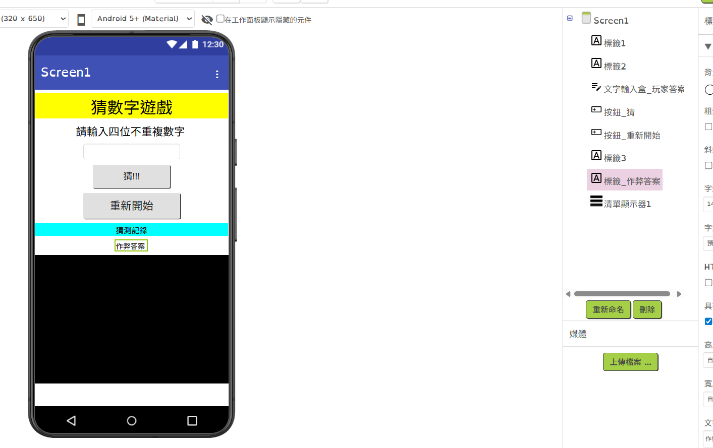

---

# 拆解問題 - 定義資料

玩家輸入的答案，暫定為文字
但正確答案，使用數字清單

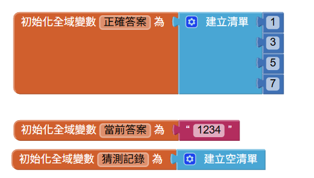

---

# 拆解問題 - 特殊函式

我們要思考，有沒有比較特殊的功能要實作
要把問題拆到多細，視熟悉度而定。
(不需要在這個階段就知道怎麼實作!)

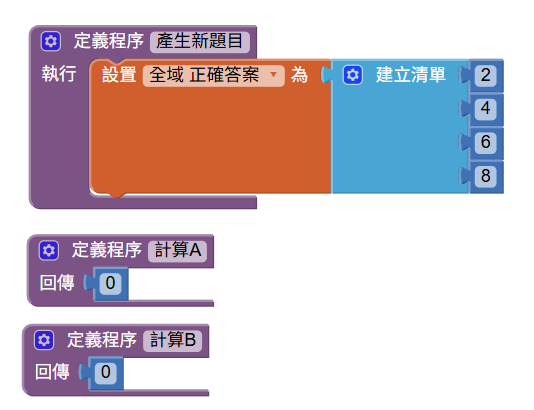

---

# 拆解問題 - 起始狀況 / 按鈕-重新開始

相同的功能可以整合

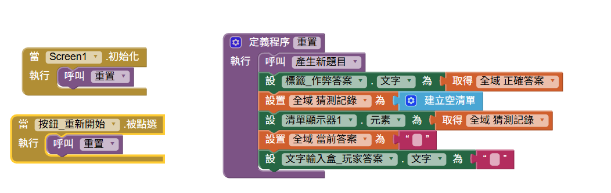

---

# 拆解問題 - 介面互動 [猜按鈕] 

我們希望產生紀錄，若正確答案為1357，出現"**1234 => 1A1B**"
但我們先簡化一點..
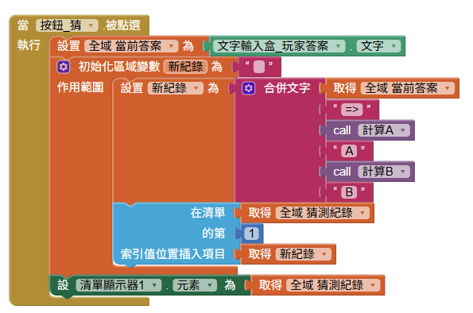

---

# 拆解問題 - 介面互動 [猜按鈕] 

改回呼叫函式，並且加上判斷!

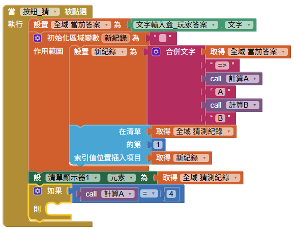

---

# 各個擊破：計算A的數量

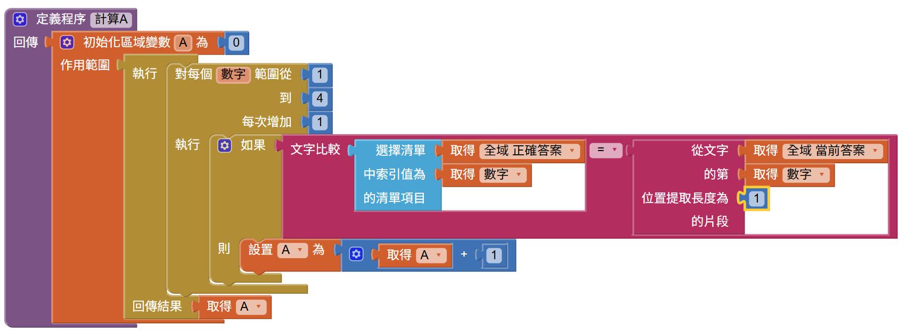

---

# 各個擊破：計算B的數量

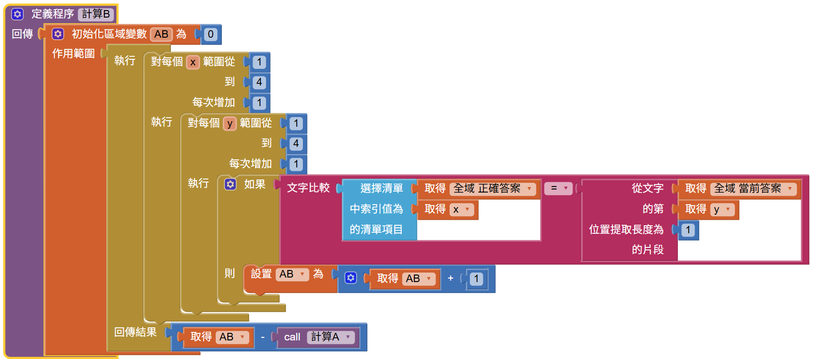

---

# 遊戲結束邏輯

#### 當猜到正確答案時，不要讓使用者繼續輸入，讓他按下重新開始吧

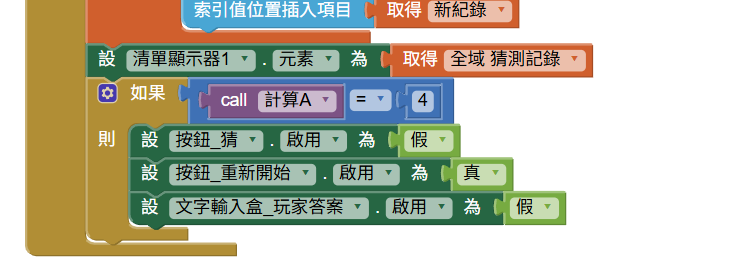

---
# 而按下初始化/重新開始 也加上介面控制邏輯

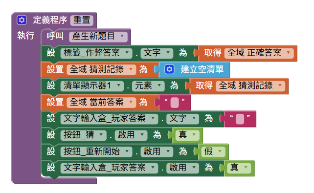

---

# 好像完成了...? [產生新題目]

我們只剩下一個部分，出題的部分，就留給你們試試看吧!!

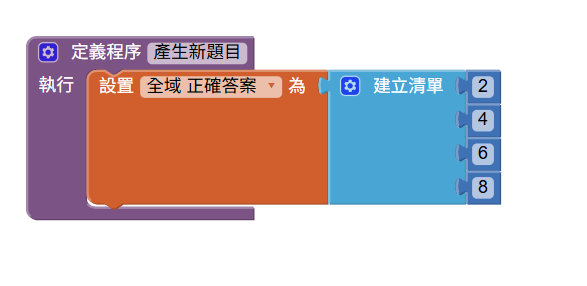

> 注意：正常這種遊戲，數字必須為四位數，且不可重複!
> 不過數字如果重複，還是會給你一些分數
> 注意2：不要關閉"作弊答案"，不然我很難批改作業 :)

---

# 評分標準

| 項目 | 配分 | 說明 |
|:---|:---:|:---|
| **基本功能** | 80% | 1. 能正確計算並顯示 A,B 的數量 2. 猜測紀錄能累積顯示 3. 重新開始功能正常 |
| **加分：隨機出題** | 20% | 1. 可隨機出四位數字題目 +10%  2. 隨機出題不出現重複數字+5% 3. 首位數字可為0 +5% |

---

# 繳交方式

1. 在 AI2 網頁，選擇 **「建置」→「Android App 安裝檔 (.apk)」**
2. 等待進度條跑完，下載 `.apk` 檔案
3. 將此檔案繳交至創課平台

