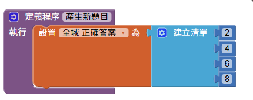
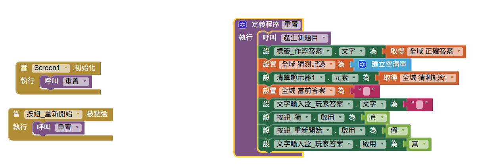
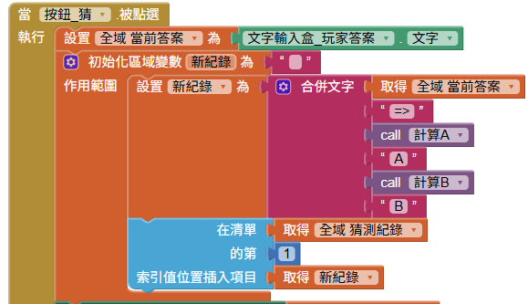
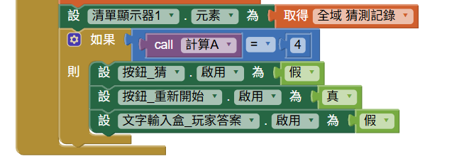

<!-- _class: lead -->
<!-- _paginate: false -->

### 作業 3

# 猜數字遊戲 (xAxB)

## 參考版本
## Horazon
## 應用程式設計

---

# 畫面設計

- **文字輸入框_玩家答案**：玩家輸入猜測（限制只能輸入數字）
- **按鈕_猜**：按下後進行判斷
- **清單顯示器_紀錄**：累積顯示所有猜測紀錄
- **按鈕_重新開始**：重新產生秘密數字，清空紀錄

- **其他標籤**：提示用標籤，如「輸入 4 位不重複的數字」

- **作弊標籤**：顯示正確的答案，等測試完成，將這個隱藏!

---

# 畫面設計（參考）

---

# 拆解問題 - 定義資料

玩家輸入的答案，暫定為文字
但正確答案，使用數字清單

---

# 各個擊破：產生新題目

> 這邊是未完成版，這段是加分項目 (20%)

---

# 各個擊破：計算A的數量

---

# 各個擊破：計算B的數量

---

# 重置 (初始化/重新開始)

---

# 猜題按鈕(1)

---

# 猜題按鈕(2)

---

# 評分標準

| 項目 | 配分 | 說明 |
|:---|:---:|:---|
| **基本功能** | 80% | 1. 能正確計算並顯示 A,B 的數量 2. 猜測紀錄能累積顯示 3. 重新開始功能正常 |
| **加分：隨機出題** | 20% | 1. 可隨機出四位數字題目 +10%  2. 隨機出題不出現重複數字+5% 3. 首位數字可為0 +5% |

---

# 繳交方式

1. 在 AI2 網頁，選擇 **「建置」→「Android App 安裝檔 (.apk)」**
2. 等待進度條跑完，下載 `.apk` 檔案
3. 將此檔案繳交至創課平台

