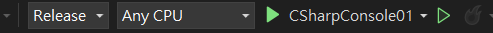
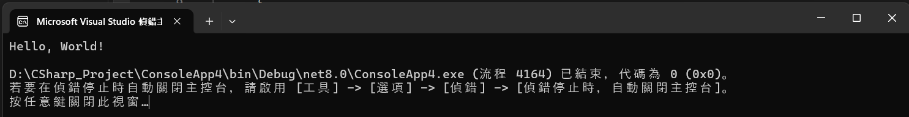

<!-- _class: lead -->
<!-- _paginate: false -->

### Ch. 3
# 你好世界
## Horazon
## C#程式設計

---
# Microsoft Visual Studio
<br>

#### 下載與安裝
https://visualstudio.microsoft.com/zh-hant/downloads/
<br>

#### 建議註冊微軟帳號、能註冊Github帳號更好
---
# 開啟專案
#### 在初學程式的時候，我們使用較純粹的方式來學習
#### 主控台應用程式 (必須選擇C#)


開啟時會要求你決定名稱，及一些其他設定(可忽略)

---
# Visual Studio IDE 展示
<!-- 縮小一點 -->
<style scoped>
img {
  transform: scale(1);
  translate: 0 -20px
}
</style>


---
# Visual Studio 主要介面

#### 方案總管 (右上)
#### 主要區域 (程式碼、中間)
#### 屬性 (右下)
#### 其他資訊(左側)

#### 錯誤清單 (下方)
#### 輸出 (下方)
<br>
如果消失，如何開啟？  <mark>工具列 > 檢視 > 需要的區塊</mark>

---
# Visual Studio 其他建議設置
####  工具列 > 工具 > 選項
* 環境 > 可切換為 深色
* 環境 > 字型  可改動為喜歡字型 (建議粗體字=固定等寬字型)
* 文字編輯器 > 行號 建議開啟 

---
# 第一個程式
#### 如果你開啟正確，你會看到兩行程式碼
```cs
// See https://aka.ms/new-console-template for more information
Console.WriteLine("Hello, World!");
```

第一行是行註解(comment)，以 // 開頭，無任何實際功能
第二行是一行指令，會在主控台印出Hello, World!

---
# 你好, 世界!

```cs
// See https://aka.ms/new-console-template for more information
Console.WriteLine("Hello, World!");
```
按下<mark>執行按鈕</mark>，



<br>

你就會看到Hello, World! 文字


---
# 程式碼：註解
註解是一段沒有功能的文字，你可以用來說明你的程式內容
或是將暫時無用的程式碼關閉
<br>
#### 單行註解  //  
#### 多行註解 /* ... */
```cs
//這是單行註解
/* 這是多行註解-第1行
   這是多行註解-第2行
   這是多行註解-第3行  */
```

---
# 程式碼：輸出
```cs
Console.WriteLine("Hello, World!");
```
這一行，會讓主控台列印出文字
你可以修改<mark>雙引號" "</mark>內的文字，來列印不同內容
<br>

```cs
Console.WriteLine("你好, Horazon!");
```
Console.Writeline(  ); 這個形式先記起來就好
括號 ()、雙引號"" 務必成對出現


