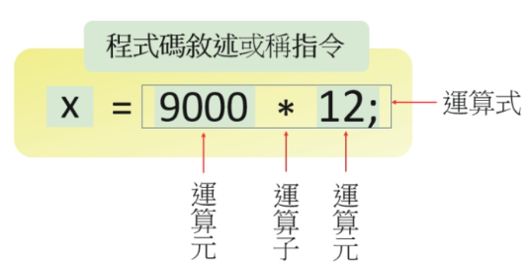
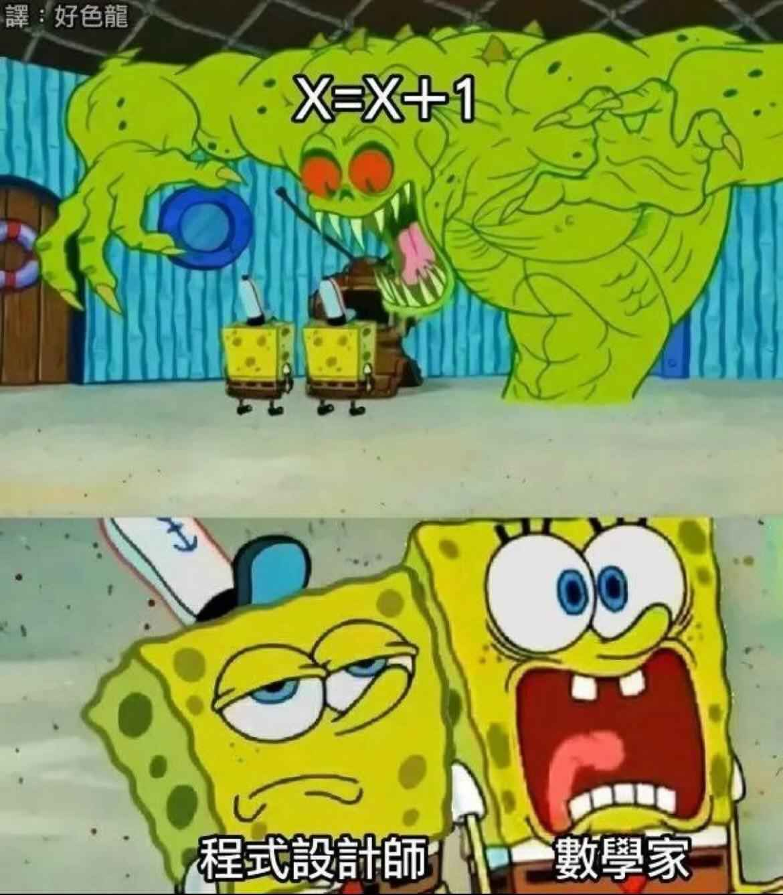

<!-- _class: lead -->
<!-- _paginate: false -->
### Ch.5
# 運算式與運算子

## Horazon
## C#程式設計
---

# 陳述式 (Statement)

在說明運算式之前，我們前面使用的變數宣告在語法中都稱為<mark>陳述式</mark>
指的是執行特定任務的程式指令

```cs
int x = 10;             //變數宣告
x = 20;                 //變數重新賦值
```

---

# 運算式 (Expression)

而能夠<mark>產生數值</mark>的一段程式碼，稱為運算式或表達式
陳述式與運算式在程式中會混用

```cs
string str = "Hello";
str = "Hi";
```
在以上例子中，兩行都可是陳述式，但是"Hello"、"Hi"可以視為運算式


---

# 運算式 (Expression) 

而運算式，大家最熟悉的，應該就是算術運算，如：
```cs
5 + 3           //加法
5 - 3           //減法
5 * 3           //乘法
5 / 3           //除法
```

---

# 運算元 與 運算子

運算元 (operand)
運算子 (operator)

&nbsp; &nbsp; &nbsp; 

由於乘法有兩個運算元，則屬於二元運算子 (binary operator)

---

# 算數運算子

大家最熟悉的算術運算，即為二元運算子
```cs
5 + 3           //加法
5 - 3           //減法
5 * 3           //乘法
5 / 3           //除法
```
除了以上這些，還有
```cs
5 % 3           //module, mod, 取餘數, 答案為2
-5              //negative, 負號, 一元運算子
```

---
# 指定運算子 ( = Assignment Operator)

<br>

在剛才的範例與之前的變數宣告中，我們已經使用多次這個運算子了

= 它是一個二元運算子，會將右邊的值，賦予左邊的變數

可以和算術運算混用

```cs
int p = 5 + 3;          //將p初始化賦值為8
p = (5 * 3) / 2;        //將p賦值為7 (非7.5, 整數運算問題)
```

<style scoped>
img {
  scale: 0.3;
  translate: 400px -650px;
}
</style>



---
# 複合指定運算子

由於算術運算子與指定運算子常常一起使用，所以C#提供了<mark>複合指定運算子</mark>
例如將 + 與 = 合併為 +=
```cs
int value = 1;
value = value + 3;      //與下一行相同，value結果為4
value += 3;             //與上一行相同，value結果為7
```
除此之外，也有　 -= 　 *=　   /=　  %=

---

# 一元算術運算子

以下的行為，在程式中太常使用
```cs
int value = 0;
value += 1;         //或value=value+1;
```
C#提供一個簡化的寫法
```cs
value++;            //等於value+=1;
```


---
# 一元算術運算子

正確來說，有加法與減法可使用，但沒有乘法或除法
```cs
value++;
value--;
```
另外還有
```cs
++value;
--value;
```
---
# 一元算術運算子

<br>

```cs
int a = 5;
int b = 5;
int value = 0;
```

++在後，會在執行完該行程式碼後，才進去x=x+1的運算
```cs
value = a++ + b++;
Console.WriteLine($"value={value}, a={a}, b={b}");  　　//value=10, a=6, b=6
```
++在前，會在執行完該行程式碼後，才進去x=x+1的運算
```cs
value = ++a + ++b;
Console.WriteLine($"value={value}, a={a}, b={b}");  　　//value=12, a=6, b=6
```

---

# 小括號的運用

如同以前的數學，我們可以使用小括號 ( )來調整算術的運算順序

```cs
int result = (5+3) * (2+4);

Console.WriteLine($"result = {result}");
//輸出:result = 48
```

---

# 算術運算子的執行順序

如同以前數學，除了括號、先乘除後加減外，
會遵照以下順序，運算過程由左至右

- 後置++、後置--
- 前置++、前置--
- 乘法類 * / %
- 加法類 + -

---
# 進階：+ 與 += 在字串的運用

正常來說，算術運算子只能使用在整數/浮點數
但我們在之前的範例中，有看到 + 運用在字串中

```cs
string name = "Horazon";
Console.WriteLine("Hello, " + name +"!!");  //Hello, Horazon!!
```

我們亦可以使用 += 來帶替 = 與 +
```cs
string result = "Hello, ";
result += "Horazon";
result += "!!";
Console.WriteLine(result);          //Hello, Horazon!!
```

---
# 進階：+ 與 += 在字串的運用

在以上片段 + 與 += 稱之為字串的串接(concat)，與數字的加法不同
在字串中只有+與+=可以使用，沒有其他運算

而這種相同符號，但功能上卻不相同的狀況，稱之為(運算子Operator) 多載Overloading

當與一般加法複合使用的時候，要小心隱性的轉型
```cs
int a = 5;
int b = 3;

Console.WriteLine("First " + a + b);        //First 53
Console.WriteLine("First " + (a + b));      //First 8
Console.WriteLine( a + b +" Second");       //8 Second
```

---
# 進階內容：整數除法


---

# 常見問題：除以零 (Division by Zero)

在數學中，除數不能為 0，在程式中也是如此。

```cs
int a = 5 / 0;      // ❌ 執行期間錯誤: DivideByZeroException
int b = 10 % 0;     // ❌ 執行期間錯誤: DivideByZeroException
```

### **浮點數除以零的例外**
如果是浮點數 (`float` 或 `double`)，除以 0 不會報錯，而是會得到 `Infinity` (無限大)。

```cs
double c = 5.0 / 0; // ⭕ 結果為 Infinity (不會當機)
```

