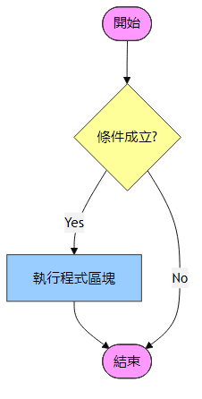
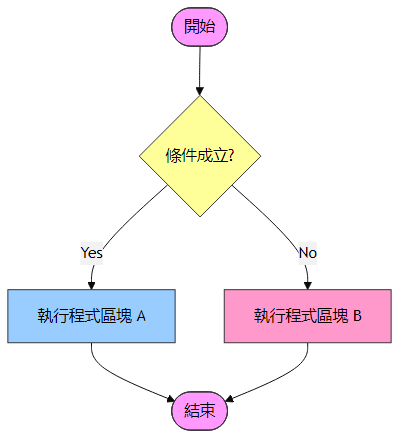
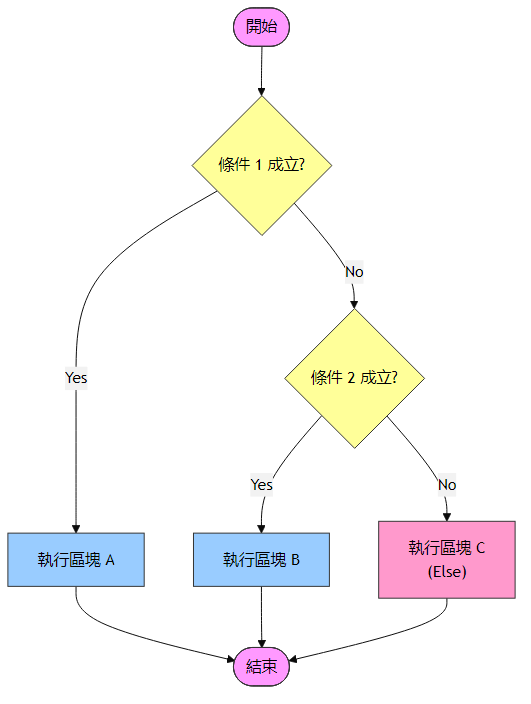
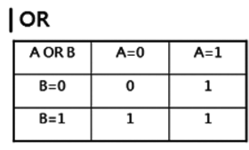
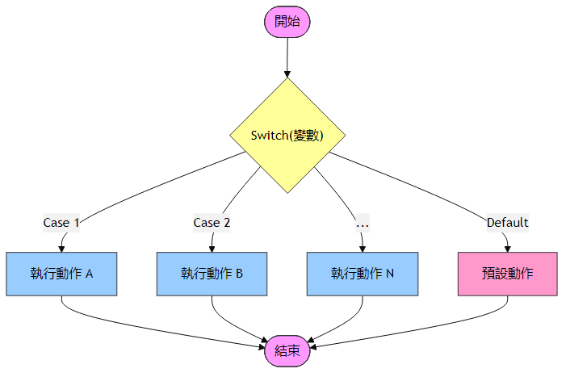
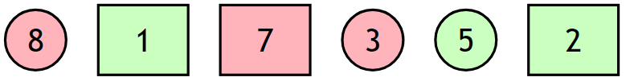

<!-- _class: lead -->
<!-- _paginate: false -->
### Ch. 6
# 流程控制
## Horazon
## C#程式設計

---

# 程式學習地圖 (初步、核心邏輯)

#### 基本結構
#### 變數宣告
#### 循序
#### <mark>選擇 (if, switch)</mark>
#### 迴圈 (for, while, do-while)

---

# 程式邏輯：循序

循序概念由於太直覺、基礎了，所以沒有特別說明
即為程式「由上而下、一行接一行」的執行過程

```cs
int a = 5;
int b = 3;
int sum = 5 + 3;
Console.WriteLine(sum);     //8

a = 10;
b = 20
sum = a + b;
Console.WriteLine(sum);     //30
```


---

# 程式邏輯：選擇

但是如果只有循序的概念，電腦能夠完成的工作非常侷限
如同在現實世界，我們需要「選擇」的功能來下指令


```
如果店家有賣蘋果的話，買三個蘋果，否則改買五個橘子
```

所以我們也需要告訴程式，如何「選擇」

---
# 程式邏輯：if

這邊先簡化問題
```
如果店家有賣蘋果的話，買三個蘋果
```

在這狀況下，就能使用if來完成
```cs
if(店家賣蘋果)
{
    購買三個蘋果
} 
```
注意 大括號 { } 的使用，必須成對出現

---

# 程式邏輯：if

實際的程式描述為
```cs
if(布林邏輯運算式)
{
    邏輯通過時執行之陳述式
}
```
注意小括號 () 與 大括號 {} 的運用
布林邏輯運算式指一段 <mark>會獲得真(true)或假(false)</mark>的運算式

<style scoped>
    img{
        scale: 1.2;
        translate: 950px -300px
    }
</style>


---

# 程式邏輯：if

<br>

```cs
if(sellApple)
{
    myApple += 3;
}
```
有些人會調整 大括號 { } 位置
```cs
if(sellApple) {
    myApple += 3;
}
```
當只有一行的時候，可以省略 大括號 { }  
```cs
if(sellApple) 
    myApple += 3;
```

---

# 程式邏輯：if/else

我們最初的需求是，但後面被省略了
```
如果店家有賣蘋果的話，買三個蘋果，否則改買五個橘子
```
利用else，就能做出「否則」的邏輯
```cs
if(店家賣蘋果)
{
    購買三個蘋果
} 
else
{
    購買五個橘子
}
```

---
# 程式邏輯：if/else

完整規則如下
```cs
if (邏輯表達式) 
{
    邏輯通過時執行之陳述式
} 
else 
{
    邏輯不通過時執行之陳述式
}
```

<style scoped>
    img{
        scale: 1.2;
        translate: 750px -300px
    }
</style>


---

# 程式邏輯：if/else if/else

<br>

有時候需要更多的判斷選擇，在if與else之間可以使用else if
```cs
if (邏輯表達式 A) 
{
    邏輯通過時執行之陳述式
} 
else if (邏輯表達式 B) 
{
    邏輯不通過A但通過B時執行之陳述式
} 
else if (邏輯表達式 C) 
{
    邏輯不通過AB但通過C時執行之陳述式
} 
else 
{
    邏輯不通過ABC時執行之陳述式
}
```

<style scoped>
    img{
        scale: 0.7;
        translate: 750px -650px
    }
</style>



---


# 程式邏輯：if/else if/else

視情況可省略最後的 else
此時如同if，若無符合任何邏輯，則沒有陳述式會被執行
```cs
if (邏輯表達式 A) 
{
    邏輯通過時執行之陳述式
} 
else if (邏輯表達式 B) 
{
    邏輯不通過A但通過B時執行之陳述式
} 
else if (邏輯表達式 C) 
{
    邏輯不通過AB但通過C時執行之陳述式
} 
```

---

# 運用與思考

學會了if/else以後，做以下的思考
```cs
在[周末]且[沒有下雨]的日子，我會出門玩
```
使用前面的內容是可以完成的，但 ...
```cs
if(周末)
{
    if(下雨天)
    {
    }
    else
    {
        出門玩
    }
}
```


---
# 布林邏輯運算子

#### 核心二元運算子 (Binary)
- `&&` (AND 且)：**嚴格**，左右 **皆為 True** 結果才為 True
- `||` (OR 或)：**寬鬆**，左右 **任一 True** 結果即為 True

#### 一元運算子 (Unary)
- `!` (NOT 非)：**唱反調**，True 變 False，False 變 True

#### 重要觀念
- 優先使用 `&&` 與 `||` (短路運算，效率高)
- 避免使用 `&` 與 `|` (除非需位元運算)
- 運算子很多時，請愛用 `( )` 括號定義順序

<style scoped>
    img{
        scale: 1;
        translate: 850px -500px
    }
</style>
<!-- 調整至右側 -->



---
# 運用與思考
<br>

```cs
if(周末)
{
    if(下雨天)
    {
    }
    else
    {
        出門玩
    }
}
```
就可以簡化為
```cs
if(周末 && !下雨天)
{
    出門玩
}
```

---

# 關係運算子 (比較運算子)

用來比較與判斷，結果會是 **布林值 (bool)**

#### 大小比較
- `>` (大於)、`<` (小於)
- `>=` (大於等於)、`<=` (小於等於)

#### 相等判斷
- `!=` (不等於)
- `==` (等於) <span style="color:red; font-weight:bold;">← 注意!!</span>
    - `a = 5` 是將 5 **存入** a (賦值)
    - `a == 5` 才是 **判斷** a 是否為 5 (比較)


---

# 程式邏輯：Switch

當需要判斷「單一變數」等於不同數值時，Switch 是比 if/else if 更整潔的寫法。

```cs
switch (expression)
{
    case value1:
        // 執行區塊 1
        break;
    case value2:
        // 執行區塊 2
        break;
    default:
        // 變數不符合任何 case 時執行
        break;
}
```

<style scoped>
    img{
        scale: 0.85;
        translate: 520px -400px
    }
</style>



---

# 運算子綜合練習 (1/3)：基礎邏輯



### 請試著回答以下條件會選中哪些數字？

<style scoped>
    table{
        font-size: 1rem;
    }
</style>

| 條件描述 | 邏輯運算式 | 自我練習 |
| :--- | :--- | :--- |
| **顏色** | `Color == Red` | 8, 7, 3 |
| **形狀** | `Shape == Rectangle` | 1, 7, 2 |
| **且 (AND)** | `Color == Red && Shape == Rectangle` | ? |
| **且 (AND)** | `Color == Green && Shape == Circle` | ? |
| **或 (OR)** | `Color == Red \|\| Shape == Circle` | ? |

---

# 運算子綜合練習 (2/3)：數值邏輯


### 請試著回答以下條件會選中哪些數字？

<style scoped>
    table{
        font-size: 1rem;
    }
</style>

| 條件描述 | 邏輯運算式 (假設變數 v) | 自我練習 |
| :--- | :--- | :--- |
| **相等** | `v == 3` | ? |
| **大於** | `v > 3` | ? |
| **區間 (AND)** | `v >= 2 && v < 7` | ? |
| **範圍外 (OR)** | `v <= 4 \|\| v >= 6` | ? |
| **空集合?** | `v < 4 && v > 5` | ? |

---

# 運算子綜合練習 (3/3)：進階混合


### 請試著回答以下條件會選中哪些數字？

<style scoped>
    table{
        font-size: 1rem;
    }
</style>

| 條件描述 | 邏輯運算式 | 自我練習 |
| :--- | :--- | :--- |
| **混合屬性** | `Color == Red && v > 5` |  ? |
| **餘數運算** | `v % 2 == 1` | (判斷奇數) ? |
| **複雜邏輯** | `v > 5 \|\| !(Color == Red && Shape == Circle)` | (先算括號→NOT→OR) ? |

---

---

# 練習 1：奇偶數判斷

### 題目
- 輸入一個整數 `num` (例如 10)
- 如果 `num` 除以 2 的餘數為 0，印出 "偶數"
- 否則印出 "奇數"

### 解答
```cs
int num = 10; 

if (num % 2 == 0)
{
    Console.WriteLine("偶數");
}
else
{
    Console.WriteLine("奇數");
}
```

---

# 練習 2：及格判斷

### 題目
- 輸入一個分數 `score` (例如 59)
- 如果 `score` >= 60，印出 "及格"
- 否則印出 "不及格"

### 解答
```cs
int score = 59; 

if (score >= 60)
{
    Console.WriteLine("及格");
}
else
{
    Console.WriteLine("不及格");
}
```

---

# 練習 3：簡易登入

### 題目
- 輸入字串 `password`
- 如果 `password` 等於 "1234"，印出 "登入成功"
- 否則印出 "密碼錯誤"

### 解答
```cs
string password = "1234";

// 字串比對使用 == 即可
if (password == "1234")
{
    Console.WriteLine("登入成功");
}
else
{
    Console.WriteLine("密碼錯誤");
}
```


