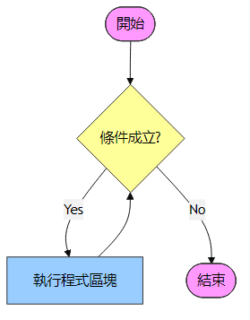
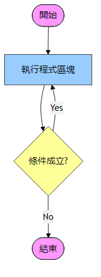
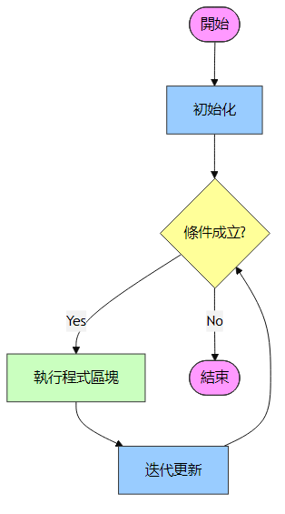

<!-- _class: lead -->
<!-- _paginate: false -->
### Ch. 7
# 迴圈控制
## Horazon
## C#程式設計

---

# 迴圈 (Loop)

循序、選擇、迴圈，是程式三大邏輯。
迴圈用於**重複執行**特定程式碼區塊。

C# 常用的迴圈結構：
- **while**
- **do-while**
- **for**
- **foreach**

---

# while 迴圈

最基本的迴圈結構，**先判斷，再執行**。

```cs
while (條件運算式)
{
    // 當條件為 true 時，重複執行此區塊
}
```

流程：
1. 檢查條件。
2. 若為 true，執行區塊內程式碼。
3. 回到步驟 1。
4. 若為 false，結束迴圈。

<style scoped>
    img{
        scale: 1.1;
        translate: 850px -300px
    }
</style>


---

# while 範例

重複印出數字 1 到 5。

```cs
int count = 1;

while (count <= 5)
{
    Console.WriteLine(count);
    count++;    // 重要：更新條件，避免無窮迴圈
}
```

若忘記 `count++`，`count` 永遠是 1，條件永遠成立，形成**無窮迴圈 (Infinite Loop)**。

---

# do-while 迴圈

與 while 相似，但**先執行，再判斷**。
保證程式碼**至少執行一次**。

```cs
do
{
    // 執行此區塊
} while (條件運算式); // 注意結尾有分號
```

<style scoped>
    img{
        scale: 1.1;
        translate: 850px -250px
    }
</style>


---

# do-while 範例

常用於輸入驗證或使用者互動。

```cs
int input;
do
{
    Console.Write("請輸入正數：");
    input = int.Parse(Console.ReadLine());
} while (input <= 0);

Console.WriteLine($"你輸入了：{input}");
```

使用者若輸入負數，會持續要求重新輸入，直到輸入正數為止。

---

# for 迴圈

適合**已知執行次數**的迴圈。
將「初始化、條件判斷、迭代更新」寫在一起，結構最緊湊。

```cs
for (初始化; 條件; 迭代)
{
    // 執行區塊
}
```

<style scoped>
    img{
        scale: 1.1;
        translate: 850px -300px
    }
</style>


---

# for 範例

印出 0 到 4。

```cs
for (int i = 0; i < 5; i++)
{
    Console.WriteLine(i);
}
```

執行順序：
1. `int i = 0` (只執行一次)
2. 檢查 `i < 5`
3. 執行 `Console.WriteLine(i)`
4. 執行 `i++`
5. 回到步驟 2

---

# foreach 迴圈

專門用於**走訪集合或陣列**。
語法簡潔，不易出錯 (不用管索引值)。

```cs
string[] fruits = { "Apple", "Banana", "Orange" };

foreach (string fruit in fruits)
{
    Console.WriteLine(fruit);
}
```
變數 `fruit` 會依序代表陣列中的每一個元素。

---

# 跳躍敘述 (Jump Statements)

用於改變迴圈的執行流程。

- **break**：**立即中斷**迴圈，跳出大括號。
- **continue**：**跳過本次**迭代，直接進入下一輪判斷。

---

# break 與 continue 範例

```cs
for (int i = 1; i <= 10; i++)
{
    if (i == 3)
    {
        continue; // 跳過 3，不印出，直接變 4
    }
    
    if (i == 8)
    {
        break;    // 遇到 8，直接結束整個迴圈
    }
    
    Console.WriteLine(i);
}
```
輸出結果：1, 2, 4, 5, 6, 7

---

# 總結比較

| 迴圈類型 | 特性 | 適用時機 |
| --- | --- | --- |
| **while** | 先判斷 | 條件為主，次數不確定 |
| **do-while** | 後判斷 | 至少需執行一次 |
| **for** | 結構緊湊 | 次數固定或已知範圍 |
| **foreach** | 直覺簡潔 | 讀取陣列/集合所有資料 |


-
---

# 常見範例 1：累加計算 (Sum)

計算 1 加到 10 的總和。

```cs
int sum = 0;

for (int i = 1; i <= 10; i++)
{
    sum += i;  // 等同於 sum = sum + i;
}

Console.WriteLine($"總和為：{sum}"); // 55
```
重點：**累加變數** (`sum`) 必須在迴圈外宣告並初始化為 0。

---

# 常見範例 2：倒數計時 (Countdown)

從 10 倒數到 1，最後發射！

```cs
for (int i = 10; i >= 1; i--)
{
    Console.WriteLine($"倒數：{i}");
}

Console.WriteLine("發射！");
```
重點：
- 初始值較大 (10)。
- 條件為大於等於 (`>=`)。
- 迭代為遞減 (`i--`)。

---

# 常見範例 3：巢狀迴圈 (Nested Loop)

雙層迴圈：九九乘法表 (部分)

```cs
for (int i = 2; i <= 9; i++)
{
    for (int j = 1; j <= 9; j++)
    {
        Console.Write($"{i}x{j}={i * j}\t");
    }
    Console.WriteLine(); // 換行，準備印下一列
}
```
重點：**外層跑一次，內層跑全部**。
`\t` 為定位字元 (Tab)，讓排版對齊。