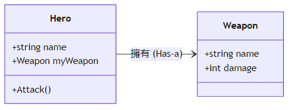

<!-- _class: lead -->
<!-- _paginate: false -->
### Ch. 11
# 類別與物件 (Class & Object)
## Horazon
## C#程式設計

---

# 結構 (Struct)

除了 Class，C# 還有一個很像的東西叫做 **Struct (結構)**。
通常用來定義**輕量級的資料結構**，例如座標 (x, y)、顏色 (r, g, b)。

```cs
struct Point
{
    public int x;
    public int y;
}
```

它跟 Class 長得很像，但運作方式完全不同 (稍後揭曉)！

---
# 範例：使用 Struct

Struct 是**實值型別**，通常直接宣告後使用，不需要 `new` (也可以用，但意義不同)。

```cs
// 在 Main 中使用 Point
Point p1; 
p1.x = 10;
p1.y = 20;

Point p2 = p1; // p2 是 p1 的複製品 (Copy)
p2.x = 999;

Console.WriteLine(p1.x); // 10 (p1 不受影響)
Console.WriteLine(p2.x); // 999
```

如果是 Class，p1.x 也會變成 999！這就是關鍵差異。

---

# 程式語言的三大典範 (Paradigms)

1. **程序導向 (Procedural)**：C 語言
   - 指令式，一步一步執行，強調函式 (Function)。
2. **物件導向 (OOP)**：C#, Java, C++
   - 強調「物件」與「物件」之間的互動。
   - 適合大型專案，易於維護與擴充。
3. **函數式 (Functional)**：Haskell, F#
   - 強調數學函數的對應，避免副作用 (Side Effect)。
   - 近年來 C# 也加入了許多函數式特性 (如 LINQ)。

---

# 什麼是物件導向 (Object-Oriented)

在我們之前的課程中，程式碼多半是「一行一行」或「一個函式」的概念。
但在大型專案 (例如遊戲開發) 中，我們會用**物件導向程式設計 (OOP)** 來思考。

我們將程式中的功能看作是一個個的**物件 (Object)**，它們各自負責不同的工作，並且互相溝通。

---

# 核心概念：類別 (Class) vs 物件 (Object)

這兩個名詞是 OOP 的基礎。

- **類別 (Class)**：藍圖、設計圖、模具。
  - 定義了某種東西「長什麼樣子」、「有什麼功能」。
  - 例如：「設計圖：汽車」。

- **物件 (Object)**：根據藍圖做出來的實體 (Instance)。
  - 真正存在記憶體中，可以使用的東西。
  - 例如：「這台紅色的 Ferrari」、「那台藍色的 Toyota」。

---

# 範例：定義一個類別

在 C# 中，使用 `class` 關鍵字來定義類別。

```cs
// 定義一個 "玩家" 類別
class Player
{
    // 1. 成員變數 (Fields)：描述屬性/狀態
    public string name;
    public int hp;
    
    // 2. 方法 (Methods)：描述行為/功能
    public void Attack()
    {
        Console.WriteLine($"{name} 發動了攻擊！");
    }
}
```
* `public` 代表這個成員可以被外部存取 (稍後會詳談)。

---

# 範例：建立物件 (new)

有了設計圖 (`class Player`)，我們需要用 `new` 關鍵字將它「做出來」。

```cs
void Main()
{
    // 建立一個 Player 物件 (p1)
    Player p1 = new Player();
    p1.name = "勇者";
    p1.hp = 100;
    
    // 建立另一個 Player 物件 (p2)
    Player p2 = new Player();
    p2.name = "魔王";
    p2.hp = 999;
    
    // 讓物件執行動作
    p1.Attack(); // 輸出：勇者 發動了攻擊！
    p2.Attack(); // 輸出：魔王 發動了攻擊！
}
```

---

# 記憶體中的運作 (Stack vs Heap)

這是非常重要的觀念！

- **實值型別 (Value Type)**：如 `int`, `float`, `bool`。
  - 資料直接存放在變數中 (Stack)。

- **參考型別 (Reference Type)**：如 `string`, `Array`, **`class`**。
  - 變數 (`p1`) 只存了一個**地址 (Reference)**。
  - 真正的資料 (`name`, `hp`) 存放在記憶體堆積 (Heap) 中。

當你寫 `Player p3 = p1;` 時，其實只是複製了「地址」。
修改 `p3.hp`，`p1.hp` 也會跟著變！(因為它們指向同一個實體)


---

# 範例：物件與物件的互動 (多 Class)

勇者 (Hero) 手上拿著武器 (Weapon) 攻擊怪物。

```cs
class Weapon {
    public string name;
    public int damage;
}

class Hero {
    public string name;
    public Weapon myWeapon; // 勇者擁有一個武器物件

    public void Attack() {
        Console.WriteLine($"{name} 用 {myWeapon.name} 造成 {myWeapon.damage} 點傷害！");
    }
}
```

這就是**組合 (Composition)** 的概念：一個物件可以包含另一個物件。

---

# 類別圖 (Class Diagram)

我們可以用圖形來表示類別之間的關係：

<br>


<!-- 請自行將 MERMAID/MD/ClassDiagram_HeroWeapon.mmd 轉檔為圖片並放置於 MERMAID/IMAGE -->


---

# 為什麼需要類別？

1. **資料封裝**：將相關的資料 (`name`, `hp`, `exp`) 綁定在一起，而不是散落在各處的變數。
2. **邏輯統一**：將操作這些資料的函式 (`Attack`, `Heal`) 也放在一起，更好維護。
3. **擴充性**：可以輕易產生多個獨立的物件 (多個敵人、多個 NPC)。

> **疑問：這些事情 Struct 不也辦得到嗎？**
> Struct 也可以有欄位、也可以有方法啊！為什麼要用 Class？

沒錯！Struct 確實可以做到類似的事情，但最關鍵的差異在於**記憶體行為**與**特性**。

---

# Class vs Struct

<style scoped>
table {
    font-size: 35px;
}
th, td {
    padding: 4px 8px;
}
</style>

| 特性 | Class (類別) | Struct (結構) |
| :--- | :--- | :--- |
| **型別種類** | **參考型別 (Reference Type)** | **實值型別 (Value Type)** |
| **記憶體位置** | Heap (堆積) | Stack (堆疊) |
| **賦值行為** | 複製記憶體地址 (參考) | **複製整個數值** (深拷貝) |
| **繼承** | 支援繼承 (Inheritance) | **不支援**繼承 |
| **適用場景** | 大型物件、邏輯複雜、需要繼承 | 小型資料 (座標、簡單數值) |
| **預設值** | null | 該型別的預設值 (全為0) |

---

# 總結

**Struct (結構)**
- 實值型別，資料存在 Stack，賦值時**複製整個數值**。
- 適合輕量純資料 (如: Vector3, Color, Rect)。

**Class (類別) & Object (物件)**
- **Class** 是設計圖（包含 Fields + Methods），**Object** 是用 `new` 建立的實體。
- 參考型別，資料存在 Heap，賦值時複製**地址**。
- 適合大型物件、需要繼承 (如: Player, Enemy, GameManager)。


---

# 綜合範例：銀行帳戶 (OOP)

```cs
class BankAccount
{
    public string owner;
    public int balance;

    public void Deposit(int amount) {
        if (amount > 0) {
            balance += amount;
            Console.WriteLine($"{owner} 存入 {amount}，餘額: {balance}");
        }
    }

    public void Withdraw(int amount) {
        if (amount <= balance) {
            balance -= amount;
            Console.WriteLine($"{owner} 提款 {amount}，餘額: {balance}");
        } else {
            Console.WriteLine($"{owner} 餘額不足！");
        }
    }
}
```

---

# 綜合範例：學生成績系統

```cs
class Student
{
    public string name;
    public int score;

    public void CheckPass()
    {
        if (score >= 60)
            Console.WriteLine($"{name} 及格了！");
        else
            Console.WriteLine($"{name} 需要補考...");
    }
}

Student s1 = new Student();
s1.name = "小明";
s1.score = 59;
s1.CheckPass(); // 小明 需要補考...
```

