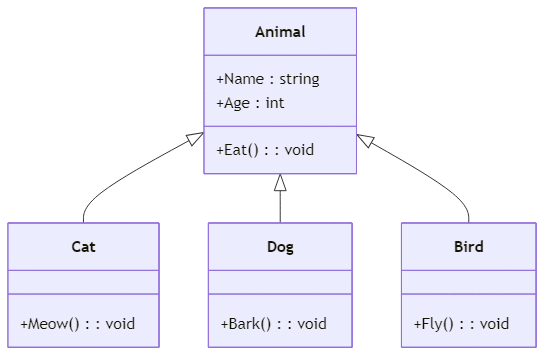
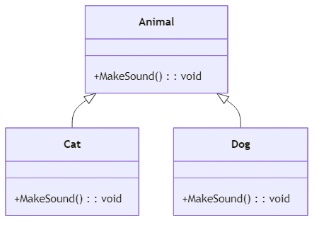

<!-- _class: lead -->
<!-- _paginate: false -->
### Ch. 13
# 繼承與多型 
## Horazon
## C#程式設計

---

# 如果我們要寫一個動物園程式...

想像我們現在要寫一個程式，裡面有 **貓 (Cat)** 和 **狗 (Dog)**。

我們一開始可能會這樣寫：

```cs
class Cat {
    public string Name { get; set; } // 名字
    public int Age { get; set; }     // 年紀
    public void Eat() { /* ... */ }  // 吃東西
    public void Meow() { /* ... */ } // 貓咪專屬：喵喵叫
}
```

---

# 如果我們要寫一個動物園程式...

然後我們寫狗狗的類別：

```cs
class Dog {
    public string Name { get; set; } // 重複了！
    public int Age { get; set; }     // 重複了！
    public void Eat() { /* ... */ }  // 重複了！
    public void Bark() { /* ... */ } // 狗狗專屬：汪汪叫
}
```

**問題來了：** 如果我們還要加鳥、大象、老虎... 
我們是不是要一直複製貼上 `Name`, `Age`, `Eat()` 這些一樣的程式碼？

---

# 為什麼這是一個問題？

一直複製貼上相同的程式碼，會造成：

1. **程式碼太長**：檔案變得很大，很難閱讀。
2. **修改困難**：如果今天想幫所有動物加上「體重(Weight)」屬性，我們必須要在所有動物的類別裡面，一個一個手動加進去！這太累人也容易忘記。

工程師最討厭做重複的事情了！有沒有更好的方法？

---

# 救星來了：繼承 (Inheritance)

**繼承** 就像是家族的傳承。
我們可以把所有動物 **共通** 的特徵與行為（例如：名字、年紀、吃東西），全部提取出來，做成一個通用的 **「父類別」**！

然後，讓貓咪、狗狗這些 **「子類別」** 去「繼承」它。
子類別就可以自動擁有父類別的所有功能，不用再重新寫一次囉！

---

# 繼承的圖解



*在 UML 類別圖中，空心三角形箭頭會由「子類別」指向「父類別」，代表繼承關係。*

---

# 步驟 1：建立父類別 (Animal)

我們先寫出一個叫做 `Animal` (動物) 的類別，把大家都有的東西放進去。

```cs
// 父類別 (Base Class)
class Animal {
    public string Name { get; set; }
    public int Age { get; set; }
    
    public void Eat() { 
        Console.WriteLine(Name + " 正在吃東西..."); 
    }
}
```

---

# 步驟 2：建立子類別 (Cat)

現在我們來寫貓咪。
在 C# 中，我們使用 **冒號 `:`** 來表示繼承。

```cs
// 子類別 (Derived Class)
class Cat : Animal  // 冒號代表 Cat 繼承了 Animal
{
    // Cat 自動擁有了 Name, Age 和 Eat()！不用重寫！
    
    // 我們只要加上貓咪特有的行為就好
    public void Meow() { 
        Console.WriteLine("喵喵！"); 
    }
}
```

---

# 步驟 3：建立子類別 (Dog)

狗狗也一樣，繼承 `Animal` 就可以了！是不是變簡單了？

```cs
// 子類別 (Derived Class)
class Dog : Animal  // 冒號代表 Dog 也繼承了 Animal
{
    // 同樣不用重寫 Name, Age, Eat()
    
    // 我們只要加上狗狗特有的行為就好
    public void Bark() { 
        Console.WriteLine("汪汪！"); 
    }
}
```

---

# 來測試看看吧！

```cs
Cat myCat = new Cat();
myCat.Name = "小黑";    // 這是從 Animal 繼承來的
myCat.Age = 3;         // 這是從 Animal 繼承來的
myCat.Eat();           // 這是從 Animal 繼承來的
myCat.Meow();          // 這是 Cat 自己專屬的

Dog myDog = new Dog();
myDog.Name = "小白";    // 從 Animal 繼承來的
myDog.Bark();          // 這是 Dog 自己專屬的
```

子類別完美吸收了父類別的所有優點，程式碼變得超乾淨！

---

# 存取權限複習與 protected

還記得 `public` 和 `private` 嗎？
- `public`：大家都能用。
- `private`：只有自己類別內部能用，連**繼承的子類別也不能用**！

那如果我有一個秘密，不想讓外面的人知道，但**可以讓我的子類別知道**，該怎麼辦？

我們可以使用 **`protected` (受保護的)**！

---

# protected 範例

```cs
class Animal {
    // 只有 Animal 內部和繼承它的子類別可以存取
    protected string Secret = "動物的專屬秘密"; 
}

class Cat : Animal {
    public void TellSecret() {
        // Cat 可以看到 Secret，因為它是子類別！
        Console.WriteLine(Secret); 
    }
}
```

*`protected` 就像是家族的傳家寶，外人不能看，但子孫可以用。*

---

# 什麼是多型 (Polymorphism)？

有了繼承後，我們來認識第二個厲害的觀念：**多型**。

**多型** 的白話文就是：「同一種指令，不同的對象會有不同的反應」。

例如，我對所有動物下達同一個指令：「發出聲音！」
- 貓咪會回應：「喵喵！」
- 狗狗會回應：「汪汪！」
- 鳥兒會回應：「啾啾！」

指令明明是一樣的，但不同動物做出來的結果卻不一樣！這就是多型。

---

# 多型怎麼做？ (virtual 與 override)

在 C# 中，要達成多型，我們需要兩個關鍵字的配合：

1. **父類別**：把方法加上 **`virtual` (虛擬的)**，表示「我允許小孩子改變這個方法」。
2. **子類別**：把方法加上 **`override` (覆寫)**，表示「我要改變爸爸傳下來的這個方法」。

就像是爸爸留了一間房子 (`virtual`)，小孩決定把它重新裝潢 (`override`)！

---

# 多型步驟 1：父類別加上 virtual

我們回到 `Animal` 類別，加入一個會發出聲音的方法：

```cs
class Animal {
    public string Name { get; set; }
    
    // 加上 virtual，表示允許子類別重新定義這個方法
    public virtual void MakeSound() { 
        Console.WriteLine("動物發出未知的聲音"); 
    }
}
```

---

# 多型步驟 2：子類別加上 override

接著，讓貓咪和狗狗來「重新裝潢」這個聲音！

```cs
class Cat : Animal {
    // 加上 override，覆寫掉父類別的 MakeSound
    public override void MakeSound() { 
        Console.WriteLine(Name + " 說：喵喵！"); 
    }
}

class Dog : Animal {
    // 加上 override，覆寫掉父類別的 MakeSound
    public override void MakeSound() { 
        Console.WriteLine(Name + " 說：汪汪！"); 
    }
}
```

---

# 多型圖解



---

# 多型最強大的地方：裝在同一個箱子裡！

因為貓咪和狗狗「都是」動物 (Is-A 的關係)，所以我們可以用一個 **「動物陣列」** 來統一裝牠們！

```cs
// 準備一個 Animal 陣列，長度為 2
Animal[] myAnimals = new Animal[2];

// 把不同種類的動物塞進同一個陣列中！
myAnimals[0] = new Cat() { Name = "小黑" };
myAnimals[1] = new Dog() { Name = "小白" };
```

這是繼承和多型結合後，最不可思議的魔法！

---

# 享受多型的魔法！

```cs
// 我們可以用 foreach 一次叫出所有動物
foreach (Animal a in myAnimals)
{
    // 對每個動物下達同樣的「發出聲音」指令
    a.MakeSound(); 
    
    // 雖然變數型別是 Animal，
    // 但 C# 會聰明地根據牠「實際上」是貓還是狗，去執行對應的叫聲！
}
```

**輸出結果：**
小黑 說：喵喵！
小白 說：汪汪！

---

# 補充：base 關鍵字

如果你在「重新裝潢房子 (`override`)」的時候，還是想保留爸爸原本留下的東西，可以使用 `base` 關鍵字呼叫父類別的方法。

```cs
class Bird : Animal {
    public override void MakeSound() {
        // 先執行 Animal 原本的 MakeSound()
        base.MakeSound(); 
        
        // 再加上鳥兒專屬的
        Console.WriteLine("然後發出：啾啾！");
    }
}
```

---

# 本章總結

- **繼承 (`:`)**：讓子類別獲得父類別的屬性與方法，大大**減少重複寫程式碼**的時間。
- **`protected`**：比 `private` 多了一點彈性，允許**子類別**存取的權限。
- **多型**：
    - 父類別使用 **`virtual`** 開放修改。
    - 子類別使用 **`override`** 進行覆寫。
- **多型的應用**：我們可以用父類別的陣列，來統一管理各種不同的子類別，讓程式更簡潔強大！
