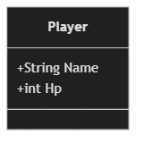
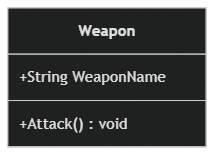
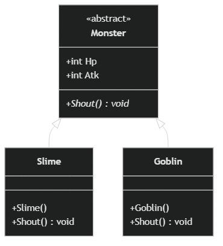

<!-- _class: lead -->
<!-- _paginate: false -->
### Homework 3

# C# 程式設計
## 課後練習 作業三
## (範圍：Ch.11 - Ch.13)

---

# 繳交方式說明

### 請將 3 個 .cs 檔案壓縮後繳交
- 格式支援：**.zip** / **.rar** / **.7z**
- 內容包含本次作業的 **3 個 資料夾** (每個資料夾要包含幾個.cs檔案看你需求)
  1. 作業題目 1：建立純屬性類別
  2. 作業題目 2：具備方法的類別與呼叫
  3. 作業題目 3：抽象類別繼承與多型

> 不需要整個專案資料夾 (不需要 bin/obj)

---

# 作業題目 1：建立純屬性類別 (Ch.11)

### 題目說明
請建立一個簡單的「角色 (Player)」類別，裡面只包含屬性（或欄位），**不需要加上任何自訂方法（Function/Method）**。

  

---

# 作業題目 1：實作步驟

### 實作步驟
1. 宣告一個類別 (`class`) 名稱為 `Player`。
2. 在類別內加入兩個公開的變數欄位（`public`）：
   - `Name` (字串 `string`)：記錄角色名稱。
   - `Hp` (整數 `int`)：記錄角色的血量。
3. 在主程式頂端 (`Main`) 中：
   - 使用 `new Player()` 建立這個也就是實例化 `Player` 物件。
   - 給予這隻角色名字（例如 `"勇者"`）和血量（例如 `100`）。
   - 用 `Console.WriteLine` 印出這個角色的名字跟血量。

---

# 作業題目 2：具備方法的類別與呼叫 (Ch.12)

### 題目說明
請建立一個「武器 (Weapon)」類別，裡面除了屬性外，還要加上一個自己專屬的**攻擊功能（方法）**，並將其呼叫出來。

  

---

# 作業題目 2：實作步驟

### 實作步驟
1. 宣告一個類別 (`class`) 名稱為 `Weapon`。
2. 裡面包含：
   - 一個字串欄位 `public string WeaponName;`（代表武器名稱）。
   - 一個公開方法 `public void Attack()`：當呼叫時，要在螢幕印出 `使用 [武器名稱] 進行了攻擊！` 
3. 在主程式頂端 (`Main` / 最上層區塊) 中 ：
   - 使用 `new Weapon()` 建立一個武器物件。
   - 把它的 `WeaponName` 設定為 `"鐵劍"`。
   - 不要用 `Console.WriteLine` 來印，而是直接**呼叫**該物件的 `Attack()` 方法讓它自動印出文字。

---

# 作業題目 3：抽象類別繼承與多型 (Ch.13)

### 題目說明
請設計一個「怪物 (Monster)」的**抽象父類別**，除了具有血量與攻擊力外，再延伸出「史萊姆 (Slime)」與「哥布林 (Goblin)」兩個**子類別**，為它們設定不同的數值，並學習「多型 (Polymorphism)」的概念。

  

---

# 作業題目 3：實作步驟(1)

### 實作步驟
1. 建立一個抽象類別 `abstract class Monster`。
   - 在裡面加入兩個數值欄位：`public int Hp;` (血量) 與 `public int Atk;` (攻擊力)。
   - 在裡面宣告一個沒有實作內容的**抽象方法**：`public abstract void Shout();`（代表怪物的專屬叫聲）。
2. 建立子類別 `class Slime : Monster`：
   - 定義預設建構子 (`public Slime()`)：在裡面設定初始數值，例如 `Hp = 50;` 以及 `Atk = 5;`。
   - 覆寫 (`override`) 叫聲方法：讓它印出 `"史萊姆：噗嚕噗嚕！"`

---

# 作業題目 3：實作步驟(2)

3. 建立子類別 `class Goblin : Monster`：
   - 定義預設建構子 (`public Goblin()`)：在裡面設定較高的數值，例如 `Hp = 100;` 以及 `Atk = 15;`。
   - 覆寫 (`override`) 叫聲方法：讓它印出 `"哥布林：大家一起上！"`
4. 在主程式頂端 (`Main`  / 最上層區塊) 中 ：
   - 使用**父類別作為型別**，各自實例化這兩隻怪物。（例如：`Monster m1 = new Slime();` 與 `Monster m2 = new Goblin();`）
   - 分別印出 `m1` 與 `m2` 的 `Hp` 和 `Atk` 數值。
   - 分別呼叫 `m1.Shout()` 和 `m2.Shout()`，觀察執行結果。
