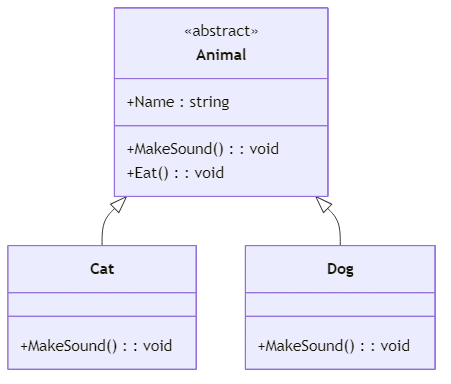
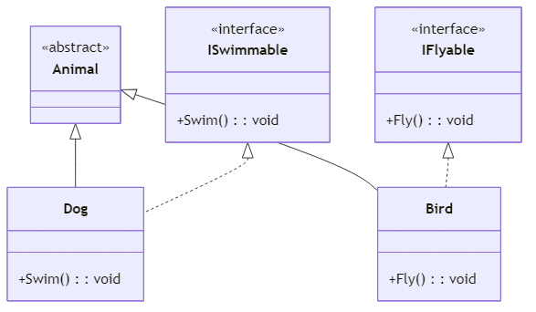

<!-- _class: lead -->
<!-- _paginate: false -->
### Ch. 14
# 抽象、介面與命名空間
## (Abstract, Interface & Namespace)
## Horazon
## C#程式設計

---

# 延續上一章的動物園...

上一章我們建立了 `Animal` (父類別)，以及 `Cat`、`Dog` (子類別)。

```cs
class Animal {
    public virtual void MakeSound() { 
        Console.WriteLine("動物發出未知的聲音"); 
    }
}
```

但仔細想想：
1. 世界上真的有「一種動物」叫做「動物」嗎？沒有，只有具體的貓、狗、鳥。
2. 我們不應該允許別人 `new Animal()` 建立一個模糊的「動物」物件。
3. `MakeSound()` 在父類別裡寫「未知的聲音」很奇怪，因為每種動物的叫聲都不同。

---

# 抽象類別 (Abstract Class) 登場！

**抽象類別 (Abstract Class)** 就是一個「不完整」的類別。

特性：
1. **不能被實例化**：不允許使用 `new Animal()`。
2. **作為樣板**：它純粹是拿來被「繼承」的。
3. **可以包含抽象方法**：只定義方法名稱，不寫大括號 `{}` 的內容，強制子類別一定要自己實作！

我們使用 **`abstract`** 關鍵字來宣告。

---

# 抽象類別與抽象方法範例

```cs
// 加上 abstract 代表它是抽象類別，不能被 new
abstract class Animal {
    public string Name { get; set; }
    
    // 抽象方法：沒有 {} 實作，只有宣告，必須是 public 或 protected
    // 加上 abstract，強迫所有子類別必須「覆寫 (override)」這個方法！
    public abstract void MakeSound();
    
    // 抽象類別內也可以有一般的具體方法
    public void Eat() {
        Console.WriteLine(Name + " 正在吃東西...");
    }
}
```

---

# 子類別實作抽象方法

子類別繼承抽象類別後，**必須**使用 `override` 實作所有的抽象方法，否則編譯會失敗！

```cs
class Cat : Animal {
    // 必須覆寫 MakeSound，否則會報錯！
    public override void MakeSound() {
        Console.WriteLine(Name + " 說：喵喵！");
    }
}

class Dog : Animal {
    // 必須覆寫 MakeSound，否則會報錯！
    public override void MakeSound() {
        Console.WriteLine(Name + " 說：汪汪！");
    }
}
```

---

# 抽象類別的 UML 表示

在 UML 類別圖中，**抽象類別名稱**與**抽象方法**會使用 **`<<abstract>>`** 標記，並以 *斜體* 表示。



*箭頭為實線空心三角形，代表繼承關係（Generalization）。*

---

# 為什麼需要介面？ (多重繼承的問題)

在 C# 中，**一個子類別只能繼承一個父類別**（單一繼承）。

但如果我們有以下需求：
- 飛機可以飛，鳥也可以飛。
- 飛機是機器，鳥是動物，牠們沒有共同的父類別。
- 狗會游泳，鴨子會游泳，魚也會游泳，但牠們在繼承鏈中完全不同。

如果想要強迫這些不同類別都擁有「飛」或「游泳」的功能，該怎麼辦？
這時候就要使用 **介面 (Interface)**！

---

# 什麼是介面？ (Interface)

**介面** 是一組「行為的契約」。它比抽象類別更極端：
1. **沒有任何實作**：介面裡的方法都只能宣告，不能寫 `{}` (C# 8.0 之前)。
2. **不能包含成員欄位**：不能存儲資料變數。
3. **可以多重實作**：一個類別可以同時實作多個介面！

在 C# 中，介面習慣以 **`I`** 開頭（例如 `IFlyable`, `ISwimmable`）。

---

# 宣告與實作介面

```cs
// 宣告一個「會游泳」的介面
interface ISwimmable {
    void Swim(); // 預設就是 public abstract，不用寫修飾詞
}

// 狗狗繼承 Animal，同時「實作」ISwimmable 介面
class Dog : Animal, ISwimmable {
    public override void MakeSound() { Console.WriteLine("汪汪！"); }
    
    // 必須實作 Swim() 方法
    public void Swim() {
        Console.WriteLine(Name + " 正在用狗爬式游泳！");
    }
}
```

---

# 介面的多重實作

類別只能繼承一個爸爸，但可以遵守多個契約！

```cs
interface IFlyable { void Fly(); }
interface ISinger { void Sing(); }

// 鳥類繼承 Animal，同時實作 IFlyable 與 ISinger
class Bird : Animal, IFlyable, ISinger {
    public override void MakeSound() { Console.WriteLine("啾啾！"); }
    public void Fly() { Console.WriteLine(Name + " 在天空中飛翔！"); }
    public void Sing() { Console.WriteLine(Name + " 在愉快地歌唱！"); }
}
```

---

# 介面的 UML 表示

在 UML 中，介面使用 **`<<interface>>`** 標記。
類別與介面之間的實作關係，使用 **虛線空心三角形** 指向介面，這在 UML 中稱為 **實現 (Realization)**。



---


<!-- _style: "table { font-size: 22px; }" -->

# 抽象類別 vs 介面

| 比較項目 | 抽象類別 (`abstract class`) | 介面 (`interface`) |
| :--- | :--- | :--- |
| **繼承數量** | 單一繼承 (只能繼承一個) | 多重實作 (可以實作多個) |
| **成員欄位** | 可以包含變數 (欄位) | 不能包含任何欄位 |
| **方法實作** | 可以有具體實作的方法 | 只能宣告方法，不能有實作 |
| **設計意義** | 「它是什麼」(Is-A) | 「它能做什麼」(Can-Do) |
| **舉例** | 貓是動物 (Cat **is an** Animal) | 狗會游泳 (Dog **can** Swim) |

---

# 為什麼需要命名空間？

假設你和同學都寫了一個叫做 `Player` 的類別。
兩個 `Player` 放在同一個程式裡，編譯器會不知道要用哪一個！

**命名空間 (Namespace)** 就像「姓氏」，幫類別加上識別標誌：

```cs
// 你寫的
MyGame.Player

// 同學寫的
HisGame.Player
```

這樣兩個 `Player` 就不會衝突了。

---

# 宣告命名空間

用 `namespace` 關鍵字包住你的類別：

```cs
namespace MyGame
{
    class Player
    {
        public string Name = "勇者";
    }
}
```

在另一個地方使用時，需要寫完整名稱：

```cs
MyGame.Player hero = new MyGame.Player();
```

---

# using 指令

每次都寫完整名稱很麻煩。
使用 `using` 可以告訴編譯器「我要用這個命名空間」：

```cs
using MyGame; // 引入命名空間

// 現在可以直接用，不需要寫 MyGame.
Player hero = new Player();
```

這就是為什麼每支程式開頭都會看到：
```cs
using System;
using System.Collections.Generic;
```

---

# 巢狀命名空間

命名空間可以有層級，用 `.` 分隔：

```cs
namespace MyGame.Enemies
{
    class Slime { }
    class Goblin { }
}

namespace MyGame.Items
{
    class Potion { }
}
```

使用時：
```cs
using MyGame.Enemies;

Slime s = new Slime();
```

---

# .NET 常見命名空間

| 命名空間 | 內容 |
| :--- | :--- |
| `System` | 基本型別、Console、Math |
| `System.Collections.Generic` | List、Dictionary |
| `System.IO` | 檔案讀寫 |
| `System.Text` | 字串處理 (StringBuilder) |
| `System.Linq` | 資料查詢 |

---

# 什麼是 DLL？

**DLL (Dynamic Link Library)** 是已經編譯好的程式碼，打包成一個 `.dll` 檔案。

- 你寫的 C# 程式碼 `.cs` → 編譯後 → `.dll`
- 別人寫好的功能，直接引用 `.dll` 就能使用，不需要原始碼。

### 生活比喻
就像買現成的「零件」組裝：
不需要自己製造馬達，直接買來裝上就好。

---

# 引用 DLL (組件)

在 Visual Studio 中，可以手動加入 DLL 參考：

1. 在專案上右鍵 → **新增參考 (Add Reference)**
2. 選擇 `.dll` 檔案
3. 在程式碼加上對應的 `using`

```cs
// 引用後，才能使用裡面的命名空間
using SomeLibrary;

var obj = new SomeLibrary.MyClass();
```

---

# 全域 using (C# 10+)

在 C# 10 之後，可以在專案層級定義「全域 using」，
讓整個專案所有檔案都自動引入，不需要每個檔案重複寫：

```cs
// GlobalUsings.cs
global using System;
global using System.Collections.Generic;
global using UnityEngine;
```

現代 Unity 和 ASP.NET Core 專案都大量使用這個功能。

---

# 最上層陳述式 (Top-level Statements)

傳統 C# 程式需要大量「儀式性」的樣板程式碼：

```cs
using System;

namespace MyApp
{
    class Program
    {
        static void Main(string[] args)
        {
            Console.WriteLine("Hello World");
        }
    }
}
```

對初學者來說，真正要學的只有第 9 行，其他都是「規定要寫的」。

---

# 進入點：Main 方法

每個程式都需要一個「從哪裡開始執行」的地方，這叫做 **進入點 (Entry Point)**。

在 C# 中，進入點固定是名為 **`Main`** 的靜態方法：

```cs
static void Main(string[] args)
{
    // 程式從這裡開始執行
}
```

- 程式啟動時，作業系統會**直接呼叫 `Main`**。
- `Main` 執行完畢後，程式結束。
- `args` 是執行程式時可以從外部傳入的參數。

---

# 最上層陳述式 (C# 9+)

C# 9 之後，可以省略 `class Program` 和 `Main`，直接寫邏輯，甚至連 using 都可簡化：

```cs
// 這就是完整的程式！

Console.WriteLine("Hello World");
```

- 編譯器會**自動**幫你產生 `Main` 方法。
- 原本需要寫 `using System;`
- **整個專案只能有一個**檔案使用最上層陳述式。

---

# 本章總結

| 概念 | 說明 |
| :--- | :--- |
| **抽象類別 (`abstract`)** | 不完整的類別，不能被實例化，強制子類別覆寫抽象方法 |
| **介面 (`interface`)** | 行為的契約，只宣告不實作，支援類別的「多重實作」 |
| **namespace** | 幫類別加上「姓氏」，避免命名衝突 |
| **using** | 省略命名空間前綴，讓程式碼更簡潔 |
| **DLL** | 編譯後的程式庫，可直接引用使用 |
| **global using** | C# 10+ 的全域引用，減少重複 using |
