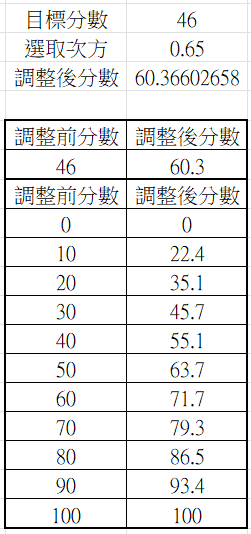

<!-- _class: lead -->
<!--_paginate: false-->

### 
# 課程說明

## Horazon
## 114下學期

---
# 張仕明 (Horazon)
#### 專長
```
遊戲開發 (Unity)
遊戲程式 (C#)
演算法
資料庫
 ```
#### 興趣
```
電子遊戲
策略桌上遊戲
```

--- 
# 聯絡方式

### E-Mail：horazon@hk.edu.tw
### 研究室：MB10303 (分機5420)
- 時間：
### Line : horazon
- 加我 請跟我說你是哪門課 & 你是誰
### Discord : https://discord.gg/Wf4GXcuWAf

---
# 評分標準
#### 點名成績：20%
- 我不喜歡點名，固定會在最後一節課才點，讓你們較難被扣考。
- 最後一節課有出席，視同所有課程出席
- 不一定每周點名，只有點名週會當作分母計算分數

#### 作業成績：80%
- 作業數量視課程而定 (至少 期中、期末作業各一次)
- 我討厭抄襲，會使用多種偵測方式，抓到雙方都會0分

---

# 最終評分方式
## 只當掉班級<mark> 約10%~25% </mark>的人數。

遵照以上的評分標準，如果不及格人數很多，
則會啟動分數縮放調整，調整方式見下頁

---
# 最終評分方式

原始分數為 $S_{old}$，新分數為 $S_{new}$

大家可能聽過 開根號乘以10 的調整分數方式，即為


$
S_{new} = \sqrt{S_{old}} \times 10 = {S_{old}}^{0.5} \times 10
$

<br>

以下方法會與前者相同

$
\begin{cases}
S_{new} = (\frac {S_{old}}{100})^p \times 100
\\p=0.5
\end{cases}
$


---
# 最終評分方式

先選擇要通過的最低分數$S_{pass}$(如:46分)
計算以下公式中的p，使其轉換為60分

$
\begin{cases}
(\frac{S_{pass}}{100})^p = \frac{60}{100}
\\ \text{ } 1 \geq p \geq 0.5
\end{cases}
$
<br>

之後的分數就能使用以下公式

$
S_{new} = (\frac {S_{old}}{100})^p \times 99
$

(ps.老師這邊有不能打100分的壓力)




---
# 最終評分方式 - 結論

若創課原始分數$\geq 60$，則一定會通過

若創課原始分數$<60$，但 $\geq S_{pass}$ ( 設定的通過分數 )，則會通過

$S_{pass}$為多少，會到期末才決定

<br>

新分數 通常會$\geq$原始分數，接近99分的同學可能會降低分數


