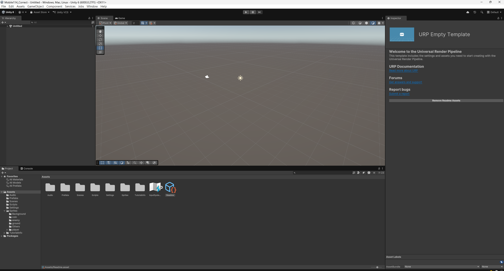
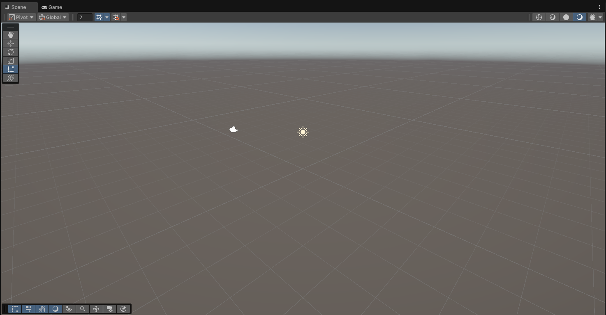
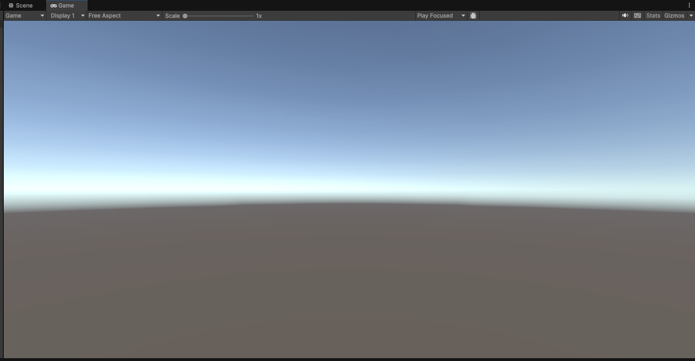
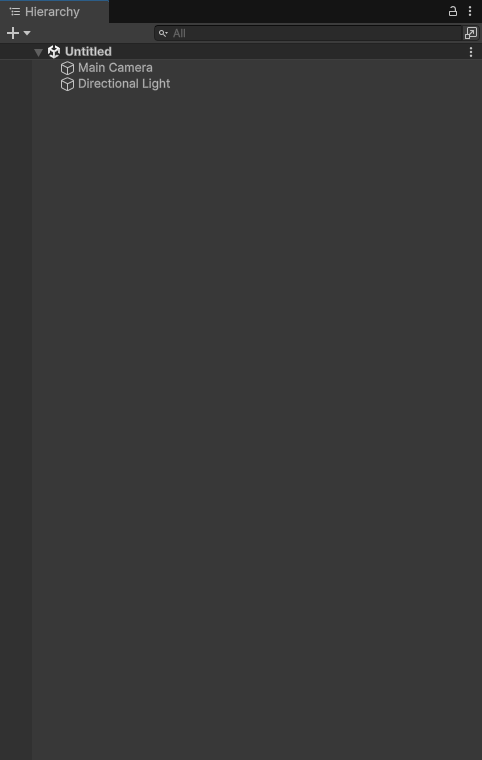
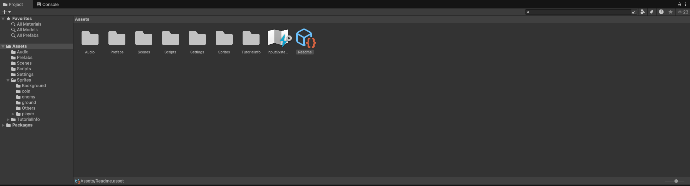
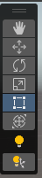
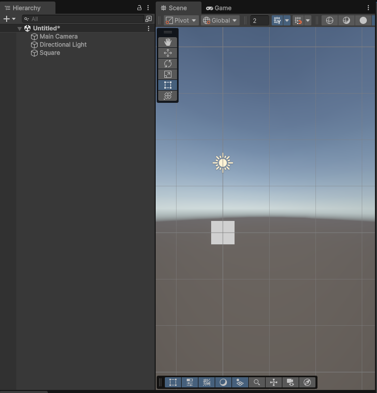

<!-- _class: lead -->
<!-- _paginate: false -->

### Chapter 02

# 專案建置 & 介面導覽

## Horazon
## 手機程式設計

---

# 複習：上週重點

-   [x] **Unity Hub** 已經安裝。
-   [x] **Unity 2022.3 LTS** 已經安裝。
-   [x] **Android Build Support** 模組有勾選。
-   [x] **Visual Studio 2022** 已經安裝。

---

# 本章目標

今天我們要正式進入 Unity 的世界。

1.  學會建立標準的 2D 專案。
2.  熟悉 Unity 五大介面操作。
3.  學會物件的基本操作 (移動、旋轉、縮放)。
4.  **做出你的第一個靜態場景畫面。**

---

# 建立新專案 (詳細版)

1.  開啟 **Unity Hub**。
2.  點選右上角 **New project**。
3.  **Editor Version**：確認選 2022.3 LTS。
4.  **Template (範本)**：
    -   請選擇 **Universal 2D**。
    -   *(註：不要選到 3D 或 VR 範本，設定會很麻煩)*
5.  **Project Name**：取名為 `MobileGame`。

6.  **Location**：選一個乾淨的資料夾。

---

# 等待 Unity 啟動...

第一次建立專案會比較久 (約 3~10 分鐘)。

### 它在做什麼？
-   建立專案資料夾結構。
-   匯入預設的 Package (如 2D Sprite, UGUI)。
-   編譯 Library (這是最花時間的)。

*這時候可以先喝口水，不要以為當機就把它關掉喔！*

---

# 歡迎來到 Unity Editor

當載入完成，你會看到預設的版面配置 (Layout)。
我們將它分為五大區塊來介紹。

---

# 1. Scene View (場景視窗)

---

# 1. Scene View (場景視窗)

這裡是**編輯者的工作區**，你是上帝，可以自由飛翔。

### 操作手勢 (滑鼠)：
-   **右鍵按住 + 移動**：旋轉視角 (3D) / 平移 (2D)。
-   **中鍵按住 + 移動**：平移視角 (Pan)。
-   **滾輪滾動**：縮放視角 (Zoom)。
-   **點選物件 + 按 F**：聚焦該物件 (Focus)，鏡頭會飛過去。

---

# 2. Game View (遊戲視窗)

---

# 2. Game View (遊戲視窗)

這裡是**玩家看到的畫面**，也就是攝影機 (Camera) 拍到的東西。

### 重要設定：
-   **Aspect (長寬比)**：
    -   預設是 `Free Aspect` (隨視窗大小變動)。
    -   做手遊請務必切換成 `1920x1080 Landscape` 或 `16:9`。
    -   這樣介面才不會跑版。
-   **Scale**：預覽縮放倍率，通常設 1x。
-   **Play / Pause / Step**：控制遊戲開始、暫停、單張執行。

---

# 3. Hierarchy (階層視窗)

這是**場景內容清單**。
目前場景裡有哪些東西，這裡就會列出來。

### 預設會有：
-   **Main Camera**：攝影機，遊戲的眼睛。
-   **Global Light 2D** (如果是 URP 專案)：全域燈光。

### 父子關係 (Parenting)：
-   把 A 物件拖到 B 物件身上，A 就會變成 B 的小孩。
-   移動 B 時，A 會跟著動 (像是拿著槍的人，人動槍跟著動)。

---

# 4. Project (專案視窗)

---

# 4. Project (專案視窗)

這是**檔案總管**，存放所有素材。

-   **Assets**：所有資源的根目錄。
-   **Packages**：Unity 內建功能的目錄 (通常不動它)。

### 建議的資料夾結構：
請養成好習慣，在 Assets 下建立資料夾分類：
-   `Scenes` (場景)
-   `Scripts` (程式)
-   `Sprites` (圖片)
-   `Prefabs` (預製物)

---

# 5. Inspector (屬性視窗)

這是**物件的詳細設定**。
當你在 Hierarchy 選取一個物件時，這裡會顯示它的資訊。

### GameObject 與 Component
-   **GameObject**：只是一個空殼 (容器)。
-   **Component (元件)**：賦予殼功能的零件。
    -   就像「空人偶」+「廚師服」=「廚師」。
    -   「空人偶」+「警察服」+「槍」=「警察」。

---

# 最重要的 Component：Transform

所有 GameObject **一定**會有這個元件。

-   **Position (位置)**：X, Y, Z 座標。
-   **Rotation (旋轉)**：X, Y, Z 角度。
-   **Scale (縮放)**：X, Y, Z 大小 (1 是原始大小)。

> **Tip**: 在 Transform 標題按右鍵 -> Reset，可以快速歸零。

---

# 工具列 (Toolbar)

位於左上角，決定滑鼠在 Scene 視窗的功能。

### 常用快速鍵 (QWERTY)：
-   **Q (View)**：手型工具，平移畫面。
-   **W (Move)**：移動工具，出現三軸箭頭。
-   **E (Rotate)**：旋轉工具，出現球狀線。
-   **R (Scale)**：縮放工具，出現方塊頭。
-   **T (Rect)**：矩形工具，UI 與 2D 常用，直接拉邊框。
-   **Y**：綜合工具 (不常用)。

---

# 實作練習 1：建立物件

我們來放點東西到場景裡。

1.  在 **Hierarchy** 空白處按右鍵。
2.  選擇 **2D Object** -> **Sprites** -> **Square** (正方形)。
3.  你會看到畫面中間出現一個白色方塊。
4.  且 Hierarchy 多了一個名為 `Square` 的物件。

---

# 實作練習 2：操作物件

試著用快速鍵 **W, E, R** 來操作它：

1.  **移動 (W)**：拉動 紅色(X) 或 綠色(Y) 箭頭。
2.  **旋轉 (E)**：拉動 藍色圈圈 (Z軸旋轉)。
3.  **縮放 (R)**：拉動中間的小方塊 (等比例) 或 軸向方塊。

> **觀察 Inspector**：數值會隨著你的操作即時改變。

---

# 實作練習 3：改變顏色

白色的方塊太無聊了。

1.  選取 **Square**。
2.  看 **Inspector**，找到 **Sprite Renderer** 元件。
    -   這是負責「顯示圖片」的元件。
3.  點擊 **Color** 旁邊的色塊。
4.  選一個你喜歡的顏色。

---

# 實作練習 4：修改背景色

預設的藍色背景看膩了嗎？

1.  在 Hierarchy 選取 **Main Camera**。
2.  看 Inspector 的 **Camera** 元件。
3.  找到 **Environment** -> **Background**。
    -   如果是舊版，可能是 **Clear Flags** -> **Solid Color**。
4.  點擊顏色更改背景色 (通常建議深色，比較不刺眼)。

---

# 觀念：什麼是 Scene (場景)？

場景就是「關卡」。
-   主選單是一個 Scene。
-   第一關是一個 Scene。
-   Game Over 畫面是一個 Scene。

### 儲存場景：
-   **File** -> **Save** (Ctrl + S)。
-   Unity 檔案副檔名為 `.unity`。
-   請將它存在 `Assets/Scenes/` 資料夾中。

---

# 觀念：GameObject 運作原理

再次強調：**GameObject = Container (容器)**

-   一個空的 GameObject 什麼都看不到，只有座標。
-   加上 **Sprite Renderer** -> 變成了圖片。
-   加上 **Camera** -> 變成了攝影機。
-   加上 **Audio Source** -> 變成了喇叭。

Unity 的開發過程，就是在**組合這些 Component**。

---

# 自訂版面 (Layout)

你不一定要用預設的版面。

### 推薦版面：2 by 3
1.  右上角 Layout 下拉選單 -> 選擇 **2 by 3**。
2.  這樣 Scene 和 Game 會並排，方便一邊編輯一邊看結果。
3.  把 Project 拉到下方長條狀。

*(講師示範如何調整並儲存 Layout)*

---

# 匯入素材 (Import Assets)

只能用白色方塊太單調了，我們來匯入圖片。

1.  準備一張 PNG 或 JPG 圖片 (背景透明最好)。
2.  直接從 Windows 資料夾**拖曳**進 Unity 的 **Project 視窗**。
3.  建議放在 `Assets/Sprites/` 資料夾。

---

# 圖片設定 (Texture Type)

點選剛匯入的圖片，看 Inspector：

-   **Texture Type**：預設通常是 `Sprite (2D and UI)`，如果是 `Default` 請手動改過來。
-   **Pixels Per Unit (PPU)**：預設 100。
    -   意思是「100 個像素 = Unity 世界的 1 公尺」。
    -   數值越小，圖片在場景中會越大。

---

# 將圖片放入場景

有兩種方法：

1.  **直接拖曳**：把圖片從 Project 拉到 Scene 畫面中。
    -   Unity 會自動幫你建立一個帶有 Sprite Renderer 的 GameObject。
2.  **更換圖片**：
    -   選取之前的 `Square`。
    -   把圖片拖到 Sprite Renderer 的 **Sprite** 欄位中。

---

# 圖層順序 (Sorting Order)

如果你有兩個重疊的物件，誰在前誰在後？

### 調整方法：
1.  看 Sprite Renderer 的 **Additional Settings** (或直接看下面)。
2.  **Order in Layer**：整數數值。
    -   **數字大** 的在 **前面** (蓋住別人)。
    -   **數字小** 的在 **後面** (被蓋住)。
    -   預設都是 0。

---

# 快速鍵總整理 (Cheat Sheet)

| 按鍵 | 功能 |
| :--- | :--- |
| **Q, W, E, R, T** | 切換操作工具 |
| **F** | 聚焦選取物件 (Focus) |
| **Ctrl + S** | 儲存場景 |
| **Ctrl + D** | 複製物件 (Duplicate) |
| **Delete** | 刪除物件 |
| **Ctrl + Z** | 復原 (Undo) - **救命恩人** |
| **Alt + 左鍵** | 旋轉視角 (3D用) |

---

# 疑難排解：視窗不見了！

Q: 「老師，我的 Inspector 不見了！」
Q: 「我不小心把 Game 視窗關掉了！」

### 解法：
1.  上方選單 **Window** -> **General** -> 找回你要的視窗。
2.  放大絕：**Window** -> **Layouts** -> **Default**。
    -   直接恢復原廠設定。

---

# Q & A

有任何操作上的問題，現在開放提問！

-   物件拉不動？(檢查是否選到工具 W)
-   看不到畫面？(點物件按 F)
-   圖片糊糊的？(檢查 Filter Mode)

*(自由練習時間)*
