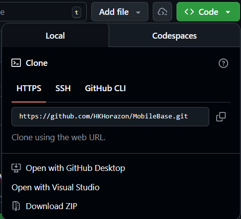
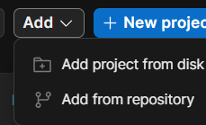

<!-- _class: lead -->
<!-- _paginate: false -->

### Chapter 03

# 2D 世界建構 (Tilemap)

## Horazon
## 手機程式設計

---

# 本章目標

今天我們要打造遊戲的舞台！

1.  理解為什麼需要 **Tilemap**。
2.  學會匯入與設定 **Sprite** 素材。
3.  建立 **Tile Palette** (瓦片調色盤)。
4.  使用 **Brush** (筆刷) 繪製關卡。
5.  掌握 **Sorting Layer** (圖層管理)。

---

# 從 GitHub 下載專案

1.  **取得連結**：使用老師提供的 GitHub 專案網址。
    - https://github.com/HKHorazon/MobileBase/tree/master
2.  **下載檔案**：
    -   點選綠色的 **<> Code** 按鈕。
    -   選擇 **Download ZIP**。
3.  **解壓縮 (非常重要！)**：
    -   下載後是一個 `.zip` 檔。
    -   **請按右鍵 -> 解壓縮 (Extract All)**。
    -   不要直接點兩下進去執行，會發生錯誤！這點非常重要！

---

# Unity 專案結構說明

Unity 專案不是「單一個檔案」，而是一個「資料夾」。
只要確認資料夾內有以下三個重要目錄，就是完整的專案：

1.  **Assets** (資產)：
    -   你做的所有圖片、程式碼、場景都在這裡。
2.  **Packages** (套件)：
    -   專案有用到的外掛紀錄。
3.  **ProjectSettings** (設定)：
    -   遊戲的設定檔 (如解析度、Icon)。

> 其他如 `Library`, `Logs` 都是自動產生的，沒有也沒關係。

---

# 如何開啟舊專案

1.  打開 **Unity Hub**。
2.  確認你在 **Projects** 分頁。
3.  點選右上角的 **Add (加入)** 按鈕。
4.  瀏覽到你剛剛 **解壓縮** 的資料夾。
5.  **選擇最外層** (看得到 Assets 的那一層)。
6.  按下 **Select Folder**。

---

# 處理版本問題

如果專案是用不同版本的 Unity 做的 (例如老師用 2022.3.5，你用 2022.3.20)：

1.  Hub 會顯示黃色驚嘆號，或版本號碼是灰色的。
2.  點選 **Unity Version** 的數字欄位。
3.  選擇你電腦裡 **已安裝的版本** (Recommended)。
4.  按下 **Open**。
5.  跳出警告視窗 "Change Editor Version?" -> 勇敢按下 **Continue / Change Version**。

> 通常版本號最後一碼不同，都不會被版本影響太多。

---

# 實作練習：放置平台 (Platform)

除了 tilemap，我們也可以使用一般物件來製作關卡元件。

1.  在 **Project** 視窗，找到 `Prefab` 資料夾。
2.  找到 `Platform` (或是長條狀的圖片)。
3.  直接拖曳到場景中。
4.  使用 **Rect Tool (T)** 拉動藍色節點，調整它的寬度。
5.  把它放在空中，當作一個「浮動平台」。

> **Tip**: 也可以用 **Scale (R)** 來縮放，但 Rect Tool 對於 UI 和 2D 物件比較直觀。

---

# 問題：如果不用 Tilemap...

假設你要做一個瑪利歐的關卡。
地板由 1000 個磚塊組成。

### 傳統做法：
-   你拉了 1000 個 Sprite 到場景裡。
-   Hierarchy 會有 1000 個 GameObject。
-   **災難！** 電腦變慢，你也找不到東西。

### Tilemap 做法：
-   像畫家一樣，用「筆刷」在「畫布」上塗抹。
-   整張地圖只算一個物件。
-   **效能好，管理方便。**

---

# 檢查與安裝 Tilemap 套件

在開始使用之前，我們需要確認 Unity 專案是否有安裝 Tilemap 功能。

1.  **如何檢查**：
    -   點選上方選單 **Window** -> **Package Manager**。
    -   將左上角的 Packages 切換為 **Unity Registry**。
    -   在右側搜尋框輸入 `Tilemap` 或 `2D`。
2.  **如何安裝**：
    -   找到 **2D Tilemap Editor** 套件。
    -   如果右下角有 **Install** 按鈕，請點選安裝並等待跑條完成。
    -   如果顯示 **Remove** 或是右下角出現綠色打勾，代表已經安裝好了！

---

# Tilemap 四大天王

要使用這套系統，你需要認識四個名詞：

1.  **Grid (網格)**：這是爸爸，負責定義格子的大小。
2.  **Tilemap (地圖)**：這是畫布，顯示畫面用的。
3.  **Tile Palette (調色盤)**：這是顏料盤，選你要畫什麼磚塊。
4.  **Tile (瓦片)**：這是顏料，把圖片轉成 Unity 看得懂的瓦片資料。

---

# 步驟 1：準備素材 (Sprite Assets)

在 Unity 中處理 2D 素材有兩種常見方式：

1.  **Sprite Sheet (大圖)**：把很多角色動作或地圖磚塊塞在同一張大圖裡，需要切割。
2.  **Multiple Sprites (多張小圖)**：每個磚塊分開存成一張張獨立的圖片。

**本次教學使用後者 (多張小圖)**，因為管理起來比較直觀。

---

# 步驟 2：調整圖片設定 (Import Settings)

因為我們是一張張的小圖，不需要切割 (Sprite Editor)，但要確認尺寸設定。

1.  在 Project 視窗，**全選** 剛剛匯入的所有圖片。
2.  看 Inspector 設定：
    -   **Pixels Per Unit (PPU)**：這很重要！如果你的磚塊是 128x128，這裡就要設 128 (讓它在世界中剛好是一格)。
    -   **Filter Mode**：如果是像素風請選 `Point (no filter)`，平滑風格選 `Bilinear`。
3.  按下右下角的 **Apply** 套用設定。

---

# 步驟 3：開啟瓦片調色盤

就像小畫家一樣，我們要先打開調色盤。

1.  上方選單 **Window** -> **2D** -> **Tile Palette**。
2.  這個視窗很重要，建議拖曳並排在 Inspector 旁邊。

---

# 步驟 4：建立 Palette

1.  在 Tile Palette 視窗中，點選 **Create New Palette**。
2.  **Name**：取名 `LevelPalette`。
3.  **Grid**：選擇 `Rectangle` (矩形)。
4.  **Cell Size**：選擇 `Automatic` 或 `Manual`。
5.  點選 **Create**，並選擇一個資料夾存放 (建議 `Assets/Tiles/`)。

---

# 步驟 5：製作瓦片 (Tile Assets)

現在我們有空的調色盤，要把顏料 (圖片) 放上去。

1.  打開 Project 視窗，找到剛剛匯入的圖片。
2.  **直接拖曳**所有圖片 (可全選) 到 **Tile Palette** 視窗的灰色區域。
3.  Unity 會問你要把這些 Tile 檔案存在哪。
    -   存到 `Assets/Tiles/`。
4.  完成後，你就會在調色盤上看到一格格的磚塊了！

---

# 步驟 6：建立畫布 (Tilemap Object)

顏料有了，現在要準備畫布。

1.  在 Hierarchy 按右鍵 -> **2D Object** -> **Tilemap** -> **Rectangular**。
2.  你會看到出現一個 `Grid` 物件，底下有一個 `Tilemap` 物件。

-   **Grid**：控制格子多大。
-   **Tilemap**：真正顯示圖案的地方 (有 Tilemap Renderer)。

---

# 步驟 7：開始繪畫！

1.  點選 Hierarchy 中的 **Tilemap** 物件 (這是你要畫的目標)。
2.  在 **Tile Palette** 選一個磚塊。
3.  使用上方工具列：
    -   **B (Pixel Paint)**：點選繪製單格。
    -   **U (Box Fill)**：拉框填滿一大片。
    -   **D (Erase)**：橡皮擦。
    -   **I (Picker)**：吸管，吸取場景上的圖案。

*(講師現場示範繪製過程)*

---

# 常見問題：格子對不準？

Q: 「老師，我畫上去的磚塊比格子小很多，或是大很多？」

A: 這是 **Pixels Per Unit (PPU)** 的設定問題。
-   檢查你的圖片 Inspector 設定。
-   如果你的磚塊是 64x64 像素，PPU 就該設為 **64**。
-   或者是調整 Grid 物件的 Cell Size (不推薦)。

**最佳解法**：確認素材規格，設定正確的 PPU。

---

# 進階技巧：圖層管理 (Sorting Layers)

場景變複雜後，你需要分層。
例如：背景的天空、中間的地板、前景的草叢。

Unity 預設只有 `Default` 圖層。我們來新增：
1.  Inspector 右上角 **Tag** 下方 -> **Layer** -> **Sorting Layer** -> **Add Sorting Layer...**
2.  這不是 Physics Layer，是 **Sorting Layer (渲染順序)**。

---

# 建議的圖層架構

點選 `+` 新增以下圖層 (順序越下面越前面)：

1.  **Background** (背景)
2.  **BackProps** (遠景裝飾)
3.  **Ground** (地板/主要遊玩層)
4.  **Props** (玩家會經過的裝飾)
5.  **ForeGround** (前景/遮擋物)
6.  **UI** (介面)

---

# 消除縫隙 (Fixing Gaps)

有時候你會發現磚塊之間有細微的縫隙。

### 原因：
這是貼圖濾鏡 (Filter Mode) 造成的。Unity 預設會做平滑處理 (Bilinear)。

### 解法：
1.  點選你的磚塊圖片素材。
2.  Inspector -> **Filter Mode** 改為 **Point (no filter)**。
3.  如果是像素風遊戲 (Pixel Art)，這步是必須的！
4.  **Compression** (壓縮) 改為 **None** 也會有幫助。

---

# 步驟 8：加入碰撞器 (Map Collision)

畫好地圖後，角色卻會掉下去？因為地圖還沒有「實體」。

1.  點選 **Ground** 圖層 (玩家要踩的那一層)。
2.  **Add Component** -> 搜尋 **Tilemap Collider 2D**。
    -   你會看到每個磚塊都有綠色的框線。

---

# 優化碰撞器 (Composite Collider)

每個磚塊都有一個 Collider 雖然可以運作，但效能不好，且角色移動容易卡住。

1.  在同一個物件上，再 **Add Component** -> **Composite Collider 2D**。
2.  回去找 **Tilemap Collider 2D**，勾選 **Used By Composite**。
3.  你會發現所有綠色框線合併成一個整體的形狀了！

---

# 規劃你的第一個關卡

畫地圖不是亂塗鴉，要有邏輯。

1.  **起點**：玩家出生的地方 (要有平地)。
2.  **路徑**：引導玩家往右邊走。
3.  **跳躍挑戰**：挖洞，或是放高台。
4.  **邊界**：上下左右都要有牆壁或東西擋住 (除非是掉下去會死)。

---

# 什麼是 Palette Edit Mode？

如果你想整理調色盤 (把磚塊排整齊)...

1.  在 Tile Palette視窗上方點選 **Edit**。
2.  現在你可以用橡皮擦或移動工具來編輯「調色盤本身」了。
3.  整理完記得關閉 Edit 模式，不然會沒辦法畫到場景上。

---

# 總結

今天我們學會了：

1.  **Sprite** 圖片的匯入與設定 。
2.  **Tile Palette** 製作與管理。
3.  **Grid & Tilemap** 的父子關係。

