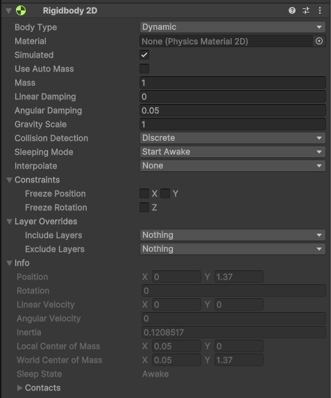
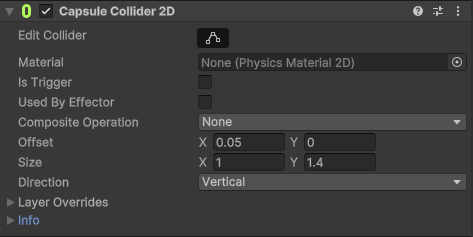

<!-- _class: lead -->
<!-- _paginate: false -->

### Chapter 04

# 物理系統

## Horazon
## 手機程式設計

---

# 複習：上週重點

-   [x] 學會製作 Tilemap 地圖。
-   [x] 學會使用 Tile Palette 繪製關卡。
-   [x] 加入了 Tilemap Collider 讓地板有實體。

但是... 現在場景裡空蕩蕩的。
今天我們要放入角色，並且讓 這世界擁有**物理法則**！

---

# 本章目標

這堂課我們不寫太多程式，而是**玩弄物理**。

1.  **下載完整專案**：取得老師做好的 Player 與素材。
2.  認識 **Rigidbody 2D** (剛體)：讓物體有重力。
3.  認識 **Collider 2D** (碰撞器)：讓物體有形狀。
4.  實驗 **Physics Material**：製作彈跳床與溜冰場。
5.  讓角色在你的地圖上跑跳！

---

# 步驟 1：下載並開啟完整專案

為了讓大家專注在「關卡設計」與「物理體驗」，
老師已經準備好寫好程式的角色了。

1. Github 下載：  
https://github.com/HKHorazon/MobileBase/tree/master
2.  **解壓縮** (這很重要！)。
3.  使用 Unity Hub **Add** 專案並開啟。

(細節請看上一章節投影片)

---

# 專案內容物檢查

開啟後，請檢查 Project 視窗：

-   `Assets/Prefabs/`：有沒有 **Player**？
-   `Assets/Scripts/`：有沒有 **PlayerController.cs**？
-   `Assets/Sprites/`：美術素材。

> 我們現階段不需要懂 `PlayerController` 裡面寫什麼。
> 把它當成一個**黑盒子**，只要知道它能讓角色動起來就好！

---

# 步驟 2：放入主角

1.  把 `Assets/Prefabs/Player` 拖進場景 (Hierarchy)。
2.  把它放在地圖的「起點」位置 (確保不會掉出畫面)。
3.  按下 **Play** 測試！

**你應該可以用鍵盤 (AD 或 左右鍵) 移動，空白鍵跳躍。**
(如果掉下去，檢查上一章的 Tilemap Collider 有沒有做對)

---

# 什麼是物理引擎？

Unity 內建了強大的物理引擎 (Box2D)。
它可以幫你模擬：

-   **重力 (Gravity)**
-   **摩擦力 (Friction)**
-   **反彈力 (Bounciness)**
-   **碰撞偵測 (Collision Detection)**

---

# 物理雙壁

要有物理反應，必須要有這兩個 Component：

1.  **Rigidbody 2D**
    -   讓物件受重力影響，可以被推動。
2.  **Collider 2D**
    -   定義物件的實體範圍，讓它不會穿牆。

> **Warning**: 請務必選有 **2D** 字尾的 Component！(3D 的 BoxCollider 沒用)

---

# Rigidbody 2D (剛體)

點選場景中的 **Player**，看 Inspector：

-   **Body Type**：
    -   **Dynamic** (預設)：受重力與力影響 
    (主角、敵人、箱子)。
    -   **Kinematic**：不受重力影響，但會推動別人 
    (移動平台)。
    -   **Static**：完全不動 
    (牆壁、地板)。
-   **Mass**：質量 (越重越難推)。
-   **Gravity Scale**：重力倍率 (1=地球重力，0=無重力)。

---

# 重要設定：Constraints

在 2D 遊戲中，這非常重要！

### Freeze Rotation Z
-   預設情況下，球滾動會旋轉。
-   但如果你的人物 (膠囊體) 走路走到一半跌倒滾走怎麼辦？
-   **一定要勾選 Freeze Rotation Z**，鎖住 Z 軸旋轉，讓主角永遠站著。

*(老師的 Prefab 已經幫你勾好了，但你自己做物件時要記得！)*

---

# 實作練習 1：推箱子

我們來做一點障礙物。

1.  在場景建立一個 **Square** (正方形 Sprite)。
2.  Add Component -> **Rigidbody 2D**。
3.  Add Component -> **Box Collider 2D**。
4.  把它放在主角前面。
5.  Play！

**試著用主角去推它，看能不能推動？**
(如果太重推不動，可以把 Mass 改小一點)

---

# Collider 2D (碰撞器) 類型

只有剛體，物體是「幽靈」，會穿過地板。
我們需要 **Collider** 來定義它的實體。

-   **Box Collider 2D**：方塊 (箱子、磚塊)。
-   **Circle Collider 2D**：圓形 (球、金幣)。
-   **Capsule Collider 2D**：膠囊形 (最適合**人類角色**)。
-   **Polygon Collider 2D**：多邊形 (不規則地形)。

---

# Physics Material 2D (物理材質)

想要做彈力球？還是溜冰場？

1.  Project 視窗按右鍵 -> **Create** -> **2D** -> **Physics Material 2D**。
2.  設定參數：
    -   **Friction** (摩擦力)：0 = 很滑 (冰)，1 = 很粗糙 (砂紙)。
    -   **Bounciness** (彈力)：0 = 不彈 (石頭)，1 = 超彈 (果凍)。

---

# 套用物理材質

1.  建立一個新的 **Platform** 當作地板。
2.  找到它的 **Box Collider 2D**。
3.  將剛剛做好的 Material 拖曳到 **Material** 欄位中。

**實驗：**
-   把摩擦力設為 0，做一個「滑冰場」。
-   把彈力設為 1，做一個「彈跳床」。

---

# 總結

本週我們學會了如何操控物理：

1.  匯入 **Player Prefab**，讓遊戲能玩。
2.  **Rigidbody 2D**：賦予重力與物理特性。
3.  **Collider 2D**：賦予實體形狀。
4.  **Physics Material 2D**：控制摩擦與彈力。

現在你的關卡不只是「好看」，而是「好玩」了！

---

# 下週預告

雖然現在有物理，但我們還不能自己決定「發生什麼事」。
例如：踩到陷阱應該要死掉，而不是穿過去。

下週我們要進入程式設計的世界 (C#)：
-   腳本 (Script) 是什麼？
-   寫出你的第一行程式碼。
-   控制遊戲邏輯。

---

# Q & A

-   主角會卡住牆壁？
    -   檢查用的是哪種 Collider？Capsule Collider (膠囊) 最不容易卡住。
-   推不動箱子？
    -   檢查箱子的 Mass (質量) 是不是太大了。
-   物件穿過地板掉下去？
    -   檢查地板有沒有裝 Collider。

