<!-- _class: lead -->
<!-- _paginate: false -->

### Chapter 12

# 玩家角色-動畫

## Horazon
## 手機程式設計

---

# 複習：上週重點

-   實現了 **Jump Force** 跳躍
-   解決了無限跳躍問題 (**Ground Check**)
-   調整了重力與手感

---

# 問題

現在主角能跑能跳

但看起來還是「滑來滑去」的僵屍

今天我們要賦予他**生命力**

---

# 本章目標

1.  理解 Unity 動畫系統 (Mecanim)
2.  製作關鍵動作：**Idle / Run / Jump**
3.  設定 **Animator Controller** (狀態機)
4.  透過程式控制動畫切換

---

# 必備素材

主角的分解動作圖：

-   `Idle` 系列
-   `Run` 系列
-   `Jump`


---

# 製作動畫片段

1.  選取場景中的 **Player**
2.  Window → Animation → Animation
3.  點 **Create** 按鈕
4.  命名 `Player_Idle`，存到 `Assets/Animations/`

---

# 錄製動畫：Idle

1.  選取所有 Idle 圖片
2.  **拖曳**到 Animation 時間軸
3.  按 **Play** 預覽

太快？調整 **Samples** (預設 60，改 12~24)


---

# 錄製動畫：Run

1.  左上角下拉選單 → **Create New Clip**
2.  命名 `Player_Run`
3.  拖入跑步連續圖
4.  調整 Samples 速度


---

# 錄製動畫：Jump

1.  Create New Clip → `Player_Jump`
2.  拖入跳躍圖

這邊只有單張圖片
更強的製作，通常是「起跳 → 滯空 → 落地」三段


---

# Animator 元件

幫角色加上 **Animator** 元件

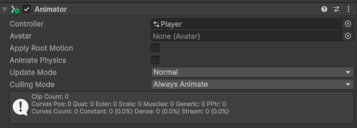

並建立 **Animator Controller** 檔案


---

# 兩個概念

-   **Animation Clip**：動作片段 (影片檔)
-   **Animator Controller**：大腦，決定要播哪一支 (播放器)

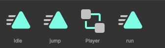

---

# 設定狀態機

1.  Window → Animation → **Animator**
2.  選取主角，會看到方塊：
    -   **Entry** (綠色)：入口
    -   **Player_Idle** (橘色)：預設狀態
    -   **Player_Run** / **Player_Jump** (灰色)

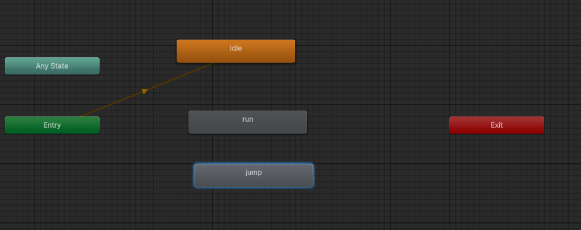

---

# 預設狀態
- 如果橘色不在 Idle 上：
- 在 Idle 按右鍵 → **Set as Layer Default State**

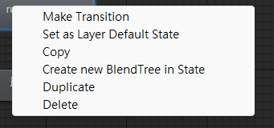

---

# 建立參數 (Parameters)

動畫切換需要條件

Animator 視窗左側 **Parameters** 分頁，點 `+`：

1.  **Speed** (Float)：移動速度
2.  **IsGround** (Bool)：是否在地板上

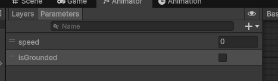

---

# 過渡：Idle → Run

1.  Idle 右鍵 → **Make Transition** → 連到 Run
2.  點白線看 Inspector：
    -   **Has Exit Time**：取消勾選
    -   **Transition Duration**：0
    -   **Conditions**：`Speed` Greater `0.1`

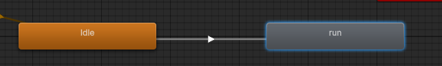
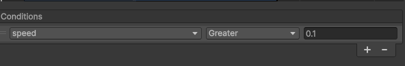

---

# 過渡：Run → Idle

同樣步驟反向連回來

Conditions：`Speed` Less `0.1`

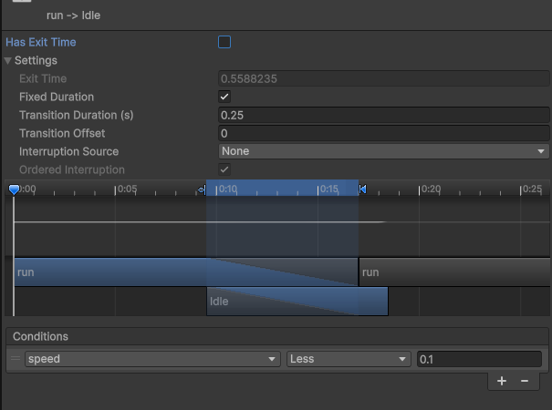

---

# 過渡：Any State → Jump

跳躍隨時都可以發生

1.  **Any State** 右鍵 → 連到 Jump
2.  Has Exit Time：關閉
3.  Conditions：`IsGround` False

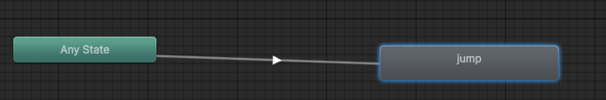
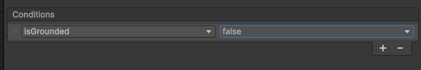

---

# 過渡：Jump → Idle

跳完要回來

從 **Jump** 連回 **Idle**

Conditions：`IsGround` True

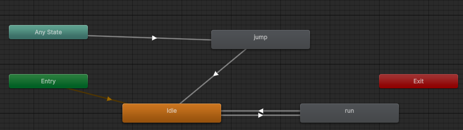
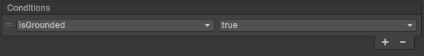

---

# 程式控制：宣告

回到 `PlayerController.cs`

```csharp
public Animator anim;
```

```csharp
void Start()
{
    anim = GetComponent<Animator>();
}
```

---

# 程式控制：傳送參數

```csharp
void Update()
{
    // 設定速度 (取絕對值)
    anim.SetFloat("Speed", Mathf.Abs(rb.velocity.x));

    // 設定是否在地板
    anim.SetBool("IsGround", isGrounded);
}
```

---

# 跑步動畫跟著速度連動

希望跑得慢，動畫播慢？

1.  選取 Animator 裡的 **Run** 狀態
2.  勾選 **Multiplier** → **Parameter**
3.  選 `Speed`

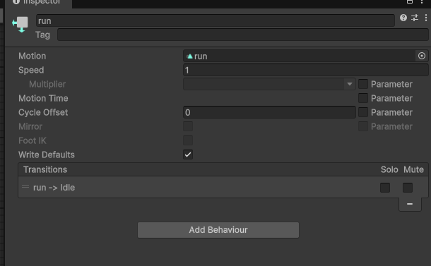

---

# 常見問題 1

**Q：放開按鍵後，動畫還在原地踏步？**

-   `rb.velocity.x` 可能有殘留微小速度
-   把條件 `Speed > 0.1` 改大
-   檢查 **Has Exit Time** 是否關閉

---

# 常見問題 2

**Q：跳起來過一下子才變跳躍姿勢？**

**Any State → Jump** 的 Transition Duration 不是 0

2D 遊戲講求反應快，Duration 設 0

---

# 進階：混合樹

有「走 → 小跑 → 快跑」時不想連一堆線：

1.  右鍵 Create State → **From New Blend Tree**
2.  雙擊進入
3.  設定 Threshold 根據 Speed 自動混合

*本課程簡單版 Idle/Run 切換即可*

---

# 下樓梯問題

膠囊體下樓梯有短暫「騰空」

→ `isGrounded` 瞬間變 false

→ 觸發 Jump 動畫 → 角色抽蓄

---

# 解法

Jump 的 Transition Duration 加一點 (例如 0.1 秒)

極短暫離地時，還沒切到 Jump 就又著地

可以掩蓋這個問題

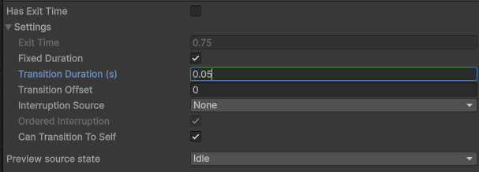

---

# 總結

1.  **Animation Clip**：錄製動作
2.  **Animator Controller**：規劃流程
3.  **Parameters**：溝通橋樑
4.  **Code**：`SetFloat` / `SetBool`

---

# 補充：有限狀態機

**FSM (Finite State Machine)**

一種把行為拆成「有限個狀態」的設計方式

任何時刻只能處於 **一個** 狀態

---

# FSM 三要素

1.  **State (狀態)**：Idle、Run、Jump…
2.  **Transition (轉換)**：狀態之間的連線
3.  **Condition (條件)**：什麼時候可以轉換

> Unity Animator 就是一個視覺化 FSM

---

# 生活中的 FSM

紅綠燈：

-   狀態：紅 / 黃 / 綠
-   轉換：綠 → 黃 → 紅 → 綠
-   條件：時間到

電梯、自動門、洗衣機都是 FSM

---

# 遊戲中的 FSM

**角色行為**

-   待機 / 移動 / 攻擊 / 受傷 / 死亡

**敵人 AI**

-   巡邏 / 追擊 / 攻擊 / 逃跑

**遊戲流程**

-   主選單 / 遊戲中 / 暫停 / 結算


---

# FSM 的限制

只能在**一個**狀態 → 角色不能「邊跑邊揮劍」？

**解法**：

-   Animator 的 **Layer** (上下半身分離)
-   **Sub-State Machine** (子狀態機)
-   進階做法：**HFSM** / **Behavior Tree**

---

# 補充：遊戲2D動畫的常見形式

2D 動畫不只一種做法

選擇會影響**美術流程**、**檔案大小**、**效能**

---

# (1) Sprite Sheet 逐格動畫

把每一格畫面排在一張圖上輪流播放

✅ 製作直覺、像翻動畫本
✅ Unity 內建支援 (本章做法)
❌ 動作越多、圖越大
❌ 換裝困難

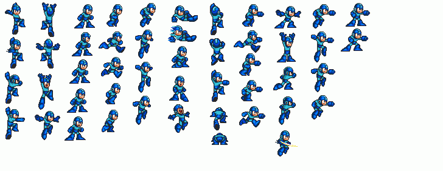

---

# (2) 骨骼動畫 (Skeletal)

像紙偶：身體拆成零件 + 骨架控制

**常見工具**：Spine、DragonBones、Unity Anima2D

✅ 檔案小、可重複利用
✅ 容易換裝、做表情
❌ 學習曲線高、需要美術配合

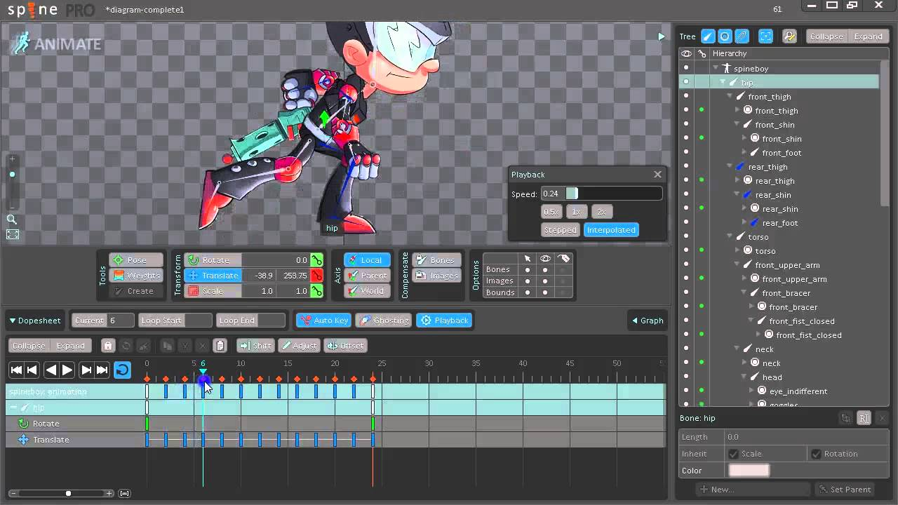

---

# (3) Live2D

骨骼動畫的進化版
用變形 (Mesh Deformer) 模擬 2.5D 立體感
常見於：

-   Vtuber
-   日系手遊立繪 

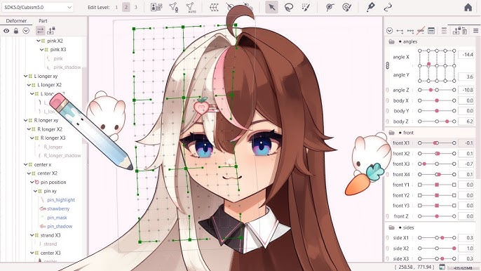

---

# (4) 程式動畫 (Tween)

不畫圖，用程式補間 (Position / Scale / Rotation)

```csharp
transform.DOScale(1.2f, 0.2f);
```

常見於：

-   UI 彈跳效果
-   特效、彈簧反饋

工具：**DOTween**、Unity Animation Curve

