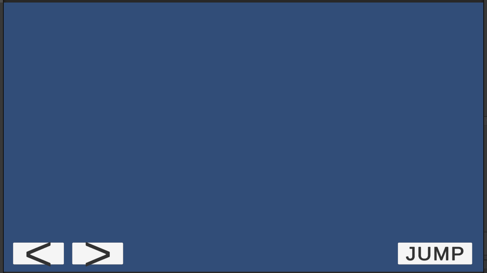
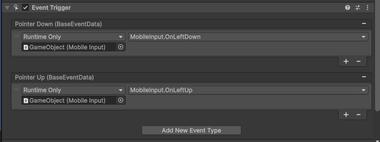
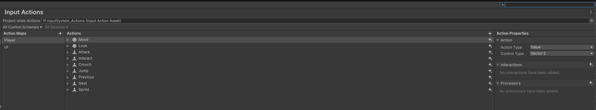
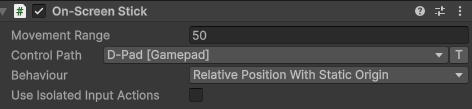

<!-- _class: lead -->
<!-- _paginate: false -->

### Chapter 14

# 手機操作

## Horazon
## 手機程式設計

---


# 本章目標

1.  製作螢幕虛擬按鈕 (左、右、跳)。
2.  使用 **EventTrigger** 偵測「按住」事件。
3.  修改 `PlayerController` 支援手機輸入。


---

# 介面佈局

我們需要在螢幕上畫出控制器。

1.  在 Canvas 建立新的 **Panel**，命名為 `Controls`。
    -   把 Alpha 值調成 0 (透明底)。
2.  **D-Pad (方向鍵)**：
    -   在左下角放兩個 Button (或 Image)：`<` (左) 和 `>` (右)。
    -   Anchor 設為 **底端-左側 (Bottom-Left)**。
3.  **Jump Button (跳躍鍵)**：
    -   在右下角放一個 Button：`Jump`。
    -   Anchor 設為 **底端-右側 (Bottom-Right)**。


---
# 介面布局


---

# 難點分析：按鈕 vs 按住

-   **一般 Button (OnClick)**：
    -   手指「點一下並放開」才觸發。
    -   適合：跳躍 (Jump)。
    -   **不適合：移動 (Move)**。因為移動需要「一直按著」。

-   **解決方案**：
    -   我們需要偵測 **PointerDown** (按下) 和 **PointerUp** (放開) 事件。

---

# 實作：手機輸入腳本

建立腳本 `MobileInput.cs`：

```csharp
using UnityEngine;

public class MobileInput : MonoBehaviour
{
    // 靜態變數，讓主角可以隨便讀取
    public static bool isLeftPressed = false;
    public static bool isRightPressed = false;
    public static bool isJumpPressed = false;

    // 給左鍵綁定
    public void OnLeftDown() { isLeftPressed = true; }
    public void OnLeftUp()   { isLeftPressed = false; }

    // 給右鍵綁定
    public void OnRightDown() { isRightPressed = true; }
    public void OnRightUp()   { isRightPressed = false; }
    
    // 給跳躍鍵綁定
    public void OnJumpDown() { isJumpPressed = true; }
    public void OnJumpUp()   { isJumpPressed = false; } // 跳躍其實不太需要 Up，但為了保險
}
```

---

# 設定 EventTrigger

1.  建立空物件 `MobileInputManager`，掛上 `MobileInput.cs`。
2.  選取 UI 上的 **左鍵 (<)**。
3.  Add Component -> **Event Trigger**。
4.  點 `Add New Event Type` -> **Pointer Down**。
    -   綁定 `MobileInputManager` -> `OnLeftDown`。
5.  點 `Add New Event Type` -> **Pointer Up**。
    -   綁定 `MobileInputManager` -> `OnLeftUp`。
6.  **右鍵 (>)** 與 **跳躍鍵** 依此類推。


---
# 設定EventTrigger (示意)



---

# 修改主角程式 (PlayerController)

我們要同時支援鍵盤 (測試用) 與 手機 (發布用)。

```csharp
void Update()
{
    // 1. 讀取鍵盤
    float mx = Input.GetAxisRaw("Horizontal");

    // 2. 讀取手機 (覆蓋鍵盤)
    if (MobileInput.isLeftPressed) mx = -1;
    if (MobileInput.isRightPressed) mx = 1;

    // 3. 跳躍
    if ((Input.GetButtonDown("Jump") || MobileInput.isJumpPressed) && isGrounded)
    {
        Jump();
        MobileInput.isJumpPressed = false; // 按下即觸發，馬上重置
    }
    // ... (剩下的物理移動程式不用改)
}
```

---

# UI 優化：半透明與圖示

虛擬按鍵不要擋住畫面。

1.  把按鈕圖片的 **Alpha 值** 調低 (例如 100/255)，變成半透明。
2.  把文字 `<` 改成漂亮的箭頭圖示 (Sprite)。
3.  確保按鈕夠大！(手指很粗)，建議至少 100x100 像素。


---

<!-- 說明一下Input System 與 Input Manager的差異-->

# 補充：兩套輸入系統

Unity 其實有「兩套」輸入系統，網路教學常常混用，別搞混了。

### Input Manager (舊 / Legacy)
-   用 `Input.GetAxis()`、`Input.GetButtonDown()`。
-   設定在 **Project Settings -> Input Manager**。
-   就是我們今天用的方式。

### Input System (新)
-   用 **Action (動作)** + **Callback (回呼)** 架構。
-   需要先安裝套件、建立 Input Actions 資產。
-   支援更多裝置 (手把、觸控)，更有彈性。

---

<!-- 展示Input System -->

# Input System 長這樣

安裝套件後，會多一個 **Input Actions** 設定視窗，所有按鍵都在這裡綁定。



---

<!-- 說明一下為我這邊為啥用Input Manager(因為簡單) -->

# 那為什麼今天用舊的？

**因為簡單。**

-   Input System 功能強，但對新手來說「前置設定」很繁瑣。
-   我們的遊戲只需要 左 / 右 / 跳，用 `Input.GetAxis` + EventTrigger 就夠了。
-   先把「能動、能玩」做出來，學會概念最重要。

*(等做更複雜的專案，再回來研究 Input System)*

---

<!-- 使用Input System OnScreenStick / OnScreenButton -->

# 進階：Input System 的內建虛擬鍵

如果改用 Input System，手機虛擬按鍵有**內建元件**，不必自己寫 `MobileInput`：

-   **On-Screen Stick**：掛在 UI 上就變成虛擬搖桿。
-   **On-Screen Button**：掛在按鈕上就模擬實體按鍵。


