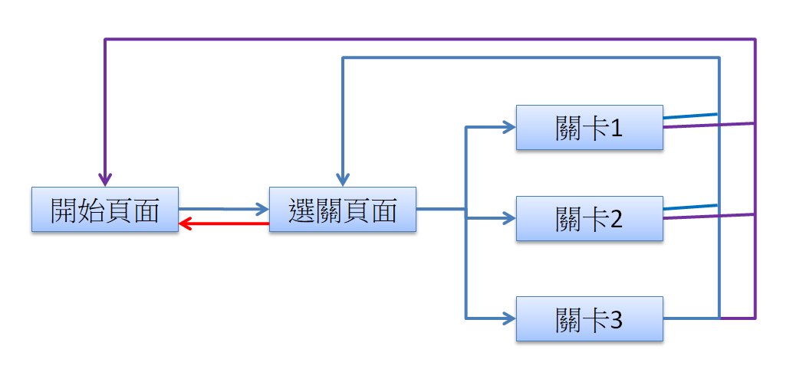
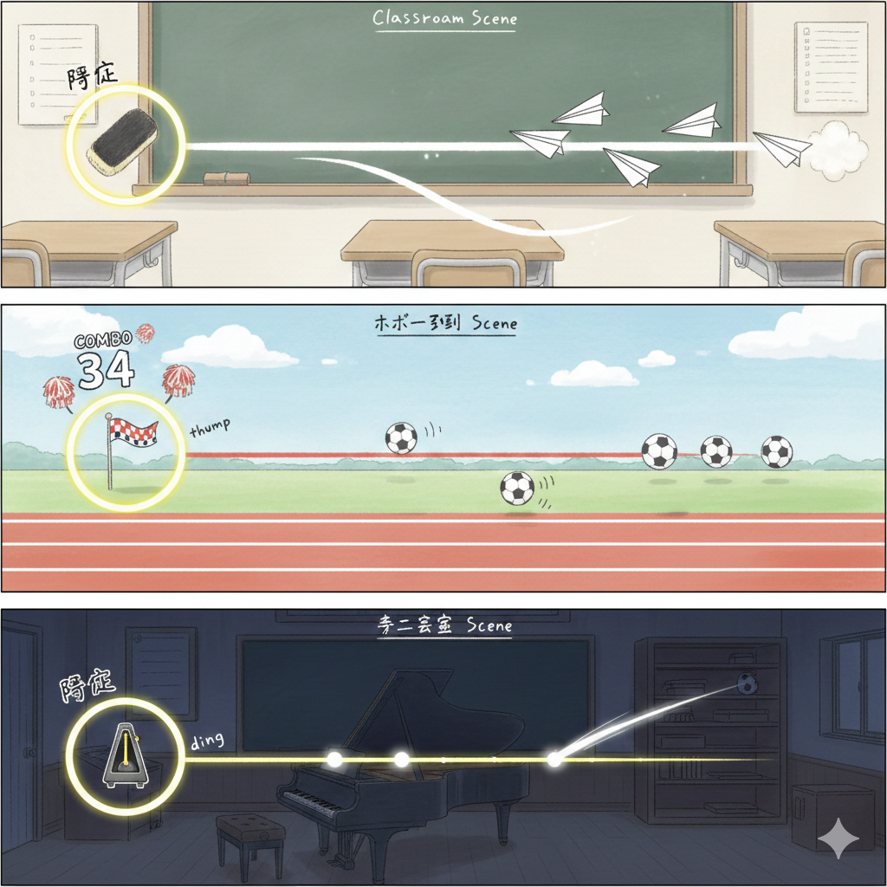
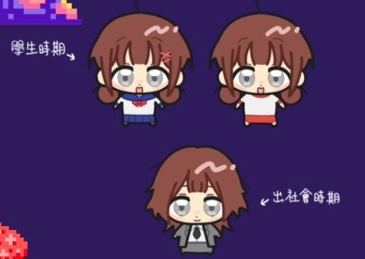

<!-- _class: lead -->

# 遊戲核心程式


---

# 範例歌曲 

歌曲下載
https://drive.google.com/file/d/1X7uz0ky3wI_C1fzFMnFbyXH-oyIT1rns/view?usp=drive_link

BPM 120、44拍
前有一個短短的進入音樂

---

# BPM 與 Note

數學應用題： 一首歌 BPM 210，44拍，第一拍的進入點為2.3秒，使用者的調整為-0.1秒 一個note(音符) 必須在第 4 小節 第 3拍 打到，該note生成至被打擊的時間 為1.5秒 請問：
該note何時該被打到
該note何時被生成

https://chatgpt.com/share/691ad570-0f00-8008-bf10-bf0b0ce9ba41

---

# 核心程式內容1

1. 嘗試學會如何建立遊戲物件，並且讓它位移
將一個Cube建立在(0,0,0)的位置，並以程式方式讓它在1秒後位移至(5,0,0)位置，到達該位置後請將該物件移除
也可以嘗試使用動畫的方式

2. 播放音樂
在Unity放入前一段音樂，並且瞭解其播放與暫停的方式

---

# 核心程式內容2

1. 在前段音樂播放的時間，每一拍都要去生成一個Cube，並且都要執行位移。

2. 修改為每個小節的第一拍

3. 修改為以下時間點生成Cube
    第1小節第1拍、第3小節第2拍、第5小節第3拍、第7小節第4拍

記得以上的Cube都要包含移動至(5,0,0)以及消失

---

# 核心程式內容3

目前已完成：你可以在 第X小節第Y拍 的1秒前建立一個物件，並且讓他在1秒後準確移動到該點。

接下來開始研究：

(1) 如果同時有多個物件，如何判斷何者為「當前音符」(即音樂遊戲打擊時應該要計算的音符。

(2) 判定「當前音符」的方式，必須允許延後，如該節拍的 
     正負0.15秒

---

# 核心程式內容4

接下來開始研究：

(1) 讀取玩家任何一種輸入(建議鍵盤按鍵)，並且列印一個訊息(Debug.Log)來顯示點擊的音樂時間

(2)  以該音樂時間 尋找前段找到的「當前音符」，
       顯示第X小節第Y拍，並且顯示「誤差的時間」。

(3)  建立一個時間區間的對應，將「誤差的時間」的轉換為
     「完美」「太快」「太慢」等。

---
# 核心程式內容5

建立專用類別(class) NoteData 來儲存
1. Note種類
1. 打擊時間 (第幾小節,第幾拍)
<br>

此時要設法允許不同Note播放，能的話最好使不同note間其動作時間不同


---
# 核心程式內容6


建立 List\<NoteData\>來儲存多個NoteData
<br>

讓程式可以播放一個List\<NoteData\>，使其可播放多個Note

---

# 核心程式內容7

待續..

使用 ScriptableObject 儲存譜面檔案
使用一個大物件 包含音樂與其他


---

<!-- _class: lead -->

# UI+流程 程式

---

# 場景相關流程1

<br>

取得一個正確的 <mark> [遊戲引擎]作業3 完成品 </mark>
場景相關

1. 確認目前存在的三個場景
2. 新增一個場景[關卡1]
3. 設法讓「開始遊戲」按鈕能到達該場景
```cs
public class MenuPanel : UIPanelBase
{
    //開始遊戲按鈕事件
    public void OnClick_StartGame()
    {
        this.Hide();
        UIManager.Instance.loadingPanel.LoadScene(UIManager.BATTLE_SCENE);
    }
...
```


---

# 場景相關流程2

建立另一個場景起始程式，可先閱讀
```
Script/Scene/GameSceneBaseScript.cs    //基底
Script/Scene/StartGameScene.cs
Script/Scene/FinishGameScene.cs
Script/Scene/BattleGameScene.cs
```
1. 為剛才建立的新場景，建立一段起始程式碼
2. 讓該段程式碼，可開啟任何一個UI (如:FinishPanel)


---
# UI相關程式

1. 閱讀 UI相關程式碼
```
Scripts/UI/UIPanelBase.cs
Scripts/UI/MenuPanel.cs
```
2. 建立一個新的UI程式碼 OptionPanel.cs，
3. 讓[開始遊戲]場景的Option可開啟該UI。
3. 在左上角放上一個按鈕，點擊會關閉該UI。
4. 嘗試將該UI設定為Popup，而非Panel


---
# 流程圖




---
# 場景與UI程式1

### 製作正式流程

請參照上一頁的流程圖，製作多個場景

每個場景都要放上專用的起始程式碼

場景間 可以先用簡易按鈕移動

---
# 場景與UI程式2

待續..
<br>

與UI美術合併
製作其他設定功能
在各個場景播放不同音樂
按鈕播放音效

---


<!-- _class: lead -->

# 美術 (背景, 人物)

---

# 背景

已經有這三個AI產生的背景

請對每個背景手/電繪 拆解成以下內容

1. 背景圖
2. 音樂判定線 (圈&線可分開)
3. 音符圖

所有製作請用1920x1080中出現大小製作



---

# 人物

已經有人物設計，接著..

1. 請確認各自用在哪個背景
    是否需要新增[音樂教室]種類
1. 提升幾種人物的差異，不要完全一樣
1. 請為每種 另外建立兩種[狀態]
    圖片差異/表情反應盡量大一些

所有製作請用1920x1080中出現大小製作




---

<!-- _class: lead -->

# 美術 (UI)

---

# 美術UI (1)

所有製作請用1920x1080中出現大小製作
部分內容請在Unity嘗試操作
請先取得一個正確的<mark> [遊戲引擎]作業3 完成品 </mark>

[開始遊戲] 場景..
1. 修改字體
2. 處理背景
2. 在[開始遊戲]場景放入LOGO
    這邊的LOGO..我會建議是海報上的雲


---
# 美術UI (2)

所有製作請用1920x1080中出現大小製作
請先設計音樂遊戲中會用到的介面
可能有
1. 太晚、完美、太早的文字
2. 分數指示 或其他做法

---

# 美術UI (3)

選關頁面，有三個關卡(區塊)可選
每個關卡(區塊)中，至少會有
1. 關卡名稱
1. 示意圖
1. 最高分數
2. 開始的按鈕

---

# 美術UI (4)

製作結算頁面的UI
到時候可以考慮在遊戲畫面上蓋一個半透明灰幕
其上再放上UI，UI上至少有：

1. 關卡名稱
1. 獲得的分數
2. 之前獲得的最高分數
3. 按鈕：重來、至選關畫面、回到首頁等


---

<!-- _class: lead -->

# 音樂與音效

---
# 遊戲音樂

這邊建議的組合式音樂，要做NOTE點的位置用額外的音效
所以要找的音樂 (就用AI來做吧..)

1. 無人聲
2. 不要太激昂、祥和一點的音樂，避免蓋掉額外音效
3. 至少三首，配合三個關卡
4. 務必要知道BPM，建議為44拍，而且不能變奏


---
# 遊戲音效

這邊可以嘗試找看看AI，沒有的話我提供素材包，但你們還是需要去找

1. 配合三個關卡的「NOTE音符」來製作
2. 可能同個關卡也要找幾種不同音符

然後我們用剪輯軟體去合成，務必將音效放在音樂的拍點上

---
# 其他

這邊可以晚一點再去做，大概也是AI或找素材包
1. 其他介面的UI (首頁、選關介面)
1. UI按鈕的點擊音效
1. 結束/勝利/失敗 之類的音效


--- 
<!-- _class: lead -->
# 特效
---
# 特效

這個部分，你們如果有修特效的課程，
如果到時候是教Unity Particle System
可以在課堂製作的內容拿來使用

等前面大多數完成再來完成 & 製作