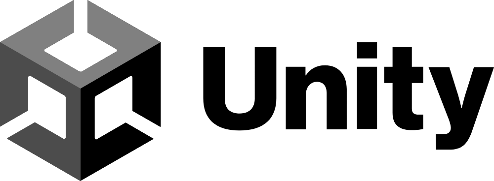
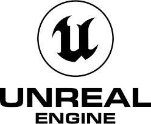
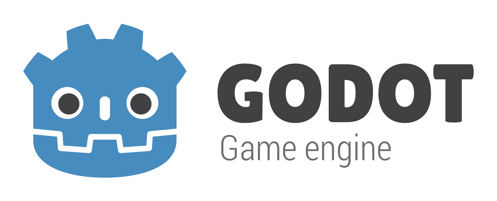
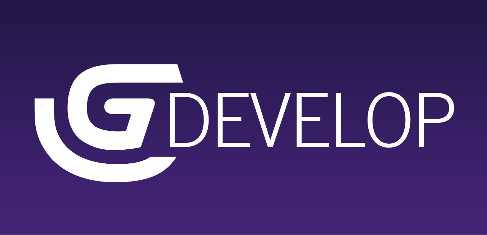

<!-- _class: lead -->
<!--_paginate: false-->

### 特別主題
# 遊戲引擎與製作

## Horazon
## 遊戲開發工作坊

---

# About Me

**張仕明 (Horazon)**

- **現職**：弘光科技大學 多媒體遊戲發展與應用系 助理教授
- **專長**：遊戲開發、程式設計

---

# 弘光多遊系
## Dept. of Multimedia Game Development and Application

我們致力於培養具備「數位創意」與「技術實力」的專業人才。

- **核心領域**：**遊戲、動畫、漫畫、直播、電競**
- **特色設施**：電競館、動作捕捉室、遊戲開發實驗室
- **教學目標**：透過實作與產學合作，讓學生接軌國際產業趨勢

> 在這裡，不只是玩遊戲，更是**創造遊戲**的地方！

---

# Topic

- 理解遊戲引擎是什麼，以及為什麼我們需要它。
- 認識市場上常見的遊戲引擎差異。
- 了解遊戲引擎中的「四大核心」功能。
- 遊戲引擎和高中數學的關聯。
- 遊戲引擎和高中物理的關聯。

---

# 什麼是遊戲引擎？

遊戲引擎是開發遊戲的核心軟體，可以將它看作是一個**專屬工具箱**。

- 提供現成且驗證過的程式碼與工具模組。
- 整合了影像、聲音、物理等各種不同系統。

<br>

<mark>讓我們能專注於設計遊戲玩法，不需去寫底層技術。</mark>

---

# 從零開始開發有多累？

如果不使用引擎，一切程式都需要自己重新發明。

- **工作量龐大**：光是寫出「碰到牆壁會停下」的程式，可能就要幾個月。
- **技術門檻極高**：必須具備深厚的微積分與電腦繪圖系統能力。

<br>

完全從無到有開發，只有少數的頂尖工程師能做到。

---

# 使用引擎的核心好處

- **節省時間**：提供現成的通用功能，只要點選套用就能生效。
- **降低門檻**：有簡單的視覺化滑鼠介面，非程式技術人員也能操作。
- **跨平台輸出**：只要開發一次，就能輕易發布到手機或電腦主機。

<br>

現在幾乎沒有人從零寫程式了，使用引擎是業界「最基本的常識」。

---

# 常見的三大遊戲引擎

市場上有許多不同的引擎工具可供挑選。

- 它們最大的差異在於：主打特色與學習難易度不同。
- 目前業界最知名的三大軟體分別為：**Unity、Unreal、Godot**。

<br>

根據您的專案規模與需求，一開始選對引擎非常重要。

---

# Unity 引擎



業界使用率最高、資源極多的熱門軟體。

- **特色**：使用 **C#** 開發，學習資源極龐大且 2D/3D 通用。
- **對象**：非常適合初學者，也是獨立小團隊的首選。
- **知名遊戲**：《原神》、《Pokemon GO》、《空洞騎士》(Hollow Knight)。

---

# Unreal (虛幻) 引擎



以強悍的「頂級視覺畫面表現」舉世聞名。

- **特色**：使用 **C++** 開發或免寫程式的「藍圖」，內建神級光影。
- **對象**：追求極致畫面的大型專案與 3A 級遊戲公司。
- **知名遊戲**：《堡壘之夜》(Fortnite)、《黑神話：悟空》。

---

# Godot 引擎



備受獨立開發者喜愛的新興「開源引擎」。

- **特色**：完全免費零抽成，軟體容量極小、執行速度非常快。
- **對象**：單人開發者，或製作機制簡單的輕量級休閒遊戲團隊。
- **知名遊戲**：《馬鈴薯兄弟》(Brotato)、《穹頂守護者》(Dome Keeper)。

---

# 引擎的四大核心功能

引擎的核心功能，至少有以下內容。

- **1. 渲染 (Rendering)**
- **2. 物理 (Physics)**
- **3. 音效 (Audio)**
- **4. 腳本 (Scripting)**

---

# 核心 1：渲染 (Rendering)

渲染系統，負責處理並將世界裡的資料**即時畫出來給眼睛看**。

- 負責處理平面圖片的大小推疊、旋轉角度。
- 負責處理立體模型的表面貼圖、以及光線打下去後的陰影。
- 重點任務：強迫維持每秒必須快速產出畫面 (例如: 60 FPS 流暢度)。

<br>

渲染系統技術越好，遊戲畫面看起來就越華麗與逼真精美。

---

# 核心 2：物理運算 (Physics)

物理系統，目標是讓螢幕裡的虛擬物品，看起來也像擁有真實世界的反應。

- **重量與重力計算**：控制所有東西往地上掉落的速度有多快。
- **碰撞判斷計算**：決定兩輛車高速撞在一起時，該如何往外旋轉彈飛。
- 通常會使用其他的物理引擎，如 Box2D、PhysX 等等。

<br>

引擎會自動把這些算好，不需要開發者自己整天在旁邊寫困難的物理公式。

---

# 核心 3：音效管理 (Audio)

音效系統有條理地幫我們管理所有的背景環境音樂與音效發聲。

- 處理突然間開槍、發生爆炸等臨時播放的短暫疊加聲音。
- 能根據玩家與「發出聲音物體」的距離遠近，自動把音量變大變小。
- 直接幫忙製造出戴著耳機遊玩時的「左耳與右耳立體空間感」。

---

# 核心 4：腳本系統 (Scripting)

我們親手利用文數字寫出來的程式碼檔案，就是控制一切機制的**腳本**。

- 收看玩家是否有把按鈕按下，收到之後控制角色的跳躍行為。
- 計算畫面右上角怪物的殘餘血量，以及通關後的玩家總得分。
- 負責告訴這個引擎：怪物死掉的那瞬間，你該幫我播什麼聲音與動畫。

<br>

程式碼就是遊戲這具身體裡的靈魂中樞神經。

---

# 其他

遊戲引擎還整合了許多讓遊戲「活起來」的強大功能：

- **動畫系統 (Animation)**：控制角色的骨架與動作切換（如走路轉為跑步）。
- **攝影機系統 (Camera)**：負責玩家視野的追蹤、運鏡震動與畫面後製效果。
- **UI 介面系統 (UI)**：製作血條、選單與計分板，處理玩家與遊戲的資訊互動。
- **特效系統 (VFX)**：模擬火焰、爆炸、煙霧等粒子動態，增加視覺衝擊力。
- **人工智慧導航 (Navigation)**：讓 NPC 具備「智商」，能自動計算最短路徑並避開障礙物。

<br>

<mark>總結：引擎的強大之處在於，它已經幫你把「輪子」造好了，我們只需要組裝。</mark>


---

# 遊戲開發與高中數學

雖然有了引擎減輕負擔，但遊戲邏輯依然仰賴最單純的基礎高中數學。

- **幫助電腦控制空間**：引擎只看得懂數字，數學負責指定「方向與目標在哪」。
- **不需要親筆算破頭**：現在不需用紙筆手算，常常只需呼叫引擎內部現成的數學指令。

<br>

<mark>現在的重點是在於「遇到什麼狀況動作，你要能知道該選用哪種數學機制」。</mark>

---

# 座標系統 (Coordinate)

座標的唯一作用，就是用數字清楚定位世界上每一樣東西的**絕對精準位置**。

- **2D 座標 (X, Y)**：平面的遊戲空間裡，X 軸負責左右寬度，Y 軸負責上下高度。
- **3D 座標 (X, Y, Z)**：一旦加入深度的第三個測量軸線 (Z 軸代表前後距離)，遊戲就變成立體的。
- **無座標就無萬物**：即使是遊戲地圖空間的起點正中央，也被標示為原點位置 `(0, 0, 0)`。

---

# 向量 (Vector) 

具備「**長度尺寸大小**」且同時還帶有一個「**指引方向**」的特殊數字組合。

- **遊戲裡的移動**：角色之所以會往前走，其實是因為推動了一支速度向量箭頭。
- **方向**：箭頭朝指哪邊，角色就被推去哪裡。
- **大小**：箭頭如果越長 (數字越大)，角色一步跨出去走的距離就越長越快。

<br>

只要畫面上有人物發生改變位置的動態，背後就一定是在大力操控向量。

---

# 簡單的向量加減法

就算數學不好，絕大多數的操作只要基礎的向量加法與減法指令就能解決。

- **加法向前進**：把主角目前的定位點 加上「這步的移動力向量」= 更新你走到的新位置。
- **減法求轉向**：用敵人的目前位置點 被你「減掉」 = 就會得出你從身體轉過去面朝向著敵人的角度方向。
- **直接換算距離**：直接請引擎抽出算完後的向量線段長度，結果就是兩人實際隔了多遠的直線距離。

---

# 三角函數：角與圓弧運動

只要你未來遇到跟**一直繞圈規律變化**或**角度極限判斷**有關的功能，就會用上三角函數。

- **計算夾角的死角**：計算出警衛前面的手電筒光錐有幾度角，看主角是不是幸運躲在死角內。
- **上下浮動發電機**：使用正弦 (Sine) 天然一直從正1回到負1的重複波動定律，製作水面上下漂浮船隻動態。
- **繞行星球軌道**：把兩三種函數疊加，用來精確產生繞著中間恆星完美旋轉的追蹤軌道半徑點位。

---

# 矩陣基礎 (Matrix)

這是一個能把一大堆數字全部塞進去表格裡一起等著被變化的工具，它也是所有畫面畫出來的算數核心。

- **縮放與變形的幕後功臣**：要讓龐然怪獸的整個身體斜坡轉彎傾倒，底層就是靠著矩陣運算達成。
- **畫面投射降階還原**：把立體的漂亮空間環境給運算壓縮，順利變成能在平面電腦螢幕上顯示的平面圖案像素。
- **高階顯示卡專職處理**：你花錢買的 GPU 顯卡硬體，天生本業就是為了能在一秒內瞬間擊殺幾萬筆矩陣而生的裝置。

---

# 轉換矩陣：位移、旋轉、縮放 (TRS)

在 3D 空間中，每個物體都有一個「Transformation」矩陣，決定它如何呈現。

- **位移 (Translation)**：物體在空間中的座標位置 `(X, Y, Z)`。
- **旋轉 (Rotation)**：物體面對的方向。引擎常用「**四元數 (Quaternion)**」來計算，避免旋轉時產生卡死問題。
- **縮放 (Scale)**：物體的體積大小倍率。

雖然遊戲製作與矩陣直接關聯，但是我們不需要自己寫矩陣，引擎會自動幫我們處理。

---

# 位移矩陣與縮放矩陣

    位移矩陣
$$
T = \begin{bmatrix} 
1 & 0 & 0 & t_x \\ 
0 & 1 & 0 & t_y \\ 
0 & 0 & 1 & t_z \\ 
0 & 0 & 0 & 1 
\end{bmatrix}
$$

    縮放矩陣
$$
S = \begin{bmatrix} 
s_x & 0 & 0 & 0 \\ 
0 & s_y & 0 & 0 \\ 
0 & 0 & s_z & 0 \\ 
0 & 0 & 0 & 1 
\end{bmatrix}
$$

---

# 旋轉矩陣

    繞 Y 軸旋轉矩陣 (Rotation around Y-axis)
$$
R_y(\theta) = \begin{bmatrix} 
\cos\theta & 0 & \sin\theta & 0 \\ 
0 & 1 & 0 & 0 \\ 
-\sin\theta & 0 & \cos\theta & 0 \\ 
0 & 0 & 0 & 1 
\end{bmatrix}
$$


    四元數 (w,x,y,z)轉矩陣 (Quaternion to Matrix)
$$
M_q = \begin{bmatrix} 
1 - 2y^2 - 2z^2 & 2xy - 2zw & 2xz + 2yw & 0 \\ 
2xy + 2zw & 1 - 2x^2 - 2z^2 & 2yz - 2xw & 0 \\ 
2xz - 2yw & 2yz + 2xw & 1 - 2x^2 - 2y^2 & 0 \\ 
0 & 0 & 0 & 1 
\end{bmatrix}
$$

---

# 為什麼需要物理引擎？

物理引擎就像是把「高中物理實驗室」搬進電腦，為遊戲帶來**互動真實感**。

- **自動化計算**：不需手寫公式，引擎會自動處理重力、摩擦力與碰撞力學。
- **接軌高中物理**：這是一個可以讓你實驗牛頓定律、能量守恆的數位沙盒。
- **增加樂趣**：讓玩家能像在現實中一樣推開木箱、打飛敵人，增加回饋感。

---

# 數位物理實驗：接軌高中課程

你可以把遊戲引擎當成一個最強大的實驗器材。

- **驗證公式**：直接在引擎裡模擬自由落體、單擺運動，看看數值是否符合公式。
- **無風險實驗**：可以隨意調整重力常數（例如模擬月球引力），觀察物體運動的變化。
- **視覺化呈現**：將原本枯燥的物理習題，轉化為生動的角色動作或爆炸特效。

---

# 剛體與碰撞：力學模擬基礎

要讓電腦物體動起來，需要先為它加上兩個關鍵組件。

- **剛體 (Rigidbody)**：賦予物體「質量 (Mass)」。有了它，物體才會受重力影響並產生慣性。
- **碰撞器 (Collider)**：定義物體的「邊界」。確保兩顆球撞在一起會彈開，而不是直接穿透。
- **摩擦力 (Friction)**：調整物體表面摩擦。例如在「草地」上滑行比在「冰面」上快停下。

---

# 拋體運動：力與飛行軌跡

模擬弓箭或砲彈路徑，在引擎中只需要設定初始的力量。

- **給予衝量 (Impulse)**：對剛體施加一個瞬間推力，當作初速度。
- **重力效應**：物體起飛後，引擎會持續施加向下的重力加速度 `g`。
- **自動形成拋物線**：結合初速與重力，呈現出完美的拋體運動軌跡。

---

# 彈性係數：模擬不同材質反應

調整「彈力」可以模擬物體碰撞後的動能回收程度。

- **恢復係數 (Bounciness)**：決定碰撞後的彈跳高度。
- **材質差異**：
    - **高彈性**：蹦蹦床、皮球（恢復大部分動能）。
    - **低彈性**：沙包、地板（能量幾乎被吸收）。
- **實作方式**：透過引擎內的 `Physics Material` 就能輕鬆調整。

---

# Unity：最強大的 C# 開發平台


Unity 是一個以「組件 (Component)」為核心的開發環境，使用 **C#** 語言。

- **組件化架構**：不需要寫超長程式碼，而是將功能拆成一個個小零件掛在物體上。
- **跨平台王者**：寫一次程式，就能發布到 iOS, Android, PC, Switch, PS5。
- **數位孿生、虛擬實境 (VR/AR)**：除了遊戲，Unity 也是目前元宇宙與工業模擬的首選。

```csharp
float speed = 10f;
void Update()
{
    // 每幀根據時間偏移量位移，確保不同幀率下移動速度一致
    transform.Translate(Vector3.forward * speed * Time.deltaTime);
}
```

---

# AI 世代的程式撰寫革命

在現代開發環境中，程式碼的「語法」已經不再是主要門檻。

- **AI 輔助開發 (AI Coding)**：使用 Github Copilot 或 Cursor 等工具，AI 能預測意圖並產出樣板。
- **從「敲鍵盤」變成「對話」**：重點在於懂邏輯與如何下 Prompt，讓 AI 幫你處理繁瑣的編碼。
- **快速原型製作**：在 AI 協助下，原本需要三天完成的功能，現在可能只需要十分鐘。

<br>

<mark>老師的建議：學程式不再是死背語法，而是學習如何與 AI 合作解決問題。</mark>

---

# GDevelop 5：無程式碼引擎首選



如果您完全不想碰程式語法，[GDevelop 5](https://editor.gdevelop.io/) 是目前最強大的視覺化開發工具。

- **100% 視覺化**：不需要寫任何一行代碼，完全透過滑鼠點選完成邏輯。
- **跨平台與 Web 支援**：可以在瀏覽器直接開發，也能輸出為手機或電腦獨立軟體。
- **強大的擴充功能**：內建大量現成的「行為 (Behaviors)」，拖拉即可完成平台跳躍運動。

---

# 事件驅動邏輯 (Event System)

GDevelop 的靈魂在於其「事件編輯器」，這也是訓練研發邏輯的最佳場域。

- **條件 (Condition)**：當發生了什麼事？ (例如：玩家按下了空白鍵)
- **動作 (Action)**：那就執行什麼動作？ (例如：角色播放跳躍動畫並向上衝)
- **邏輯思考的體現**：雖然不用寫程式，但依然需要訓練極強的邏輯判斷與流程排程。

<br>


---

# Thank you

提早讓學生們接觸遊戲引擎，也可能引發一些數學或物理的興趣。


由於本間教室沒有電腦，讓我們移動到另外一間電腦教室。
> 開啟電腦
> 準備一個Google帳號
> 嘗試操作看看Unity 或是 GDevelop5。
 