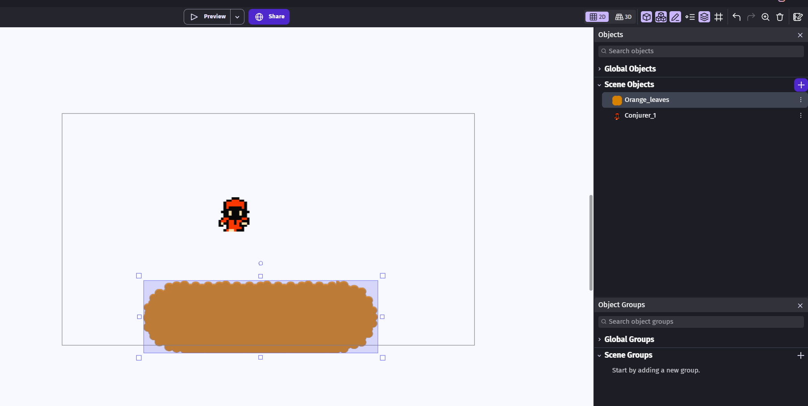
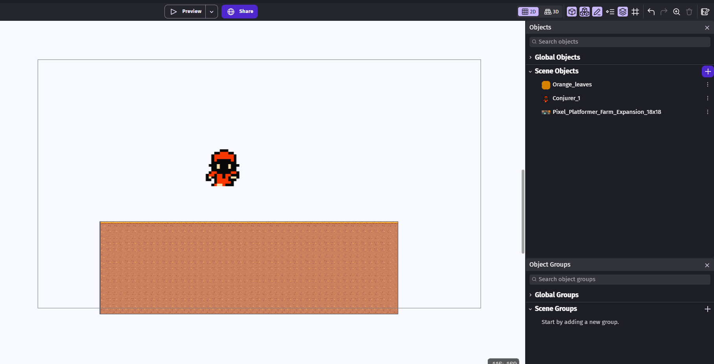
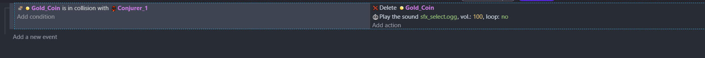
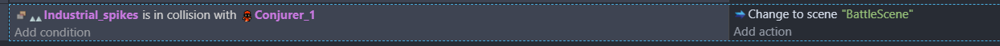

<!-- _class: lead -->
<!-- _paginate: false -->

# 遊戲開發工作坊

## Game Development with GDevelop

## 張仕明 老師 (Horazon)

---

# 關於講師
## About the Instructor

**張仕明 (Horazon)**

- **現職**：弘光科技大學 多媒體遊戲發展與應用系 助理教授
- **專長**：遊戲開發、程式設計

---

# 弘光多遊系
## Dept. of Multimedia Game Development and Application

我們致力於培養具備「數位創意」與「技術實力」的專業人才。

- **核心領域**：**遊戲、動畫、漫畫、直播、電競**
- **特色設施**：電競館、動作捕捉室、遊戲開發實驗室
- **教學目標**：透過實作與產學合作，讓學生接軌國際產業趨勢

> 在這裡，不只是玩遊戲，更是**創造遊戲**的地方！

---

# 目標
## Goal of this Workshop

在極短時間內，體驗遊戲開發的樂趣！

1. **認識遊戲引擎**：了解它是什麼、為什麼需要它
2. **選擇工具**：為什麼今天用 GDevelop？
3. **動手做**：親手完成一個平台遊戲

> **今天的重點是「創意」和「成就感」，不是「寫程式」！**

---

# 什麼是遊戲引擎
## What is a Game Engine?

遊戲引擎是一套 **幫你做遊戲的工具包**。

- 它提供了一個 **編輯器 (Editor)**，讓你拖拉物件、設計關卡
- 它內建了 **物理、繪圖、音效** 等系統，你不需要自己寫
- 你只需要專注在 **遊戲玩法** 和 **創意** 上

> 簡單來說：遊戲引擎 = **遊戲的工廠**

---

# 為什麼使用遊戲引擎
## Why use a Game Engine?

想像你要 **蓋房子**：

- **不用遊戲引擎**：從燒磚塊、砍樹、製作水泥開始 (太累了！)
- **使用遊戲引擎**：你有現成的牆壁、窗戶、地基，只要 **組裝** 起來就好

> 遊戲引擎讓你 **跳過最困難的底層技術**，直接開始做遊戲。

---

# 遊戲引擎做了什麼
## What Does a Game Engine Handle?

遊戲引擎幫你處理了 **最難搞的事**：

- **物理運算 (Physics)**：重力、碰撞、彈跳
- **畫面渲染 (Rendering)**：把圖片畫到螢幕上、動畫播放
- **聲音播放 (Audio)**：背景音樂、音效
- **輸入偵測 (Input)**：鍵盤、滑鼠、觸控
- **場景管理 (Scene)**：切換關卡、載入畫面

> 如果沒有遊戲引擎，以上每一項你都要 **自己從零寫程式**。

---

# 常見的遊戲引擎
## Common Game Engines

| Engine | 特色 (Feature) | 適合 (Best for) | 難度 |
|:---:|:---|:---|:---:|
| **Unity** | 業界標準、資源豐富 | 手遊、2D/3D、獨立遊戲 | ⭐⭐⭐ |
| **Unreal Engine** | 畫面頂級、3A 大作 | 寫實風格、大型專案 | ⭐⭐⭐⭐⭐ |
| **Godot** | 輕量開源、完全免費 | 2D 遊戲、快速原型 | ⭐⭐ |

---

# Unity
## 業界最通用的遊戲引擎

- **C# 程式語言**：需要寫程式碼
- **跨平台**：一次開發，可發布到手機、PC、主機
- **Asset Store**：有大量免費/付費素材

**知名作品**：原神、Pokémon GO、Among Us、Hollow Knight

> 功能強大，但需要 **程式基礎**。

---

# Unreal Engine
## 畫面最頂級的遊戲引擎

- **藍圖系統 (Blueprint)**：可視覺化寫邏輯，但仍偏複雜
- **C++ 程式語言**：進階功能需要 C++
- **MetaHuman**：超擬真角色系統

**知名作品**：黑神話悟空、Final Fantasy VII Remake

> 適合追求 **頂級畫面** 的大型專案，學習門檻最高。

---

# GDevelop：為什麼選擇它
## Why GDevelop?

既然 Unity/Unreal 這麼強，為什麼我們今天用 **GDevelop**？

1. **完全不用寫程式碼**：使用視覺化事件 (Events)，用選的就好
2. **學習門檻最低**：介面直覺，幾分鐘就能上手
3. **不用安裝**：網頁版直接打開就能用
4. **免費**：核心功能完全免費

> **今天我們專注在「創意」，而不是「除錯」！**

---

# GDevelop 介紹
## About GDevelop

GDevelop 是一款 **免費、開源** 的 2D 遊戲引擎。

- **事件系統 (Events)**：用「**當...就...**」的方式寫遊戲邏輯
- **內建素材庫**：官方 Asset Store 有大量免費素材
- **一鍵發布**：可以直接輸出成網頁遊戲，傳連結給朋友玩
- **支援平台**：Windows、Mac、Linux、網頁版

> 官方網站：**gdevelop.io**

---

# 介面導覽
## The GDevelop Interface

GDevelop 的介面分為三個主要區域：

1. **專案管理 (Project Manager)** — 左側
   管理你的場景 (Scene)、圖片資源、外部事件
2. **場景編輯器 (Scene Editor)** — 中央
   你的畫布，在這裡拖拉物件、設計關卡
3. **物件面板 (Objects)** — 右側
   管理遊戲中的所有元件 (主角、地板、金幣)

> 點擊上方的 **Events** 標籤，可以進入邏輯編輯區。

---

# 建立角色
## Creating the Player

1. 在右側 **Objects** 面板，點擊 **+ Add a new object**
2. 在商店搜尋一名角色 (選擇免費素材)
3. 命名為 `Player`
5. 將 **Player** 拖進場景畫面中

> **Tip**：可以點擊 **Edit collision masks** 調整碰撞框，讓碰撞更精準。

---

# 建立基礎地形
## Creating the Ground

使用 GDevelop 內建圖片快速建立地板：

1. 新增物件 → 選擇 **Tiled Sprite (拼貼精靈)**
2. 命名為 `Ground`
3. 從內建素材或 Asset Store 選擇一張地板圖片
4. 將它拖進場景中，拉寬作為地板

> **Tiled Sprite** 會自動重複圖片，適合做長長的地板。


---

# 角色與地形



---

# 讓角色移動
## Adding Movement Behaviors

讓角色動起來，完全不需要寫程式！

1. 雙擊 `Player` 物件 → 切換到 **Behaviors (行為)** 分頁
2. 點擊 **+ Add a behavior**
3. 搜尋並選擇 **Platformer character (平台角色)**
4. 角色自動獲得：左右移動、跳躍、重力

接著讓地板變成「實體」：

1. 雙擊 `Ground` 物件 → **Behaviors** 分頁
2. 新增 **Platform** 行為

> **Tip**：在 Behavior 設定中可調整 **Jump speed (跳躍力)** 和 **移動速度**。

---

# 使用 Tilemap 製作關卡
## Why Tilemap?

為什麼要使用 **Tilemap** 而不是一塊一塊拉 Tiled Sprite？

- **效率高**：像畫畫一樣，用筆刷塗出整個關卡
- **統一管理**：所有地形圖塊在同一個物件裡，不會散亂
- **容易修改**：想改關卡？直接擦掉重畫就好

---

# TileMap 使用方式
1. 新增物件 → 選擇 **Tilemap**
2. 在商店中搜尋 **Tilemap**
3. 拖拉至場景中
3. 在場景中使用 **筆刷工具** 繪製關卡

- 注意：仍然需要添加Platform Behaviour

---

# TileMap



---

# 遊戲邏輯與事件
## Events: The Brain of Your Game

在 GDevelop 中，我們不寫 Code，我們寫 **「當...就...」**

| **Condition (條件)** | **Action (動作)** |
|:---|:---|
| **「當...發生時」** | **「就執行...」** |
| 按下空白鍵 | 角色跳起來 |
| 碰到金幣 | 金幣消失 + 加分 |
| 條件留空 (Empty) | 代表「每一幀」都執行 |

> 這就是程式設計的核心邏輯，但你 **不用背任何指令**！

---

# 金幣
## Coin Collection

讓遊戲更有趣：撿金幣！

1. 新增一個 `Coin` 物件 (Sprite)，放在場景中
2. 新增事件：
   - **Condition**：`Player` collision with `Coin`
   - **Action**：Delete object `Coin`
3. 再加一個 Action 播放音效：
   - 搜尋 **Sound** → **Play a sound**
   - 選擇一個音效檔

> 進階：可以新增變數 `Score`，每撿一枚金幣就 **+100 分**。


---
# 金幣：完成畫面




---

# 勝利條件

撿到所有金幣就獲勝！

1. 新增兩個 **Scene 變數**：
   - `TotalCoins` = 場景中金幣的總數 (例如 `5`)
   - `CollectedCoins` = `0` (已撿到的數量)
2. 回到金幣事件，碰到金幣時加一個 Action：
   - **Variable** → **Change scene variable** `CollectedCoins` → **+ 1**


---
# 勝利條件 - 顯示文字

1. 先建立一個文字物件
   - 設定字型
   - 拖至適當位置
   - 初始文字設為 空白

1. 新增一個 **獨立事件** 判斷是否全部撿完：
   - **Condition**：`CollectedCoins >= TotalCoins`
   - **Action**：修改文字為 "You Win!" 

---

# 勝利條件


</br>


---

# 失敗條件1
## Death & Restart

掉出地圖外或碰到危險物應該要重來。

**掉出地圖**：
- **Condition**：`Player` Y position > 1000
- **Action**：**Change the scene** → 選擇目前場景 (重新載入)


---

# 失敗條件2
## Death & Restart

**碰到尖刺**：
1. 建立 `Spike` 物件
2. **Condition**：`Player` collision with `Spike`
3. **Action**：**Change the scene** (重新開始)



---

# 什麼是 UI / UX
## User Interface vs User Experience

在做遊戲畫面之前，先搞懂兩個重要概念：

**UI (User Interface) — 使用者介面**
- 玩家 **看到** 和 **操作** 的東西：按鈕、血條、分數、選單
- 重點是 **好看、清楚**

**UX (User Experience) — 使用者體驗**
- 玩家在遊戲中的 **整體感受**：順不順暢、會不會迷路
- 重點是 **好用、直覺**

> **UI** 是外觀設計，**UX** 是流程設計。好遊戲兩者缺一不可！

---

# UI 製作
## Building Game UI in GDevelop

在畫面上顯示金幣數量，讓玩家知道進度！

1. 新增物件 → 選擇 **Text (文字)**
2. 命名為 `CoinText`，設定字型大小與顏色
3. 將它放在畫面 **左上角**
4. 新增事件 (每一幀更新文字)：
   - **Condition**：留空 (每一幀都執行)
   - **Action**：**Modify the text** of `CoinText`
   - 文字內容設為：`"Coins: " + ToString(Variable(CollectedCoins)) + " / " + ToString(Variable(TotalCoins))`

> **Tip**：勾選 Text 物件的 **Layer** 為 UI 層，文字就不會跟著鏡頭亂跑。


---

# UI 製作：遊戲畫面
## Start Screen & Win/Lose Screen

用不同的 **Scene (場景)** 來做遊戲的開始與結束畫面：

**開始畫面 (Start Screen)**：
1. 建立新 Scene，命名為 `StartScreen`
2. 加入 **Text** 物件顯示遊戲名稱
3. 加入 **Text** 物件顯示 `"Click to Start"`
4. 新增事件：
   - **Condition**：**Mouse button released**
   - **Action**：**Change the scene** → `"Level 1"`

---
# UI製作：獲勝/失敗畫面

**獲勝 / 失敗畫面**：
1. 建立 `WinScreen` 和 `GameOverScreen` 兩個 Scene
2. 分別加入 **Text** 顯示 "You Win!" 或 "Game Over"
3. 加入重玩按鈕：點擊後 **Change the scene** 回到 `"Level 1"`

> 在 **Project Manager** 中拖曳 Scene 順序，最上面的就是遊戲啟動時的第一個畫面。

---

# 遊戲流程
## The Game Loop

恭喜！你已經完成了一個完整的 **遊戲迴圈 (Game Loop)**：

```
開始 (Start) → 遊玩 (Play) → 死亡/獲勝 (Die/Win) → 重來/下一關 (Restart/Next)
```

- **加入更多關卡**：建立新的 Scene，使用 **Change the scene** 切換

---

# 遊戲發布
## Share Your Game

做完遊戲當然要給朋友玩！

1. 點擊左上角 **File** → **Publish web build**
2. 選擇 **gd.games** (GDevelop 免費託管平台)
3. 登入帳號或選擇 **Generate link**
4. 幾秒鐘後，獲得一個 **網址 (URL)**
5. 傳給朋友！

> 不需要任何伺服器或額外費用。

---

# 遊戲展示
## Show & Tell

展示你的遊戲作品！

- 你的遊戲有什麼 **獨特的設計**？
- 你在製作過程中遇到什麼 **挑戰**？
- 你覺得最 **有趣** 的地方在哪裡？

> 每組上台展示，大家互相試玩！

---

# 遊戲企劃
## Game Design Tips

好的遊戲需要好的企劃！

1. **核心玩法**：你的遊戲「好玩」在哪裡？
2. **難度曲線**：從簡單到困難，循序漸進
3. **回饋感**：撿到東西要有音效、畫面要有反應
4. **目標明確**：玩家一看就知道要做什麼

> 先想清楚「玩家要做什麼」，再開始動手做。

---

# 總結
## Summary

今天我們學到了：

1. **遊戲引擎** 幫你處理底層技術，讓你專注在創意上
2. **GDevelop** 免程式碼、免安裝、免費
3. 用 **事件系統** 就能完成完整的遊戲邏輯
4. 遊戲開發不一定要很痛苦，**選對工具** 很重要

> 使用適合的工具，你也可以輕鬆做出自己的遊戲！

---

# 實作 + Q&A
## Let's Make a Game!

現在是 **自由實作時間**！

- 發揮創意，設計你自己的關卡
- 加入更多機關、敵人、音效
- 有問題隨時舉手發問

### Have Fun with GDevelop!
