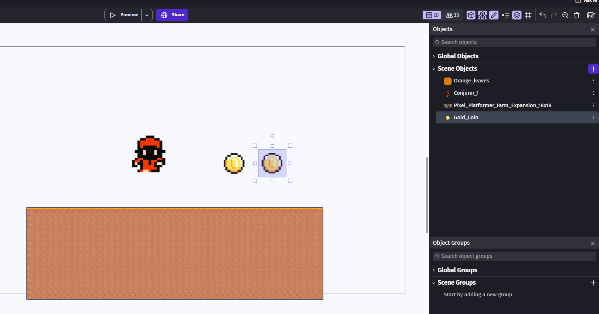
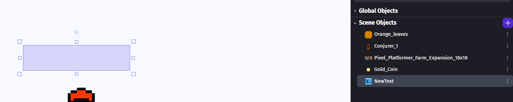
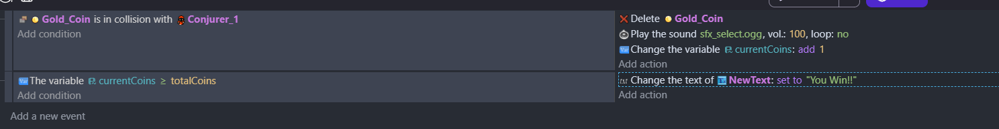
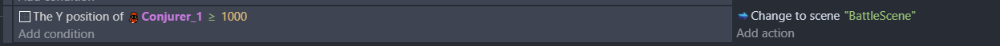

<!-- _class: lead -->
<!-- _paginate: false -->

# Game Development Workshop

## Game Development with GDevelop

## Instructor: Shih-Ming Chang (Horazon)

---

# About the Instructor
## About the Instructor

**Shih-Ming Chang (Horazon)**

- **Position**: Assistant Professor, 
Dept. of Multimedia Game Development and Application, Hungkuang University
- **Expertise**: Game Development, Programming

---

# HKU MGDA

## HongKuang University
## Dept. of Multimedia Game Development and Application


- **Core Areas**: **Games, Animation, Comics, Broadcasting, Esports**

</br>

> Here, we don't just play games; we **CREATE** them!

---

# Objectives
## Goal of this Workshop

Experience the fun of game development in a very short time!

1. **Understand Game Engines**: What they are and why we need them.
2. **Choose Your Tools**: Why are we using GDevelop today?
3. **Hands-on Practice**: Build a platformer game yourself.

> **Today's focus is on "Creativity" and a "Sense of Achievement", not "Coding"!**

---

# What is a Game Engine
## What is a Game Engine?

A game engine is a **toolkit that helps you build games**.

- It provides an **Editor** to drag-and-drop objects and design levels.
- It has built-in systems for **physics, rendering, and audio**, so you don't have to code them from scratch.
- You only need to focus on **gameplay** and **creativity**.

> Simply put: Game Engine = **A Game Factory**

---

# Why use a Game Engine
## Why use a Game Engine?

Imagine you are **building a house**:

- **Without a Game Engine**: Start from baking bricks, cutting trees, and making cement. (Too exhausting!)
- **With a Game Engine**: You have ready-made walls, windows, and foundations; just **assemble** them!

> Game engines let you **skip the hardest underlying tech** and dive straight into making your game.

---

# What Game Engines Do
## What Does a Game Engine Handle?

Game engines handle the **toughest parts**:

- **Physics**: Gravity, collisions, bouncing.
- **Rendering**: Drawing images on screen, playing animations.
- **Audio**: Background music, sound effects.
- **Input**: Keyboard, mouse, touch.
- **Scene Management**: Switching levels, loading screens.

> Without a game engine, you would have to **write code from scratch** for every single item above.

---

# Common Game Engines
## Common Game Engines

| Engine | Feature | Best for | Difficulty |
|:---:|:---|:---|:---:|
| **Unity** | Industry Standard, Resource-Rich | Mobile, 2D/3D, Indie | ⭐⭐⭐ |
| **Unreal Engine** | Top Visuals, AAA Titles | Realistic, Large Projects | ⭐⭐⭐⭐⭐ |
| **Godot** | Lightweight Open Source, Free | 2D Games, Rapid Prototyping | ⭐⭐ |

---

# Unity
## The most common game engine in the industry

- **C# Programming**: Coding required.
- **Cross-Platform**: Develop once, publish to Mobile, PC, and Consoles.
- **Asset Store**: Massive amount of free/paid assets.

**Notable Games**: Genshin Impact, Pokémon GO, Among Us, Hollow Knight

> Powerful, but requires **programming basics**.

---

# Unreal Engine
## The game engine with top-tier visuals

- **Blueprint System**: Visual logic scripting, but still somewhat complex.
- **C++ Programming**: Advanced features require C++.
- **MetaHuman**: Ultra-realistic character system.

**Notable Games**: Black Myth: Wukong, Final Fantasy VII Remake

> Suitable for large projects aiming for **top-tier visuals**; highest learning curve.

---

# GDevelop: Why choose it
## Why GDevelop?

Since Unity/Unreal are so powerful, why are we using **GDevelop** today?

1. **Zero Coding Required**: Use visual Events, just select them!
2. **Lowest Learning Curve**: Intuitive interface, get started in minutes.
3. **No Installation**: Use the web version directly.
4. **Free**: Core features are completely free.

> **Today our focus is on "Creativity", not "Debugging"!**

---

# Intro to GDevelop
## About GDevelop

GDevelop is a **free, open-source** 2D game engine.

- **Event System**: Write game logic using "If... Then...".
- **Built-in Asset Store**: Plenty of free assets provided officially.
- **One-Click Publishing**: Export directly as a web game, share the link with friends.
- **Supported Platforms**: Windows, Mac, Linux, Web.

> Official Website: **gdevelop.io**

---

# Interface Overview
## The GDevelop Interface

The GDevelop interface is divided into three main areas:

1. **Project Manager** — Left
   Manage your Scenes, image resources, external events.
2. **Scene Editor** — Center
   Your canvas; drag-and-drop objects and design levels here.
3. **Objects Panel** — Right
   Manage all elements in your game (Player, Ground, Coins).

> Click the **Events** tab at the top to enter the logic editing area.

---

# Creating a Player
## Creating the Player

1. In the right **Objects** panel, click **+ Add a new object**.
2. Search for a character in the asset store (choose a free asset).
3. Name it `Player`.
5. Drag **Player** into the Scene view.

> **Tip**: You can click **Edit collision masks** to adjust hitboxes for precise collisions.

---

# Creating Basic Ground
## Creating the Ground

Quickly create ground using GDevelop's built-in images:

1. Add new object → Select **Tiled Sprite**.
2. Name it `Ground`.
3. Choose a ground image from built-in assets or the Asset Store.
4. Drag it into the scene, stretch it to serve as the ground.

> **Tiled Sprite** automatically repeats the image, perfect for long flat grounds.


---

# Player and Ground


---

# Making the Player Move
## Adding Movement Behaviors

Make the character move without any coding!

1. Double-click the `Player` object → Switch to **Behaviors** tab.
2. Click **+ Add a behavior**.
3. Search and select **Platformer character**.
4. The character automatically gains: Left/Right movement, jumping, and gravity.

Next, make the ground "solid":

1. Double-click the `Ground` object → **Behaviors** tab.
2. Add **Platform** behavior.

> **Tip**: You can adjust **Jump speed** and **movement speed** in the Behavior settings.

---

# Designing Levels with Tilemap
## Why Tilemap?

Why use a **Tilemap** instead of dragging one Tiled Sprite at a time?

- **High Efficiency**: Paint out the level like drawing with a brush.
- **Unified Management**: All terrain tiles are in a single object, keeping it organized.
- **Easy to Modify**: Want to change the level? Just erase and redraw.

---

# How to use TileMap
1. Add new object → Select **Tilemap**.
2. Search for **Tilemap** in the store.
3. Drag it into the scene.
3. Use the **Brush Tool** to draw the level in the scene.

- Note: You still need to add a Platform Behavior.

---

# TileMap


---

# Game Logic and Events
## Events: The Brain of Your Game

In GDevelop, we don't code, we write **"If... Then..."**

| **Condition** | **Action** |
|:---|:---|
| **"When... happens"** | **"Then execute..."** |
| Pressing Spacebar | Player jumps |
| Colliding with Coin | Coin disappears + Score up |
| Empty Condition | Executes "Every frame" |

> This is the core logic of programming, but you **don't have to memorize any commands**!

---

# Coins
## Coin Collection

Make the game more fun: Collect coins!

1. Add a `Coin` object (Sprite) and place it in the scene.
2. Add an Event:
   - **Condition**: `Player` collision with `Coin`
   - **Action**: Delete object `Coin`
3. Add another Action to play a sound:
   - Search for **Sound** → **Play a sound**.
   - Choose an audio file.

> Advanced: You can add a `Score` variable, `+100` points per coin collected.


---
# Coins: Completed View




---

# Win Condition

Win by collecting all coins!

1. Add two **Scene Variables**:
   - `TotalCoins` = Total amount of coins in the scene (e.g. `5`).
   - `CollectedCoins` = `0` (Amount already collected).
2. Go back to the Coin event, add an Action when colliding:
   - **Variable** → **Change scene variable** `CollectedCoins` → **+ 1**


---
# Win Condition - Displaying Text

1. Create a Text object first
   - Set the font
   - Drag to a proper position
   - Set initial text to empty
1. Add an **Independent Event** to check if all coins are collected:
   - **Condition**: `CollectedCoins >= TotalCoins`
   - **Action**: Modify text to "You Win!" 

---

# Win Condition


</br>


---

# Lose Condition 1
## Death & Restart

Falling off the map or hitting hazards should trigger a restart.

**Falling off the map**:
- **Condition**: `Player` Y position > 1000
- **Action**: **Change the scene** → Choose the current scene (Reload)



---

# Lose Condition 2
## Death & Restart

**Hitting a Spike**:
1. Create a `Spike` object.
2. **Condition**: `Player` collision with `Spike`
3. **Action**: **Change the scene** (Restart)


---

# What are UI / UX
## User Interface vs User Experience

Before making game screens, understand two vital concepts:

**UI (User Interface)**
- Things the player **sees** and **interacts** with: Buttons, Health bars, Scores, Menus.
- The key is making it **look good and clear**.

**UX (User Experience)**
- The player's **overall feeling**: Is it smooth? Will they get lost?
- The key is making it **usable and intuitive**.

> **UI** is appearance design; **UX** is flow design. A good game requires both!

---

# UI Creation
## Building Game UI in GDevelop

Display the coin count on screen so the player knows their progress!

1. Add new object → Select **Text**.
2. Name it `CoinText`, set font size and color.
3. Place it in the **top left** of the screen.
4. Add an Event (updates text every frame):
   - **Condition**: Left empty (Executes every frame)
   - **Action**: **Modify the text** of `CoinText`
   - Set text string to: `"Coins: " + ToString(Variable(CollectedCoins)) + " / " + ToString(Variable(TotalCoins))`

> **Tip**: Check the **Layer** property of the Text object to a UI layer so it doesn't move with the camera.


---

# UI Creation: Game Screens
## Start Screen & Win/Lose Screen

Use different **Scenes** to make start and end screens:

**Start Screen**:
1. Create a new Scene, name it `StartScreen`.
2. Add a **Text** object for the game title.
3. Add a **Text** object showing `"Click to Start"`.
4. Add an Event:
   - **Condition**: **Mouse button released**
   - **Action**: **Change the scene** → `"Level 1"`

---
# UI Creation: Win/Lose Screen

**Win / Lose Screen**:
1. Create two Scenes: `WinScreen` and `GameOverScreen`.
2. Add **Text** in each showing "You Win!" or "Game Over".
3. Add a Replay button: on click, **Change the scene** back to `"Level 1"`.

> Drag Scene orders in the **Project Manager**; the top one is the first screen when the game starts.

---

# Game Flow
## The Game Loop

Congrats! You have completed a full **Game Loop**:

```
Start → Play → Die/Win → Restart/Next
```

- **Add more levels**: Create a new Scene, switch using **Change the scene**.

---

# Publishing Your Game
## Share Your Game

Definitely let your friends play the game you made!

1. Click top-left **File** → **Publish web build**.
2. Select **gd.games** (Free hosting platform by GDevelop).
3. Log in or select **Generate link**.
4. Get a **URL** in a few seconds.
5. Share it with your friends!

> No servers or extra costs required.

---

# Game Showcase
## Show & Tell

Showcase your game!

- What are the **unique designs** in your game?
- What **challenges** did you face during development?
- What do you find the most **interesting**?

> Each group showcases their game; play each other's games!

---

# Game Design
## Game Design Tips

A good game requires good game design!

1. **Core Gameplay**: What makes your game "fun"?
2. **Difficulty Curve**: Progress gradually from easy to hard.
3. **Feedback**: Sound effects when collecting items, visual reactions on screen.
4. **Clear Goals**: Players should instantly know what to do.

> Figure out "What the player needs to do" before creating.

---

# Conclusion
## Summary

Today we learned:

1. **Game engines** handle underlying tech so you can focus on creativity.
2. **GDevelop** is code-free, installation-free, and free to use.
3. You can build complete game logic using the **Event System**.
4. Game development doesn't have to be painful; **choosing the right tools** is essential.

> By using appropriate tools, you can easily make your own game!

---

# Hands-on + Q&A
## Let's Make a Game!

It's time for **free hands-on practice**!

- Unleash your creativity and design your own levels!
- Add more mechanics, enemies, and sound effects!
- Raise your hand anytime if you have questions!

### Have Fun with GDevelop!
