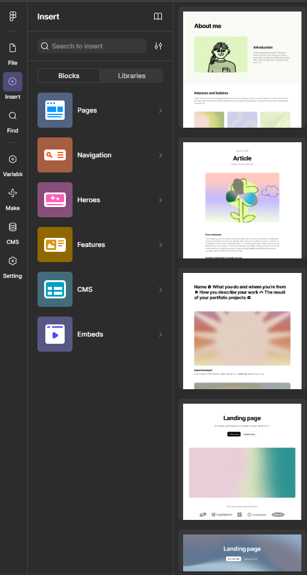
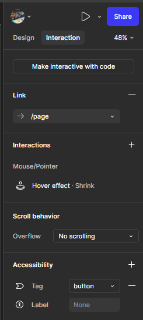
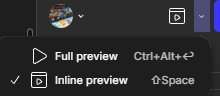

<!-- _class: lead -->
<!-- _paginate: false -->

### Chapter 05
# UI/UX 設計導論 - Figma 基礎

## Horazon
## 互動媒體設計

---

# UI vs UX：有什麼差別？

 

這兩個詞常被連在一起講，但意義完全不同。

### UI (User Interface) - 使用者介面
-   **視覺層面**：長得好不好看？
-   **元素**：按鈕顏色、字體大小、排版間距、圖示風格。
-   **產出**：高保真視覺稿 (Mockup)。

### UX (User Experience) - 使用者體驗
-   **感受層面**：好不好用？順不順暢？
-   **流程**：註冊要在三步內完成、按鈕位置是否好按。
-   **產出**：Wireframe、流程圖 (User Flow)、使用者研究。

---

# UI/UX 的譬喻

 

想像一下 **蕃茄醬瓶**。

-   **UI (介面)**：
    -   玻璃瓶身，貼著漂亮的紅標籤，看起來很有質感。
    -   (即使很難倒出來，但它放在桌上很好看)

-   **UX (體驗)**：
    -   改用軟塑膠瓶，瓶口倒置設計。
    -   (雖然沒那麼高級，但隨便擠就出來，還不會弄髒手)

> **好的設計通常兼具 UI 與 UX。**

---

# 介面設計四原則 (CRAP)

 

只要掌握這四點，你的設計就不會太醜。

1.  **對比 (Contrast)**：
    -   即使是白底黑字，也要夠黑。標題要夠大，讓重點跳出來。
2.  **重複 (Repetition)**：
    -   同樣的按鈕就要長一樣，標題字體要統一。建立一致性。
3.  **對齊 (Alignment)**：
    -   不要隨便擺放，所有東西都要有對齊線。置中或靠左，選一個。
4.  **親密性 (Proximity)**：
    -   相關的東西靠還有近一點，不相關的分開遠一點。

---

# 認識 Figma

 

## [Figma](https://www.figma.com/) - UI 設計工具。

### 為什麼是 Figma？
-   **雲端協作**：不用存檔寄給別人，給連結就好，像 Google Docs。
-   **跨平台**：瀏覽器就能跑，Mac/Windows 通吃。
-   **社群強大**：有成千上萬個免費的 Plugins 和 UI Kits。
-   **免費**：對學生跟個人使用者超級佛心。

---

# 第一步：註冊與開啟

 

1.  **註冊帳號**：
    -   前往 [Figma.com](https://www.figma.com/) 點擊 "Get started"。
    -   建議使用 Google 帳號直接登入。

2. **建立Site**
    -   點擊右上角的 **"Site"**。
    -   這個功能在最近推出，我們可以用它來建立網站。
    -   由於是新功能，我們就一起學習吧！

---

# Figma 介面導覽

 

打開 Figma，你會看到三個主要區塊：

1.  **中間：畫布 (Canvas)**
    -   無限大的空間，讓你自由揮灑。
2.  **左側：圖層 (Layers) 與 素材 (Assets)**
    -   管理你的 Frame、群組、元件。
3.  **右側：屬性面板 (Properties)**
    -   調整顏色、大小、字體、對齊、匯出設定。

---

# 第一步：建立 Figma Site

 

在 Figma 裡，現在可以直接將設計發布成網站！
-   在新建專案左上角選擇 **Figma Site**。
-   或者是打開現有專案，點擊右上角的 **"Sites"** 進入網頁設計模式。
-   預設會有 Desktop (電腦) 和 Mobile (手機) 兩個斷點，電腦版更動會自動瀑布式（Cascade）套用到手機版。

> **Site 模式專注於能真實在網頁中運作的元件。**

---

# 基本佈局：響應式斷點 (Breakpoints)

 

做網頁跟畫圖最大的不同，就是網頁要適應不同的螢幕大小 (手機、平板、電腦)。

-   **Desktop (電腦版)**：預設的設計基準。
-   **Mobile (手機版)**：Figma 會自動為你串接斷點 (Breakpoints)。
-   **Tablet (平板版)**：Figma 會自動為你串接斷點 (Breakpoints) (需要使用+額外增加至首頁)。   
-   在電腦版做的更動會自動往下瀑布式（Cascade）套用到平板 & 手機版。
-   **注意**：在手機版調整的東西，不會影響到電腦版！這樣就能專門針對手機微調。

---

# 使用內容區塊 (Blocks) 快速建構

 

Figma Sites 提供了大量預設的模組，讓你不必從零手刻：

-   點擊介面上的加號或是 **Blocks** 面板。
-   可以插入 **全頁面模版 (Pages)**。
-   也可以插入單一 **區塊 (Blocks)**：
    -   **Hero Section**：首頁大滿版的主視覺與標題。
    -   **Navigation**：上方的導覽列清單。
    -   **Features**：產品或服務特色介紹區塊。

---

# 強大的排版神器：Auto Layout (Shift + A)

 

這在網頁設計中絕對必學！它等同於網頁程式碼裡的 `Flexbox`。

-   選取多個物件，按 `Shift + A` 轉為 Auto Layout。
-   在 Sites 模式中，盡量使用 Auto Layout 取代手動拖移。
-   **好處**：
    -   當文字變多，外框會自動撐開長高。
    -   元素之間會自動保持固定的間距 (Gap)。
    -   在不同斷點(手機/電腦)下，可以輕鬆把「左右排列」一鍵改成「上下排列」。

---

# 網頁互動效果 (Interactions)

 

不用寫 JS，也能做出流暢的網頁動效：

-   **Hover (懸停效果)**：滑鼠移過去按鈕會變色、稍微放大。
-   **Scroll Reveal (捲動浮現)**：往下捲動網頁時，圖片從下方淡淡滑進來。
-   **Parallax (視差滾動)**：背景圖片跟前景移動速度不一樣，創造立體感。
-   **Link (連結)**：把區塊或按鈕變成超連結，可以跳轉到站內其他頁面、外部網址、或是指定捲動到某個區塊 (Scroll to)。
-   選取物件後，在右側屬性面板找到對應的動作設定即可！

---

# 預覽功能 (Preview / Play)

 

做好的互動效果，一定要自己先測試過！

-   **Play (播放)**：點擊右上角的 `▶` 按鈕，會開啟新分頁，模擬真實的網頁瀏覽體驗。
-   **Preview (預覽)**：點擊 `▶` 旁邊的小箭頭下拉選單，選擇 **Inline Preview** (`Shift + Space`)，會直接在畫布上浮現一個小視窗，適合邊改邊看互動效果。
-   這對於測試 Hover 或確認 Breakpoints 有沒有跑版非常有幫助！

---

# 個人Landing Page 上線！

 

請用 Figma Sites 快速實作並發布一個 Landing Page：

1.  **建立 Site**：開一個新的 Figma Site 檔案。
2.  **Hero 區塊**：插入一個 Hero Block，把標題改成自己的主題。
3.  **特色展示**：使用 Auto Layout (或預設 Block) 排列 3 塊特色卡片。
4.  **響應式設定**：切換到 Mobile 斷點，調整字體大小或卡片排列。
5.  **互動**：讓特色卡片加上 Hover 效果，滑鼠移過去會有回饋。
6.  **發布**：點擊右上角 **Publish**，取得 `*.figma.site` 的網址，並用手機親自開啟測試！

---

# AI 輔助與 CMS (內容管理)

 

Figma Sites 也導入了最新趨勢功能：

1.  **Figma AI**：
    -   可以直接打字要求 AI 幫你生一段「公司介紹文案」。
    -   或用 AI 產生簡單的配圖與排版變體。
2.  **CMS (Content Management System)**：
    -   適合部落格文章、作品集列表等多筆資料。
    -   不用一頁一頁畫，可以建立一個「資料庫」。
    -   設計一個樣板，系統會自動套用資料幫你生成所有列表與內頁！

---

# 發布 (Publish) - 一鍵上線！

 

設計做好了，要怎麼讓全世界看到？

1.  點擊右上角醒目的 **"Publish"** 按鈕。
2.  **設定網域**：
    -   你可以使用 Figma 免費提供的子網域 (例如 `yourname.figma.site`)。
    -   也可以串接自訂的專屬網域 (Custom Domain)。
3.  **SEO 設定**：順手設定一下網頁標題與預覽圖，分享給別人時才會好看。
4.  點擊發布，幾秒鐘後，你的網站就正式上線，並且手機電腦都能看！

---

# 下週預告

 

學會了基本的 UI 設計與版面配置後，下週我們要來認識另一個強大的架站工具：

**進階無程式碼平台 - Wix**
-   海量模版與拖曳式編輯。
-   App Market：購物車、留言板等外掛擴充。
-   網站內容管理。

