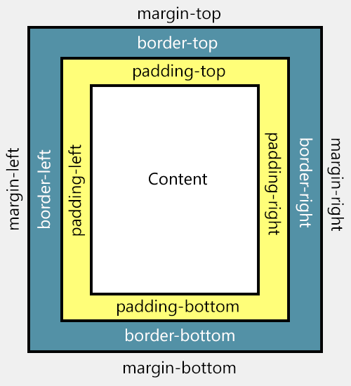

<!-- _class: lead -->
<!-- _paginate: false -->

### Chapter 08
# 網頁樣式美化 - CSS

## Horazon
## 互動媒體設計 (一學期)

---

# 什麼是 CSS?

<br>

## **C**ascading **S**tyle **S**heets (階層式樣式表)

-   負責網頁的**外觀**、**排版**與**視覺效果**。
-   HTML 是**骨架** (內容)，CSS 是**樣式** (裝飾)。
-   沒有 CSS 的網頁，就像沒有裝潢的毛胚屋，只有黑白文字。

---

# CSS 的三種寫法

<br>

1.  **行內樣式 (Inline Style)**：如果不推薦。
    `<h1 style="color: red;">標題</h1>`
    -   缺點：難維護，LABel 要每個標籤都改一遍。

2.  **內部樣式 (Internal Style)**：寫在 `<head>` 的 `<style>` 標籤內。
    -   缺點：只能給這一頁用。

3.  **外部樣式 (External Style)**：寫在獨立的 `.css` 檔案 (**推薦！**)。
    -   `<link rel="stylesheet" href="style.css">`
    -   優點：可以讓 100 個網頁共用同一個樣式檔。

---

# CSS 語法結構

<br>

```css
選擇器 {
    屬性: 設定值;
    屬性: 設定值;
}
```

-   **選擇器**：選到誰？ (例如 `h1`, `p`, `.box`)
-   **屬性**：改什麼？ (例如 `color`, `font-size`)
-   **設定值**：改多少？ (例如 `red`, `16px`)

```css
h1 {
    color: red;
    font-size: 32px;
}
```

---

# 選擇器 - 基礎篇

<br>

<style scoped>
table {
    font-size: 0.8em;
    width: 80%;
    margin: 0 auto;
}
</style>

| 選擇器 | 符號 | 範例 | 說明 |
| :--- | :--- | :--- | :--- |
| **標籤** | 無 | `p` | 選取所有 `<p>` 標籤 |
| **類別** | **`.`** | `.title` | 選取 `class="title"` 的元素 (**最常用!**) |
| **ID** | **`#`** | `#header` | 選取 `id="header"` 的元素 (唯一) |
| **全域** | **`*`** | `*` | 選取網頁上所有元素 (Reset用) |

> **ID 像是身分證字號** (全校只有一個)。
> **Class 像是制服** (很多人都可以穿一樣的)。

---

# 選擇器 - 進階篇

<br>

除了直接選，還可以選「關係」：

-   **後代選擇器 (空白)**：選取裡面的子子孫孫。
    -   `.card p` (選取 .card 裡面所有的 p，不管包幾層)
-   **子選擇器 (`>`)**：只選親生兒子 (第一層)。
    -   `.menu > li` (只選 .menu 直屬的 li)
-   **屬性選擇器 (`[]`)**：
    -   `input[type="text"]` (只選 type 是 text 的輸入框)
-   **群組選擇器 (`,`)**：
    -   `h1, h2, h3` (這些標題都套用同樣樣式)

---

# 偽類選擇器

<br>

描述元素的**狀態**，用冒號 (`:`) 開頭。

-   **`:hover`**：滑鼠移上去時。
    -   `button:hover { background: blue; }`
-   **`:active`**：按下去的那一瞬間。
-   **`:focus`**：輸入框被點擊、準備輸入時。
-   **`:nth-child(n)`**：選第幾個小孩。
    -   `li:nth-child(odd)` (選取奇數項，做斑馬紋表格常用)

---

# 權重 (Specificity)

<br>

為什麼我的 CSS 沒效？可能是**權重**輸了！

當多個 CSS 規則同時設定同一個元素時，聽誰的？

1.  **`!important`** (最強，但盡量別用)
2.  **行內樣式** (`style="..."`)
3.  **ID** (`#id`)
4.  **Class** (`.class`)、偽類 (`:hover`)
5.  **標籤** (`div`)
6.  **全域** (`*`)

> **原則**：這就是為什麼要多用 Class、少用 ID 的原因 (ID太強很難覆蓋)。

---

# 單位

<br>

-   **絕對單位**：
    -   **`px` (像素)**：最直觀，但也最死板。
-   **相對單位 (推薦)**：
    -   **`em`**：相對於「父元素」的字體大小。
    -   **`rem`**：相對於「根元素 (`html`)」的字體大小 (Root em)。
    -   **`%`**：相對於父元素的寬高。
-   **視窗單位**：
    -   **`vw` (Viewport Width)**：視窗寬度的 1%。
    -   **`vh` (Viewport Height)**：視窗高度的 1%。
    -   常用：`height: 100vh` (滿版畫面)。

---

# 文字與排版屬性

<br>

-   **`font-family`**：字型 (`"微軟正黑體", sans-serif`)。
-   **`line-height`**：行高 (如 `1.5` 倍)，閱讀舒適度關鍵。
-   **`text-align`**：對齊 (`center`, `left`, `right`, `justify`)。
-   **`text-decoration`**：裝飾。
    -   `none` (去掉超連結底線)
    -   `underline` (底線)
    -   `line-through` (刪除線)

---

# 盒子模型 (Box Model) - 核心觀念

<br>

每個 HTML 元素都是一個**盒子**，由內而外包含：

1.  **Content** (內容)：文字或圖片本身。
2.  **Padding** (內距)：內容與邊框之間的距離 (留白)。
3.  **Border** (邊框)：盒子的框線。
4.  **Margin** (外距)：盒子與盒子之間的距離。



---

# Box Sizing 的陷阱

<br>

預設的 `box-sizing: content-box` 很反直覺。
如果你設 `width: 100px`，又加了 `padding: 20px`，
盒子實際寬度會變成 **140px**！(100 + 20左 + 20右)

### 解決方案： `border-box`

```css
* {
    box-sizing: border-box; /* 內距與邊框都算在 width 裡面 */
}
```
這樣 `width: 100px` 就是 100px，Padding 會往內擠，不會把盒子撐大。

---

# 背景處理

<br>

```css
.hero {
    /* 設定背景圖 */
    background-image: url('bg.jpg');
    
    /* 背景不要重複 */
    background-repeat: no-repeat;
    
    /* 背景位置置中 */
    background-position: center;
    
    /* 背景尺寸：cover (填滿，可能會裁切), contain (完整顯示) */
    background-size: cover;
}
```

---

# 轉場與動畫

<br>

不用寫 JS 也能做簡單動畫！

`transition`：當屬性改變時 (例如 hover)，要花多久時間變過去。

```css
button {
    background: blue;
    transition: all 0.3s ease; /* 0.3秒，平滑過渡 */
}

button:hover {
    background: red; /* 滑鼠移上去，會在 0.3 秒內從藍變紅 */
    transform: scale(1.1); /* 放大 1.1 倍 */
}
```

---

# CSS 變數

<br>

方便管理主題色，一改全改。

定義變數 (通常在 `:root`)：
```css
:root {
    --main-color: #3498db;
    --text-color: #333;
}
```
使用變數：
```css
h1 {
    color: var(--main-color);
}
button {
    background: var(--main-color);
}
```

---

# 定位屬性 (Position) - 讓元素脫離乖乖排隊的規則

<br>

這是一個強大但容易讓人頭暈的屬性：

1.  **`static` (預設)**：乖乖排隊，不受 top/left 控制。
2.  **`relative` (相對)**：還是在隊伍裡，但可以微微偏移 (相對於自己原本的位置)。
3.  **`absolute` (絕對)**：脫離隊伍 (浮起來了)，相對於「最近的有定位(非static)祖先」定位。
4.  **`fixed` (固定)**：**盯著視窗跑**！捲動網頁時它不會動 (如：導覽列、Gotop 按鈕)。

---

# 堆疊順序 (z-index)

<br>

當元素重疊時 (例如用了 absolute 或 fixed)，誰在上面？

-   **`z-index`**：數字越大，越上面。
-   預設是 `auto` (依 HTML 順序，後面的蓋前面的)。
-   **注意**：只有設定了 `position` (非 static) 的元素，`z-index` 才會生效！

```css
.modal {
    position: fixed;
    z-index: 9999; /* 確保它蓋在所有東西上面 */
}
```

---

# 陰影與圓角

<br>

讓網頁從平面變立體的神器！

### 1. 圓角 (`border-radius`)
-   `border-radius: 10px;` (微圓角)
-   `border-radius: 50%;` (變成正圓形)

### 2. 陰影 (`box-shadow`)
-   `box-shadow: x偏移 y偏移 模糊半徑 顏色;`
-   範例：`box-shadow: 5px 5px 10px rgba(0,0,0,0.5);`

> **Material Design** 風格就是靠陰影堆出來的。

---

# Google Fonts (雲端字型)

<br>

受夠了 `新細明體` 嗎？

1.  去 [fonts.google.com](https://fonts.google.com/)。
2.  搜尋喜歡的字體 (例如：**Noto Sans TC** 思源黑體)。
3.  選擇粗細 (Regular 400, Bold 700)。
4.  複製右邊的 `<link>` 程式碼，貼到 HTML `<head>` 裡。
5.  在 CSS 設定：
    ```css
    body {
        font-family: 'Noto Sans TC', sans-serif;
    }
    ```

---

# 實作練習：個人簡介美化

<br>

拿出上週的 HTML，加上 `style.css`：

1.  **字體**：去 Google Fonts 找一個好看的字體。
2.  **圖片**：`border-radius: 50%` 變圓形，加點 `box-shadow`。
3.  **標題**：換個顏色，置中對齊。
4.  **按鈕**：把超連結 `<a>` 變成按鈕樣子。
    -   `padding: 10px 20px`
    -   `background-color: orange`
    -   `color: white`
    -   `text-decoration: none` (去掉底線)

---

# 下週預告

<br>

學會了基本的樣式，但你會發現：
「怎麼把東西排成兩欄？」、「怎麼讓它置中？」

這就是下週的重頭戲：
**網頁排版佈局 - CSS Flexbox & Grid**

那是現代網頁排版的兩大救星，
學會之後，你想怎麼排就怎麼排！

---
