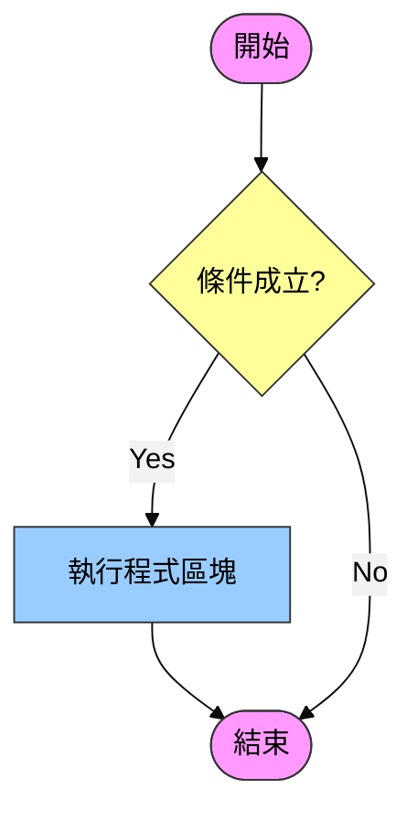
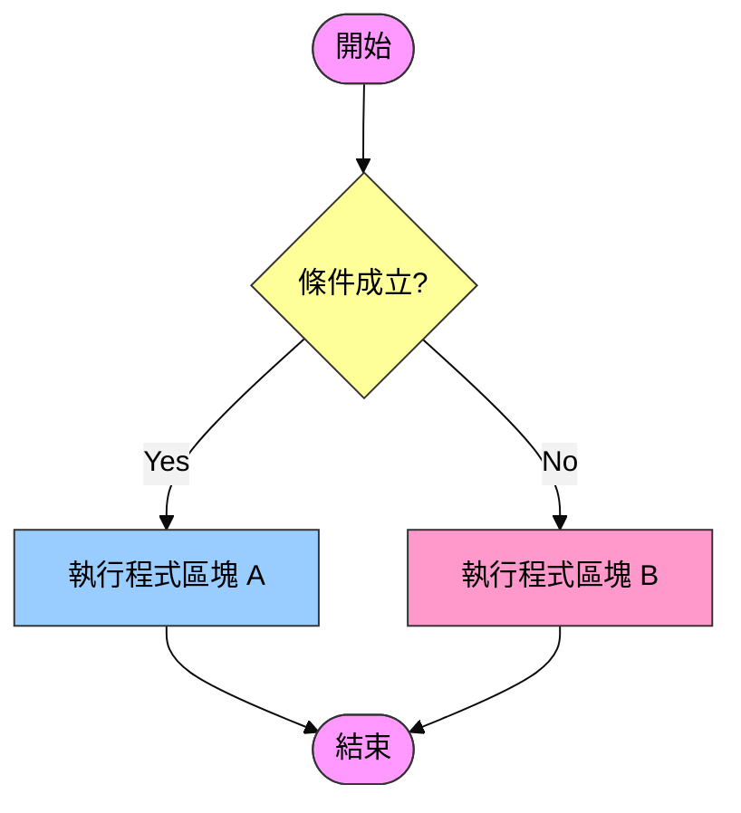
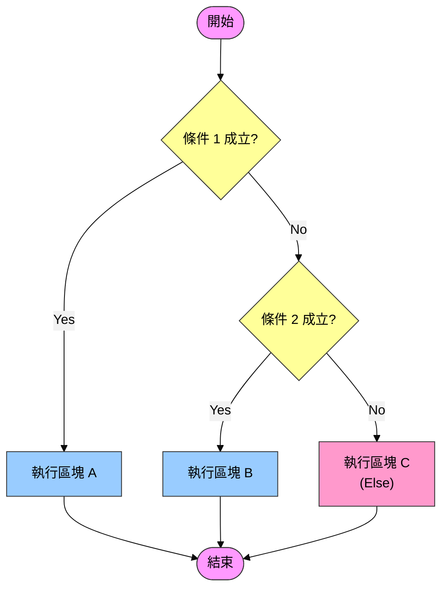
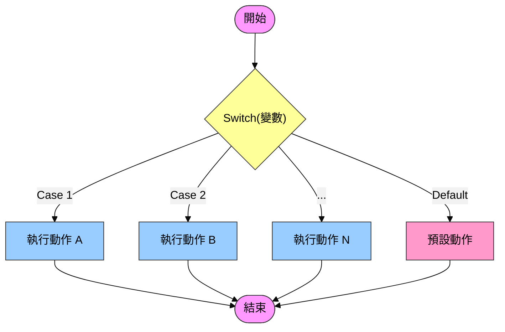

# 流程控制圖解

## 1. If 判斷式

單一條件判斷：

```mermaid
%%{init: {'theme': 'base', 'themeVariables': { 'primaryTextColor': '#000000', 'edgeLabelBackground': '#f2f2f2', 'tertiaryColor': '#f2f2f2'}}}%%
flowchart TD
    Start([開始]) --> Condition{條件成立?}
    Condition -- Yes --> Process[執行程式區塊]
    Process --> End([結束])
    Condition -- No --> End
    
    style Start fill:#f9f,stroke:#333,color:#000
    style End fill:#f9f,stroke:#333,color:#000
    style Condition fill:#ff9,stroke:#333,color:#000
    style Process fill:#9cf,stroke:#333,color:#000
```

## 2. If-Else 判斷式

雙向條件分支：

```mermaid
%%{init: {'theme': 'base', 'themeVariables': { 'primaryTextColor': '#000000', 'edgeLabelBackground': '#f2f2f2', 'tertiaryColor': '#f2f2f2'}}}%%
flowchart TD
    Start([開始]) --> Condition{條件成立?}
    Condition -- Yes --> Process1[執行程式區塊 A]
    Condition -- No --> Process2[執行程式區塊 B]
    Process1 --> End([結束])
    Process2 --> End

    style Start fill:#f9f,stroke:#333,color:#000
    style End fill:#f9f,stroke:#333,color:#000
    style Condition fill:#ff9,stroke:#333,color:#000
    style Process1 fill:#9cf,stroke:#333,color:#000
    style Process2 fill:#f9c,stroke:#333,color:#000
```

## 3. If-Else If-Else 多重判斷

多條件依序檢查：

```mermaid
%%{init: {'theme': 'base', 'themeVariables': { 'primaryTextColor': '#000000', 'edgeLabelBackground': '#f2f2f2', 'tertiaryColor': '#f2f2f2'}}}%%
flowchart TD
    Start([開始]) --> Cond1{條件 1 成立?}
    Cond1 -- Yes --> Proc1[執行區塊 A]
    Cond1 -- No --> Cond2{條件 2 成立?}
    
    Cond2 -- Yes --> Proc2[執行區塊 B]
    Cond2 -- No --> Proc3["執行區塊 C <br> (Else)"]
    
    Proc1 --> End([結束])
    Proc2 --> End
    Proc3 --> End

    style Start fill:#f9f,stroke:#333,color:#000
    style End fill:#f9f,stroke:#333,color:#000
    style Cond1 fill:#ff9,stroke:#333,color:#000
    style Cond2 fill:#ff9,stroke:#333,color:#000
    style Proc1 fill:#9cf,stroke:#333,color:#000
    style Proc2 fill:#9cf,stroke:#333,color:#000
    style Proc3 fill:#f9c,stroke:#333,color:#000
```

## 4. Switch 分支判斷

變數值匹配分支：

```mermaid
%%{init: {'theme': 'base', 'themeVariables': { 'primaryTextColor': '#000000', 'edgeLabelBackground': '#f2f2f2', 'tertiaryColor': '#f2f2f2'}}}%%
flowchart TD
    Start([開始]) --> Switch{"Switch(變數)"}
    
    Switch -- Case 1 --> Proc1[執行動作 A]
    Switch -- Case 2 --> Proc2[執行動作 B]
    Switch -- "..." --> ProcN[執行動作 N]
    Switch -- Default --> ProcDef[預設動作]
    
    Proc1 --> End([結束])
    Proc2 --> End
    ProcN --> End
    ProcDef --> End

    style Start fill:#f9f,stroke:#333,color:#000
    style End fill:#f9f,stroke:#333,color:#000
    style Switch fill:#ff9,stroke:#333,color:#000
    style Proc1 fill:#9cf,stroke:#333,color:#000
    style Proc2 fill:#9cf,stroke:#333,color:#000
    style ProcN fill:#9cf,stroke:#333,color:#000
    style ProcDef fill:#f9c,stroke:#333,color:#000
```
